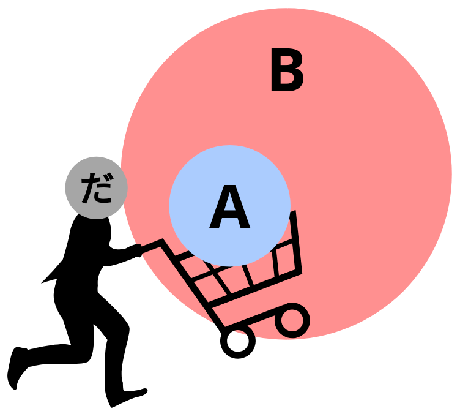

# Main wagon "A" and Engine "B"

## Main wagon "A"

We learned in the "Sentence Structure" section about the core of a Japanese sentence:

Main wagon "A" | Engine "B"
:---: | :---:
- | -

We also learned that:

> The engine "B" tells us what the main wagon "A" is doing. The main wagon "A" tells us WHO or WHAT is doing engine "B".

Now, let's learn a little bit more about the main wagon "A". Suppose we have these two sentences as examples:

1. Sakura walks.
2. Sakura is Japanese.

If we put those sentences into the train analogy, they will look like this:

Main wagon "A" | Engine "B"
:---: | :---:
Sakura | walks
Sakura | is Japanese

In these two sentences, the engine is telling us that the main wagon "A" is doing: "walks" and "is Japanese", respectively. The main wagon "A" is telling us that the engine "B" is being done by: "Sakura".

However, in Japanese we need to mark "Sakura" as the main wagon "A". To do that, **we use the particle 「が」**. We attach 「が」 at the end of "Sakura" to mark "Sakura" as the main wagon "A", like so:

Main wagon "A" | Engine "B"
:---: | :---:
Sakura が | walks
Sakura が | is Japanese

???+ note
    We will learn more about particles in a later section.

### Invisible main wagon "A"

We already know that the core of a Japanese sentence is composed of:

Main wagon "A"  | Engine "B"
:---: | :---:
- | -

However, you can't always see both of them. **You can always see the engine "B", but sometimes you can't see the main wagon "A"**. Why not? Because the main wagon became an invisible wagon. Even though you can't see it, it's still there. What is the invisible wagon? In English, the closest equivalent is the word "*it*". Let's begin by examining what "*it*" does in English. Let's look at the following sentence:

- The ball rolled down the hill. When the ball go to the bottom, the ball hit a sharp stone. The ball was punctured and all the air came out of the ball.

Would any native English speaker say it like that? Most likely not, because once we have established what we are talking about, we replace it with "*it*". So, a more natural way of saying the sentence would be:

- The ball rolled down the hill. When **it** got to the bottom, **it** hit a sharp stone. **It** was punctured and all the air came out of **it**.

Now, let's suppose a small child tries to say the same sentence but ends up saying:

- Ball rolled down hill, got to bottom, hit sharp stone, got punctured, all the air came out.

Is that difficult to understand? No, it's not. Because, in fact, we don't need to use the "*it*" marker everytime, over and over again. Technically speaking, English grammar demands it but there's no actual communicative need to do it. In Japanese grammar, "*it*" is not demanded at all. 

"*It*" by itself means nothing because it can mean anything. You will know what "*it*" is from context. If a small child came to the kitchen and said:

- Got really hungry. Came down to eat something.

there's nothing confusing or difficult about this. The child meant 

- **I** got really hungry. **I** came down to eat something.

In English, skipping the "I" is not a proper sentence, but in Japanese it is. All those English pronouns like "it", "she", "he", "I", "they", can be replaced by the invisible wagon "**the zero-pronoun (Ø)**" in Japanese. The important thing to remember is that the main wagon "A" is still there, but it's just invisible. 

Alright, let's look at how this is done in Japanese. Suppose we want to say:

- I am Japanese.

Main wagon "A" | Engine "B"
:---: | :---:
I | am Japanese

To say that sentence in Japanese, it would be:

- 私が日本人だ。

Main wagon "A" | Engine "B"
:---: | :---:
私が | 日本人だ

However, it is a perfectly valid and proper sentence if we just say:

- 日本人だ。

Main wagon "A" | Engine "B"
:---: | :---:
Øが | 日本人だ

The literal translation of 「日本人だ」 would be "is Japanese". The *full* sentence of 「日本人だ」 would be:

- Øが日本人だ。

and the zero-pronoun can be assumed to be "I" in this context. The zero-pronoun, just like the English word "it", will always have a different meaning based on context. For example, if we hear a rustling in the woods and and then we look over in the direction of the rustles, and say:

- うさぎだ!

Main wagon "A" | Engine "B"
:---: | :---:
Øが | うさぎだ!

*Literal translation*: "is rabbit!"

In normal English, we would say "it is a rabbit!". What is "*it*"? Well, "*it*" in this context means "*that thing we just saw towards the rustling in the trees*". *That* is a rabbit. Another example is, let's say:

- 土曜日だ。

Main wagon "A" | Engine "B"
:---: | :---:
Ø が | 土曜日だ

*Literal translation*: "is Saturday"

Or in normal English, we would say "it is Saturday". What is "*it*"? "*It*" could mean "today". Or it could mean "tomorrow", or any other word, depending on the context.

All these sentences are complete Japanese sentences, with two parts: 1. the main wagon "A", and 2. the engine "B". In each of these cases, the main wagon is invisible - but it's still there.

This might sound like unecessary emphasis on the fact that the main wagon is still there even though it's invisible. However, the importance of this emphasis will become more apparent as sentences become more complex. Without a good understanding of this concept, complex sentences are going to start sounding extremely vague and hard to understand.

## Type of sentences

Before we go on to learn about the engine "B", we need to learn this first: there are three types of sentences in Japanese.

Type | Used for
:--- | :---
A does B (Verbs) | These sentences are used for expressing the action or existence of "A".
A is B (Adjectives) | These sentences are used for expressing the nature, property, state, condition of "A".
A is B (Nouns) | These sentences are used for expressing the declaration of what "A" is.

### A does B (Verbs) 

These sentences are used for expressing the action or existence of "A". 

Example | Expressing:
:--- | :---
Sakura writes a book. | Action
Sakura is at home. | Existence

In the first sentence, it expresses Sakura's action: "to write". In the second sentence, it expresses Sakura's existence: "to be". The type of words that expresses action or existence is called a **verb**. 

Other examples of verbs are:

- read
- swim
- study
- sing
- sit
- run
- think
- play
- go
- live

???+ warning
    Do **NOT** confuse this "to be" (and its conjugation am/is/are/was/were/being/been) with the "to be" of the other two sentences of type "A **is** B". It is very unfortunate, but English uses the same word for expressing "existence" and expressing "what something is". To illustrate this, let's look at two English sentences where "is" is used to express "exists":

    1. There **is** a cat.
    2. Sakura **is** at the stadium.

    In the first sentence, we're not saying that a place is literally "a cat", we're saying that a cat **exsists** in that place. In the second sentence, we're not saying that Sakura is literally "a stadium", we're saying that Sakura **exists** in that stadium.

    Now, let's look at two English sentences where "is" is used to express "what something is":

    1. Sakura **is** a Japanese person.
    2. Sakura **is** a student.

    In these two sentences, "is" is actually telling us "what Sakura is". 
    
    We can now clearly see that the word "is" in English actually has two functions. One to express "exists" and one to express "what something is". In Japanese, we have one word for expressing "exists" and another word for expressing "what something is". The word that expresses "what something is" is called a **copula**. We will learn more about the copula when we learn about the だ-engine.

### A is B (Adjectives)

These sentences are used for expressing the nature, property, state, condition of "A".

Example | Expressing:
:--- | :---
The line is thick. | Nature / Property
I am sad. | State / Condition

In the first sentence, it expresses the line's property: "thick". In the second sentence, it expresses "I"'s state: "sad". The type of words that expresses property or state is called an **adjective**.

Other examples of adjectives are:

- tall
- pretty
- small
- bright
- friendly
- warm
- cold
- angry
- happy

### A is B (Nouns)

These sentences are used for expressing the declaration of what "A" is.

Example | Expressing:
:--- | :---
That person is Sakura. | What something is
Sakura is a student. | What something is

In the first sentence, it expresses what "that person" is: "Sakura". In the second sentence, it expresses what Sakura is: "a student". A **noun** is a word that is used to identify a class of people, places, things, etc.

Other examples of nouns are:

- student
- mountain
- ocean
- building
- cat
- house
- John
- Bob
- Sakura
- banana
- love
- wealth
- happiness
- history
- rice
- water
- music

???+ warning
    Do NOT confuse a noun (such as thickness) with an adjective (such as thick). We can say "the line is thick", but we can't say "the line is thickness". We can, however, say "the thickness of a line".

    The key difference is that in the sentence "the thickness of a line", we're talking about the property of the line: the thickness itself. But in the sentence "the line is thick", we're talking about the line itself, and we are describing how the line is: it's thick.

    **In practice, the difference between "A is B (Adjectives)" and "A is B (Nouns)" is not that important**, but I still want to make the distinction here so that you are aware of it. This knowledge will come in handy in some grammars that we will learn later on.

## Engine "B"

Let's remind ourselves of the three types of sentences that exist in Japanese. We will also give nicknames to each type, so it's easier to talk about them during an explanation.

Type | Nickname
:--- | :---:
A does B (Verbs) | Verb-sentence
A is B (Adjectives) | Adjective-sentence
A is B (Nouns) | Noun-sentence

Now, let's learn about the "Engine B". The engine can be divided into three types:

Engine name | Used for sentences of type:
:---: | :---:
う-engine | Verb-sentence
だ-engine | Noun-sentence + Adjective-sentence (na-adjectives)
い-engine | Adjective-sentence (i-adjectives)

???+ tip "Trivia"
    According to how grammar is taught in schools in Japan (to Japanese people), dividing the engine into these three types isn't exactly correct. But, for the sake of simplicity and to make things easier to understand for us, we will stick to this model.

### う-engine

#### Verb-sentence

This engine is used for expressing sentences like "A does B", where "B" is a verb. Verbs in Japanese can be divided into two categories: __*one-row*__ and __*five-rows*__. All *one-row* verbs end in 「る」, while *five-rows* verbs can end in 「く」、「す」、「つ」、「ぬ」、「む」、「る」、「ぐ」、「ぶ」. Therefore, if a verb does **not** end in 「る」then it must be a *five-rows* verb.

???+ note
    Notice that all verbs end with an 「う」 u-vowel sound. Hence the name of this engine: う-engine.

???+ tip
    **How to tell if a verb is *one-row* or *five-rows* if it ends in 「る」?**

    For verbs ending in 「る」, if the vowel sound preceding the 「る」 is an 「あ」、「う」 or 「お」 vowel sound, it will **always** be a *five-rows* verb. Otherwise, if it is 「い」 or 「え」, it will be a *one-row* verb **in most cases**. If you're unsure which category a verb falls into, you can verify with most dictionaries.

    - Example of *five-rows* verb: 「分かる」（わかる）. The preceding kana of「る」is「か」, which has an 「あ」 vowel sound. Therefore it is a *five-rows* verb.
    - Example of *one-row* verb: 「食べる」（たべる）. The preceding kana of「る」is「べ」, which has an 「え」 vowel sound. Therefore it is likely to be a *one-row* verb. It is, in fact, a *one-row* verb.
    - Example of *five-rows* verb: 「知る」（しる）. The preceding kana of「る」is「し」, which has an 「い」 vowel sound. Therefore it is likely to be a *one-row* verb. However, it's actually a *five-rows* verb.

???+ question "Why is it called "one-row" and "five-rows"?"
    First, we need to bring up the hiragana chart.

    {: width=400 }

    Next, we need to understand the concept of "inflection". We will learn more about inflections in a later section, but for now, you just need to know that we can change part of the verb (and the other two engines as well) to express additional information. Let's look at two verbs as examples:

    - 食べる  
    *Eat*

    - 書く  
    *Write*

    We can inflect them to express negative by attaching the helper verb 「ない」 like so:

    - 食べ{++ない++}  
    *Not eat*

    - 書 ==か== {++ない++}  
    *Not write*

    Notice that in 「書 ==く== 」→「書 ==か== {++ない++}」, we changed 「く」 to 「か」, and then attached 「ない」. If we were to attach a different helper verb, then the 「く」 might have to change to 「き」、「け」、or 「こ」. If we look at the hiragana chart above, that's all 5 variants for the /k/ consonant: 「か」、「き」、「く」、「け」、「こ」. Each variant corresponds to one row, therefore this type of verbs is called **"five-rows" 「五段」**. Some textbooks call this "ru-verb".

    Now, notice that in 「食べ{--る--}」→「食べ{++ない++}」, we simply dropped 「る」 and attached 「ない」. If we were to attach a different helper verb, the 「食べ」 part will still stay the same -it will always be fixed-. The 「食べ」 part ends with the kana 「べ」, and this kana never changes no matter what inflection we do to the verb. If we look at the hiragana chart above, the 「べ」 "stays" on the same row regardless of inflection, therefore this type of verbs is called **"one-row" 「一段」**. Some textbooks call this "u-verb".

Examples:

Example of one-row verbs | Example of five-rows verbs | Irregular verbs
:---: | :---: | :---:
⾷べる | 分かる | する
⾒る | 話す | 来る
寝る | 聞く
起きる | 泳ぐ
考える | 遊ぶ
教える | 待つ
出る | 買う
いる | ある
着る | 死ぬ

As we saw earlier, it is important to make the distinction of *one-row* vs *five-rows* because they inflect differently.

???+ warning "There are two irregular verbs"
    The verb: 「する」 and 「来る」 are considered as irregular. The reason is that these two verbs do not inflect in quite the same way as the other two categories do. We will learn about inflections in a later section.

An example sentence using the う-engine is:

- Sakura walks.

In this sentence, "A" is "Sakura" (the main wagon) and "B" is "walks" (the thing Sakura does; the engine of the sentence). In Japanese, "Sakura" is 「さくら」, and "walk" is「歩く」(あるく). To say **"Sakura walks"** in Japanese is:

- さくらが歩く。

Main wagon "A" | Engine "B"
:---: | :---:
さくらが | 歩く

Some more example sentences using the う-engine:

Main wagon "A" | Engine "B" | English
:---: | :---: | :---:
さくらが | 勉強する | Sakura studies
アリスが | 泳ぐ | Alice swims
ボブが | 読む | Bob reads
私たちが | 食べる | We eat

### だ-engine

#### Noun-sentence

If we want to express a sentence of type "Noun-sentence" such as:

- Sakura is a Japanese person.

then we need to express the "**is**" part of "Sakura **is** a Japanese person". This is where the copula comes in. In English, the word "to be" (and its conjugation am/is/are/was/were/being/been) is used as the copula.

???+ warning 
    Again, do not confuse this "to be" with the "to be" of "exist". Go back to [A does B (Verbs)](#a-does-b-verbs) if you don't remember what I'm talking about.

Examples of "noun-sentence":

1. Sakura is a Japanese person.
2. Sakura is a student.

Main wagon "A" | Engine "B"
:---: | :---: 
Sakura | is a Japanese person
Sakura | is a student

In these two sentences, the engine "B" is telling us *what* Sakura is. It is *declaring* what Sakura is. **The copula declares what something is**.

**In Japanese, the hiragana 「だ」 is used as the copula** (hence the name of this engine: だ-engine). So, to say the previous examples in Japanese, it would be:

Main wagon "A" | Engine "B" 
:---: | :---: 
さくらが | 日本人だ
さくらが | 学生だ

???+ info "Copula"
    A copula is a word that expresses a **one-way equality sign**.  
    
    In the previous example "Sakura is a Japanese person", it is essentially saying:

    - Sakura belongs to the set of Japanese people.
    - Sakura is part of the set of Japanese people. 

    To illustrate this one-way equality sign, it is helpful to think of 「だ」 as a person placing "A" into the set "B", like so:

    {: width=300 }

    In other words, the copula 「だ」 is placing "Sakura" into the set of "Japanese people".

Some more examples of "noun-sentence":

Main wagon "A" | Engine "B" | English
:---: | :---: | :---:
さくらが | 日本人だ。 | Sakura is a Japanese person.
ボブが | 声優だ。 | Bob is a voice actor.
私が | アリスだ。 | I am Alice.
その人が | アリスだ。 | That person is Alice.
私たちが | 学生だ。 | We are students.
先生が | 女の人だ。 | Teacher is a woman.
２が | 数字だ。 | 2 is a number.
トムが | 医者だ。 | Tom is a doctor.

#### Adjective-sentence (na-adjective)

While "noun-sentence" is used for declaring what something is, "adjective-sentence" is used for expressing the property or state of "A". This engine can also be used for "adjective-sentence". Specifically, it is used for "**na-adjectives**". 

???+ info "Adjectives in Japanese"
    Adjectives in Japanese can be divided into two groups: na-adjectives and i-adjectives. We will look at i-adjectives in the next type of engine.

Some example sentences using na-adjectives:

Main wagon "A" | Engine "B" | English
:---: | :---: | :---:
さくらが | 有名だ。 | Sakura is famous.
街が | 静かだ。 | Street is quiet.
辞書 | 便利だ。 | Dictionary is convenient.
友達が | 大切だ。 | Friends are precious.
書類が | 必要だ。 | Document is necessary.
アリスが | 親切だ。 | Alice is friendly.
私が | 真面目だ。 | I am honest.

???+ tip "Trivia"
    na-adjectives are actually derived from nouns[^1], which is why they both behave so similarly.

[^1]: [形容動詞 - Wikipedia](https://ja.wikipedia.org/wiki/%E5%BD%A2%E5%AE%B9%E5%8B%95%E8%A9%9E#%E6%A6%82%E8%A6%81)

#### How native speakers actually use だ-engine 

Colloquially, you will most likely hear native speakers have a **dialogue/conversation** without ending their sentences with 「だ」. For example, a dialogue between two close friends can look like:

Note: 「元気」 means "in good health"

Person A: 元気？  
Person B: うん、元気。

*Nautral Englsh*  
Person A: Are you OK? / Are you fine? / How are you doing? / How are you?  
Person B: Yeah, I'm OK. / Yeah, I'm fine. 

To fit this dialogue into our train analogy, it will look like this:

**Person A**

Main wagon "A" | Engine "B"
:---: | :---:
Ø が | 元気?

**Person B**

A simple "yes" | Main wagon "A" | Engine "B"
:---: | :---: | :---:
うん、 | Ø が | 元気

The point I want to make here is that *person B* said "Yes, I **am** OK" 「うん、元気。」 in Japanese without actually saying the "**am**" part (without actually saying the copula 「だ」). This is very common in casual **dialogues/conversations**. In fact, it's so common to the point where if you end your sentences in 「だ」 in casual **dialogues/conversations**, you might sound like an anime character (specifically shounen anime).

Here's a two lines from an anime character:

- 俺はガキではないの ==だ==。
- 俺の店 ==だ==。

If this was a real life conversation, it would probably be like this instead:

- 俺はガキじゃない / 俺はガキじゃない ==よ== / 俺はガキじゃない ==んだよ==
- 俺の店 / 俺の店 ==だよ==

Let's look at another example. This time we will look at a real life conversation between two guys from a reality TV show called "Terrace House":

- いつ行くの？
- 俺ね、来週かな。
- 俺、３日だよ。
- だよね、早いよね。
- 俺のほうが早いよ。

As you can see, they don't end their sentences with 「だ」. This can be rephrased to sound more like anime characters:

- いつ行くの{++だ++}？
- 俺は来週{++だ++}。
- 俺は３日{++だ++}。
- そうか、貴様、早いの{++だ++}な。
- 俺のほうが早い{++ぜ++}。

Hopefully, you can see that it sounds very anime-ish.

**So when do native speakers say 「だ」?**  
Like we saw earlier, it's not that they don't say 「だ」, it's that they dont end their sentences in 「だ」 in a casual **dialogue/conversation**. In a casual conversation, it is a lot more natural to end your sentences with 「よ」、「ね」、「な」、「よね」、「かな」、etc. These are called "sentence ending particles", and we will learn about them in a later section. Regardless of which engine the sentence is using, native speakers like to end it with a "sentence ending particles". And if the sentence happens to be using a だ-engine, then it will be 「だ」＋「。。。」, such as 「だよ」、「だね」、「だよね」、etc. It is also very common for women to omit 「だ」 even if they are ending their sentences with "sentence ending particles". Example:

- ヤキモチ妬き ==だよね==　←　Both men and women speak like that
- ヤキモチ妬き ==よね==　←　Only women speak like that

**However**, there are times when native speakers end their sentences in 「だ」. This typically only occur when it's **NOT** a dialogue/conversation. There are a variety of reasons for them to end their sentences in 「だ」. One of them is to make the sentence sound more emphatic. For example, if a guy is confessing his love to a girl, he might shout:

- 好きだ！

Other reasons to end a sentence in 「だ」 are:

- Emphatic self-expression (like the 「好きだ！」 we saw earlier)
- Sounding the alarm
- Invading personal space
- Casual conversation (this is often accompained with sentence ending particles, like we discussed earlier)

Explaining each reason is beyond the scope of this grammar guide. If you wish to read more about it, you can start [here](https://www.tofugu.com/japanese/da-vs-desu-in-real-life/).

### い-engine

#### Adjective-sentence (i-adjective)

This engine is also used for "adjective-sentence". Specifically, it is used for "**i-adjectives**". i-adjectives always end with the kana 「い」, hence the name of this engine: い-engine

???+ warning "Some na-adjectives look like an i-adjective"
    There are some na-adjectives that look like an i-adjective because they also "end with the kana 「い」". The two most common examples are:

    - きれい  
    *pretty*

    - きらい  
    *hated*

    However, if we write them in Kanji, we quickly realize that they aren't i-adjectives.

    - 綺麗（きれい）
    - 嫌い（きらい）

    Notice that 「嫌い」 still ends with the kana 「い」 even if we write it in Kanji. But that's because 「嫌い」(hated) actually comes from the verb 「嫌う」(to hate). Interestingly, 「好き」(liked) comes from the verb 「好く」(to like).

Some example sentences using i-adjectives:

Main wagon "A" | Engine "B" | English
:---: | :---: | :---:
ペンが | 赤い。 | Pen is red.
ビルが | 高い。 | Building is tall.
天気が | 暑い。| Weather is hot.
脳が | 大きい。 | Brain is big.
学費が | 安い。 | Tuition is cheap.
さくらが | 優しい。 | Sakura is kind.

???+ warning "Do not use 「だ」 with i-adjectives"
    Notice that we don't use the copula 「だ」 with i-adjectives, even though this is an "A is B" type sentence.

???+ question "Why not use 「だ」?"
    Because **the copula is built into the i-adjective, which is the last kana 「い」 of the adjective.** This applies to all i-adjectives.

???+ failure "Using 「だ」 with i-adjectives"
    If we say: 「さくらが優しいだ。」 then we would be saying "Sakura is kind is", which is incorrect and makes no sense.

## Copula vs Exist

In English, the verb "**be**" (and its conjugation am/is/are/was/were/being/been) has **two functions**:

Example | "is" is functioning as:
:--- | :---
Sakura **is** a Japanese person. | Copula
Sakura **is** at the stadium. | Exist

The "is" from the first sentence is expressing "Sakura belongs to the set of Japanese people". The copula allows us to express declarations about what something is. We already learned this when we learned about the だ-engine. 

The "is" from the second sentence, however, is not expressing "Sakura belongs to the set of stadium". It's not expressing that Sakura is literally a stadium. Instead, it is expressing "Sakura *exists* in a stadium".

In English, the word "be" is used as the copula and to also express "exist". However, in Japanese:

- To express the copula, the hiragana 「だ」 is used (again, we already learned this in the section about だ-engine).
- To express "exist", there are two verbs: 「いる」 and 「ある」.

We say **「いる」** for animate objects, and **「ある」** for inanimate objects.

**BIG DISCLAIMER HERE**: separating 「いる」 and 「ある」 into animate and inanimate objects, respectively, is not always true. But we can use this as a general rule of thumb.

Animate objects are things that have life: humans, animals, etc.  
Inanimate objects are things that don't.

For example:

- 教室に椅子が**ある**  
*The chairs __are__ in the classroom* / *There __are__ chairs in the classroom*
- 机の上に鉛筆が**ある**  
*The pencil __is__ on the desk* / *There __is__ a pencil on the desk*
- 教室にジョンさんが**いる**  
*John __is__ in the classroom*
- 庭に犬が**いる**  
*The dog __is__ in the garden* / *There __is__ a dog in the garden*
- 猫は部屋に**いる。**  
*The cat __is__ in the room.* / *There __is__ a cat in the room*

Now let's look at one example where the aforementioned rule (anime vs inanimte) doesn't apply.

- ❌ チューリップがいる
- ⭕ チューリップがある  
*There is a Tulip*

So, plants can't be used with 「いる」? Then it just seems like the rule should be "things that move" vs "things that don't move", right? Not true either. Let's look at the following sentences:

- ❌ 人形がある
- ⭕ 人形がいる  
*There is a doll*
- ⭕ 電車がある 
- ⭕ 電車がいる  
*There is a train*
- ⭕ タクシーがある
- ⭕ タクシーがいる  
*There is a taxi*
- ⭕ バスがある
- ⭕ バスがいる  
*There is a bus*
- ⭕ トラックがある
- ⭕ トラックがいる  
*There is a truck*
- ⭕ フィギュアがある
- ❌ フィギュアがいる  
*There is a figurine*
- ⭕ 扇風機がある
- ❌ 扇風機がいる  
*There is an electric fan*
- ⭕ シーリングファンがある
- ❌ シーリングファンがいる  
*There is a ceiling fan*

Vehicles (in the broadest sense of the word) such as trains, cars, boats, etc, are generally used with 「いる」 because there are *people* inside those vehicles. Of course, vehicles can be used with 「ある」 as well, but the nuance changes slightly. If we use 「いる」 to refer to a vehicle, it's implied that we're talking about the people inside the vehicle. If we use 「ある」 to refer to a vehicle, then: 1. we're talking about the vehicle itself or 2. we're implying that the vehicle has no one in it. There was a news article by the NHK with the title:

- 「不審な ==船== が{++いる++}」

Here, ==「船」== means "ship", and it's being used with {++「いる」++} which is for animate objects according to our rule of thumb. By using 「いる」 here, it is implied that the title is referring to the people inside the ship.[^1]

[^1]: [NHKニュース　「不審な船がいる」の「いる」について](https://lang-8.com/293700/journals/1257964)

Generally speaking, it is OK to simply use 「いる」 for humans and animals, and 「ある」 for the rest. If an exception comes up, like the ones you see above, then you just have to memorize and get used to those few exceptions.
