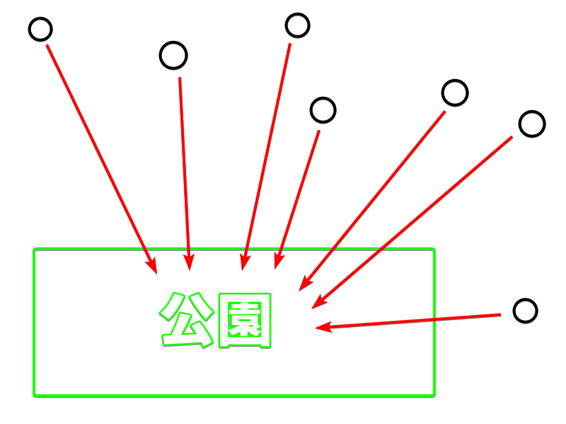
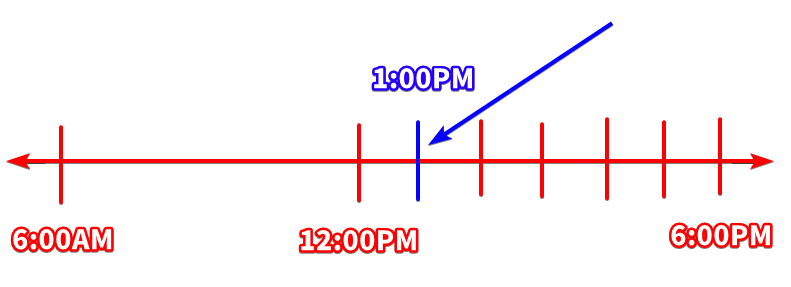
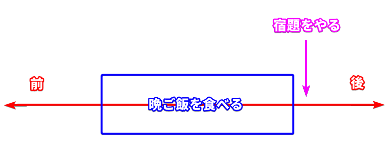

# Particles

!!! tip "Author's note"
    Particles can be very confusing if you're not used to them. If there's any grammar that I don't expect you to fully understand it before moving onto the next one, this will be it. You should expect to come back and revisit this page often if you encounter a particle in your input (reading and listening) that you don't understand. That being said, this page does not have all the particles, nor does it have all the different functions of each particle. If you're at intermediat level, I suggest you to look up the particle on a monolingual dictionary.

## What are particles?
Let's use the following sentence to illustrate what a particle is:

Note: 「魚」 means "fish"  
「食べる」 means "eat"

- 魚 ==_== 食べる。

What is that sentence saying in English?

- Fish eats (something)
- (Something) eats fish

The answer is: it can be either one. So how do we know if "fish" is doing the "eating", or if "fish" is "being eaten"? This is where particles come into play. Particles are one or more hiragana characters that attach to the end of a word to define the grammatical function of that word in the sentence. In other words, a particle defines the "role" of a word in a sentence. Using the correct particle is very important because the meaning of a sentence can completely change just by changing the particle. 

We can finally put the knowledge from "Sentence Structures" into use. As a reminder, this is how we visualize our train analogy:

<table>
  <tr>
    <th colspan="2" style="text-align: center; border: 1px solid black">Topic 🏳️</th>
  </tr>
  <tr>
    <th style="text-align: center; border: 1px solid black">Main wagon "A"</th>
    <th style="text-align: center; border: 1px solid black">Engine "B"</th>
  </tr>
  <tr>
    <td style="text-align: center; border: 1px solid black"> - </td>
    <td style="text-align: center; border: 1px solid black"> - </td>
  </tr>
</table>

Let's begin learning some basic particles. Each particle has more than one usage/function. We will only learn a few basic usage for each particle for now.

## Topic particles

If we follow the analogy of the train, then topic particles are the particles that go into the "Topic 🏳️" part of the train. We will learn what this actually means when we learn about the particles themselves. There are two topics particles in Japanese: 「は」 and 「も」.

### 「は」

**「は」 is the topic particle**. To follow the analogy of our hypothetical train, **「は」is like a flag**. Why do we depict it as a flag? Because that's what it does. **It flags something as the topic of the sentence**. While the kana 「は」 is normally pronounced as 「は」, it is pronounced as 「わ」 when it is being used as the topic particle.

Let's look at an example sentence:

- 私は日本人だ

literally means:

- "As for me, (I) am Japanese" 
- "Speaking of me, (I) am Japanese"
- "In relation to me, (I) am Japanese" 

To visualize this, here's how it looks by using our train analogy:

<table>
  <tr>
    <th colspan="2" style="text-align: center">私は 🏳️</th>
  </tr>
  <tr>
    <th style="text-align: center">Main wagon "A"</th>
    <th style="text-align: center">Engine "B"</th>
  </tr>
  <tr>
    <td style="text-align: center">Ø が</td>
    <td style="text-align: center">日本人だ</td>
  </tr>
</table>

The full sentence in Japanese is 「私はØが日本人だ」. The zero pronoun (Ø) means "I" in this context (we learned this in the "Invisible main wagon "A" section). We marked 「私」 as the topic of our sentence by attaching the 「は」 particle to it. That same sentence in English would be:

<table>
  <tr>
    <th colspan="2" style="text-align: center">As for me 🏳️</th>
  </tr>
  <tr>
    <th style="text-align: center">Main wagon "A"</th>
    <th style="text-align: center">Engine "B"</th>
  </tr>
  <tr>
    <td style="text-align: center">I</td>
    <td style="text-align: center">am Japanese</td>
  </tr>
</table>

Now, you might ask yourself, "Isn't this overcomplicated? Can't we just pretend that 「私は」 is the main wagon "A" and translate the sentence as simply "I am Japanese?". The answer is **NO**. Although it works in this example sentence, it doesn't work in every case and that's why you shouldn't do it. When you run into sentences where "pretending that 「は」 is the main wagon" doesn't work, now you suddenly can't understand the sentence and you get lost.

To illustrate why you shouldn't pretend that the topic is the main wagon, let's take a look at the following sentence:  

*A group of friends are dining at a restaurant, and one person tells the waiter:*

- 私は魚だ

The joke is that the person has literally said "I am a fish". After all, if 「私は日本人だ」 means "I am Japanese", then 「私は魚だ」 must mean "I am a fish", right? That makes perfect sense, except that 「私は日本人だ」 doesn't actually mean "I am Japanese"; it means "As for me, (I) am Japanese". This is why it is important to not pretend that the "topic" is the main wagon "A". If we look at the train for 「私は日本人だ」:

<table>
  <tr>
    <th colspan="2" style="text-align: center">私は 🏳️</th>
  </tr>
  <tr>
    <th style="text-align: center">Main wagon "A"</th>
    <th style="text-align: center">Engine "B"</th>
  </tr>
  <tr>
    <td style="text-align: center">Ø が</td>
    <td style="text-align: center">日本人だ</td>
  </tr>
</table>

Ø can be assumed to be "I" based on context. However, in the case of 「私は魚だ」, the train looks like this:

<table>
  <tr>
    <th colspan="2" style="text-align: center">私は 🏳️</th>
  </tr>
  <tr>
    <th style="text-align: center">Main wagon "A"</th>
    <th style="text-align: center">Engine "B"</th>
  </tr>
  <tr>
    <td style="text-align: center">Ø が</td>
    <td style="text-align: center">魚だ</td>
  </tr>
</table>

where Ø means "it". What is "it"? "It" is the thing we are talking about: *what we are eating for dinner*. So, the sentence 「私は魚だ」 actually means:

- As for me, (it) is fish.

Or in normal English, we would say "I'll have the fish" or "I'll go with the fish".

To better understand what the topic particle **does** and what it **doesn't do**, let's look at another example sentence without 「は」.

Note: 「投げる」(なげる) means "throw"  
「ボール」 means "ball"

- 私がボールをさくらに投げる

Main wagon "A" | Wagon 「を」 | Wagon 「に」 | Engine "B"
:---: | :---: | :---: | :---:
私が | ボールを | さくらに | 投げる

This sentence means "I throw a ball at Sakura" or "I throw a ball to Sakura". All three particles in this sentence -「が」,「を」and 「に」 tell us the "role" of each word that it's attached to. 「が」 tells us *who* threw the ball, 「を」 tells us *what* was thrown, 「に」 tells us *to whom* the ball was thrown.

???+ note
    We will learn more about 「が」,「を」and 「に」 in a later section.

Now that we've seen how those particles can affect the "role" of a word, let's introduce the 「は」 particle into the sentence to see what a topic particle does.

- 私はさくらにボールを投げる

<table>
  <tr>
    <th colspan="4" style="text-align: center">私は 🏳️</th>
  </tr>
  <tr>
    <th style="text-align: center">Main wagon "A"</th>
    <th style="text-align: center">Wagon 「に」</th>
    <th style="text-align: center">Wagon 「を」</th>
    <th style="text-align: center">Engine "B"</th>
  </tr>
  <tr>
    <td style="text-align: center">Ø が</td>
    <td style="text-align: center">さくらに</td>
    <td style="text-align: center">ボールを</td>
    <td style="text-align: center">投げる</td>
  </tr>
</table>

This means "As for me, (I) throw the ball at Sakura".

We can give the flag to the "ball" instead:

- ボールは私がさくらに投げる

<table>
  <tr>
    <th colspan="4" style="text-align: center">ボールは 🏳️</th>
  </tr>
  <tr>
    <th style="text-align: center">Main wagon "A"</th>
    <th style="text-align: center">Wagon 「に」</th>
    <th style="text-align: center">Wagon 「を」</th>
    <th style="text-align: center">Engine "B"</th>
  </tr>
  <tr>
    <td style="text-align: center">私が</td>
    <td style="text-align: center">さくらに</td>
    <td style="text-align: center">Ø を</td>
    <td style="text-align: center">投げる</td>
  </tr>
</table>

This means "As for the ball, I throw (it) at Sakura". 

Notice how the logical meaning of the sentence doesn't change at all. Let us remind ourselves of the relationship between Topic-Comment and Structure-Object.

<table style="border: 1px solid black">
  <tr>
    <th rowspan="2" style="text-align: center; vertical-align: middle; border: 1px solid black">Topic</td>
    <th colspan="4" style="text-align: center; border: 1px solid black">Comment</td>
  </tr>
  <tr>
    <th style="text-align: center; border: 1px solid black">Main wagon</th>
    <th style="text-align: center; border: 1px solid black">「に」</th>
    <th style="text-align: center; border: 1px solid black">「を」</th>
    <th style="text-align: center; border: 1px solid black">Engine "B"</th>
  </tr>
  <tr>
    <td style="text-align: center; border: 1px solid black">ボールは</td>
    <td style="text-align: center; border: 1px solid black">私が</td>
    <td style="text-align: center; border: 1px solid black">さくらに</td>
    <td style="text-align: center; border: 1px solid black">Ø を</td>
    <td style="text-align: center; border: 1px solid black">投げる</td>
  </tr>
</table>

The "Topic" simply brings something up as... well, the topic of the conversation. It doesn't tell us anything *about* it. That's what the "Comment" is there for. The "Comment" is what tells us logical information. This is why the "Topic" doesn't change the logical meaning of the sentence.

**It is important to note that giving the 「は」 flag to a word can change the nuance of the sentence every so slightly**, but we don't have to worry about it for now. We will have a deeper look at these nuances in a later section.

### 「も」

**「も」 is the inclusive topic particle**. It is essentially the topic particle with the additional meaning of "also". Basically, it can introduce another topic in addition to the current topic. Its usage is best explained by an example.

- 私 ==も== 学生だ。

<table>
  <tr>
    <th colspan="2" style="text-align: center">私も 🏳️</th>
  </tr>
  <tr>
    <th style="text-align: center">Main wagon "A"</th>
    <th style="text-align: center">Engine "B"</th>
  </tr>
  <tr>
    <td style="text-align: center">Ø が</td>
    <td style="text-align: center">学生だ</td>
  </tr>
</table>

*As for me __also__, (I) am student.*

Let's look at 「も」 in dialogues:

**Example 1**

ボブ： アリスは学⽣？  
アリス： うん、トム =も== 学⽣。

*Literal translation*  
Bob: As for Alice, are (you) a student?  
Alice: Yes. As for Tom **also**, (he) is a student.

*Normal English*  
Bob: Are you a student?  
Alice: Yeah, Tom is **also** student.

**The inclusion of 「も」 must be consistent with the answer**. It would not make sense to say, "I am a student, and Tom is also not a student." Instead, use the 「は」 particle to make a break from the inclusion, i.e. change the topic. Let's look at the next example.

**Example 2**

ボブ： アリスは学⽣？  
アリス： うん、でもトムは学⽣じゃない。

*Literal translation*  
Bob: As for Alice, are (you) a student?  
Alice: Yes, but, as for Tom, (he) is not.

*Normal English*  
Bob: Are you a student?  
Alice: Yeah, but Tom is not.

If the inclusion *is* consistent with the answer, then we can use 「も」.

**Example 3**

ボブ：アリスは学⽣？  
アリス：ううん、トム ==も==学⽣じゃない。

*Literal trasnlation*  
Bob: As for Alice, are (you) a student?  
Alice: No, as for Tom **also**, (he) is not a student.

*Normal English*  
Bob: Are you a student?  
Alice: No, Tom is **also** not student.

---

Sometimes the "comment" of the new topic doesn't have to be "consistent" with the comment of the old topic, as long as the comments are not contradicting each other.

**Example 1**

Person A: （私は）==君のことが好きだ==  
Person B: 私も ==（君のことが）好きだ==

*Literal translation*  
Person A: (As for me), ==you are liked.==  
Person B: As for me also, ==(you) are liked.==

*Normal English*  
Person A: I like ==you==.  
Person B: I like ==you== too.

Notice that when person A says "you", it's referring to person B. But when person B says "you", it's referring to person A. Even though these two comments are not referring to the same person ーtherefore they're not "consistent"ー, they don't contradict each other.

**Example 2**

Suppose you were working on something on a Sunday night. There's someone who is staying up with you to help you finish your task. Then you realize that it's already midnight and you want to let the other person know that it's OK to go to sleep now. You could say to the other person:

- もう寝ていいよ。疲れたでしょう？明日は月曜日だから{++仕事 ==も== あるし。++}  
Literally: *Sleep is OK. Tired, right? Monday is tomorrow so {++there is ==also== work.++}*  

Or in normal English:

*You can go to sleep now. You must be tired, right? It's Monday tomorrow so you also have to work.*

The comment at the end "there is also work" isn't necessarily "consistent" with what you said previously, in the sense that "There is X, there is Y, there is also work". However, saying 「も」 here is simply "adding one more reason why you should go to sleep now". The previous reason was "you must be tired, right?".

## Case marking particles

Case marking particles (「格助詞」 in Japanese) are particles that mark the role of a word in a sentence. We will take a look at a few of them here.

### 「が」

**「が」 is the identifier particle**. What do I mean by that? Let's say I want to ask "Who is the student?". If I use the topic particle 「は」, the question would become 

Note: 「誰」（だれ） means "who"

- 誰は学生？

*"As for who, is (it) a student?"*

and that doesn't make any sense because "who" is not an actual person. This is where 「が」 comes into play. We already learned from the "*Main wagon "A"*" section that 「が」 attaches to a word to mark it as the main wagon "A". 

Suppose the student is "Alice". Then, we can say "Alice is student" like so:

- アリスが学生だ

Main wagon "A" | Engine "B"
:---: | :---:
アリスが | 学生だ

But if we are asking the question "Who is the student?", that means we don't know what is inside the main carriage "A". It means that the main wagon "A" is unknown. To illustrate:

Main wagon "A" | Engine "B"
:---: | :---:
❓ が | 学生

So, all we need to do is put 「誰」 in the main wagon. The question now becomes:

- 誰が学生？

*Who is student?*

Makes sense right? The 「が」 particle marks the main wagon "A". It marks the subject. It marks the doer. It tells us *who*/*what* is doing/being "B". But didn't we say earlier that the particle 「が」 is the **identifier particle**?. That's right. The particle 「が」 marks the main wagon "A", therefore it tells us *who*/*what* is doing/being "B". It **identifies** "A" for us.

Let's look at an example:

- ボブ：誰が学⽣？  
*Bob: Who is the one that is student?*  

- アリス：ジョンが学⽣。  
*Alice: John is the one that is student*

Bob wants to identify *who* -among all the possible candidates- is a student. Alice responds that *John* is the one. Notice that Alice could also have answered with the topic particle to indicate that, "Speaking of John", she knows that he is **a** student (maybe not **the** student that Bob is looking for). Let's illustrate this difference again. If Bob asks:

- ボブ：誰が学⽣？  
*Bob: Who is the one that is student?* 

Then Alice can answer in two ways:

- アリス：ジョンが学⽣。  
*Alice: John is the one that is student.*

- アリス：ジョンは学⽣。  
*Alice: As for John, (he) is student. (As for other people, they could be students too.*

It is helpful to translate 「は」 as "as for...; about...; speaking of...; in relation to..." and 「が」 as "the one; the thing" to illustrate the difference.

Let's look at one more example:

1. 私は学⽣。  
*As for me, (I am) student.*

2. 私が学⽣。  
*I (am) the one (that is) student.*

The 「は」 and 「が」 particles are actually quite different if we use the train analogy to illustrate the sentence. 

<table>
  <tr>
    <th colspan="2" style="text-align: center">私は 🏳️</th>
  </tr>
  <tr>
    <th style="text-align: center">Main wagon "A"</th>
    <th style="text-align: center">Engine "B"</th>
  </tr>
  <tr>
    <td style="text-align: center">Ø が</td>
    <td style="text-align: center">学生だ</td>
  </tr>
</table>

The 「が」 particle identifies a specific entity as *the* thing while the 「は」 particle is used only to bring up a new topic of conversation. This is why, in longer sentences, it is common to separate the topic with commas to remove ambiguity about which part of the sentence the topic applies to.

### 「を」

The particle 「を」 has many functions. We'll look at a few functions below. The kana 「を」 , while technically pronounced as 「を」, essentially sounds like 「お」 in real speech. 

**Function 1: Marks the Direct Object of a verb**

This is probably the easiest function to understand by simply looking at a few example sentences.

- ⿂を⾷べる。  
*Eat fish*

Main wagon "A" | Wagon 「を」 | Engine "B"
:---: | :---: | :---:
Ø | ⿂を | ⾷べる

Some more examples:

- 石を投げる。  
*Throw rocks*

- 鍵を探す。  
*Find keys*

- リンゴの皮を剥く。  
*Peel apple's skin*

- 庭を掃く。  
*Sweep garden.* / *Sweep yard.*

- 黒板を消す。  
*Erase blackboard*

- 黒板の字を消す。  
*Erase blackboard's words.* (Erase what's written on the blackboard)

- 字を書く。  
*Write words.*

- パンを焼く。  
*Bake bread*

- 勝利を目指す。  
*Aim victory*

- お金を費やす。  
*Spend money*

- 本を読む。  
*Read book*

- 日本語を勉強する。  
*Study Japanese*

- アニメを見る。  
*Watch anime*

- ケーキを作る。  
*Make cake*

- パソコンを使う。  
*Use computer*

- 友達を殴る。  
*Punch friend*

- 顔を撫でる。  
*Caress face*

- 家を建てる。  
*Build house*

- 穴を掘る。  
*Dig hole*

A *direct object* of a verb, is a word that the verb is acting on. It indicates the object of the action. If I say "I eat fish", you can ask "what are you eating?", and my answer would be "fish". The verb "eat" is acting on the word "fish".

**Function 2: Marks the path/place of motion verbs**

Unlike the direct object in English, places can also be the direct object of certain motion verbs in Japanese. However, as you can see by the next examples, it often translates to something different in English due to the slight difference of the concept of direct object.

- 街を歩く。(Lit: Walk street)  
*Walk through street.* 

- ⾼速道路を⾛る。(Lit: Run expressway)  
*Run through expressway.* 

- 空を飛ぶ。(Lit: Fly sky)  
*Fly through the sky.*

- 横断歩道を渡る。(Lit: Cross pedestrian walk)  
*Cross over crosswalk.* / *Cross over pedestrian crossing.* / *Cross over pedestrian walk.*

- 山道を登る。(Lit: Climb mountain path)  
*Climb up mountain path.*

- 階段を降りる。(Lit: Descend stairs)  
*Go down the stairs.*

- 我が道を行く。(Lit: Go my path)  
*Go my own way.* / *Follow my own path.*

**Function 3: Marks the starting point of a motion verb**

- 電車を降りる。  
*Get off the train.*

- 家を出る。  
*Leave the house.* 

- 故国を離れる。  
*Separate from homeland.* / *Go away from homeland.*

- 脇道を入る。  
*Enter side road*

**Function 4: Marks the time of time-passing verbs**

- ６時を過ぎる。  
*Pass 6 o'clock*

- 時代を生き抜く。  
*Live through an era*

- 不惑の年を越える。  
*Go past one's prime time*

- 不遇の一生を送る。  
*Spend a lifetime of misfortune*

### 「に」

The particle 「に」 also has many functions. I like to think of the particle 「に」 as an **arrow**. The reason why I think of it as an arrow will become more apparent when we look at the contrast between 「に」 and other particles in a later section.

**Function 1: Marks location of existential verbs**

- 日本に住む。  
*Live in Japan*

- 私が家にいる。  
*I am at home*

- 私の中に君がいる。  
*You are inside me* / *You exist within me*

- 机の上に本がある。(Lit: Book exist above desk)  
*There is a book on the desk*

- 枝先に芽が出る。  
*Sprout appears in branch*

**Funcion 2: Marks temporal locations**

Can be used for "specific point in time"

- 1時に食べる。  
*Eat at one o'clock*

- 3年生の3月にある就活のイベント。  
*Job hunting event in March of junior year*

- 休み時間に本を読む。  
*Read a book during recess*

Can be used for "duration of time"

- 1週間に2回シャワーする。  
*Shower twice a week*

- 2年間に1回引っ越しする。  
*Move houses every two year*

???+ warning
    While we can use 「に」 for specific points in time, such as:
    
    - 1 o'clock (一時)
    - March (三月)
    - 15th (day of month) (十五日)
    
    and also for duration of time, such as:

    - 1 week (一週間)
    - 3 year (三年間)
    - 2 months (二ヶ月)

    we **can NOT use 「に」 for relative time**, such as:

    - tomorrow (明日)
    - yesterday (昨日)
    - today (今日)
    - last week (先週)
    - next month (来月)
    - this morning (今朝)
    - this evening (今晩)
    - yesterday's evening (昨夜)
    - present (現在)
    - future (将来)
    - recently (最近)
    - etc...

    However, words that don't describe an exact point in time, such as:

    - noon (昼)
    - midnight (深夜)
    - dawn (明け方)
    - sunset/dusk (暮れ)
    - around (頃)
    - before (前)
    - after (後)
    - autumn (秋)

    can be said with or without 「に」.

**Function 3: Marks the destination of a verb**

- 学校に行く。    
*Go to school*

- 家に帰る。  
*Go back home*

- 山に登る。  
*Climb up mountain*

- 電車に乗る。
*Get on train*

- 駅に着く。  
*Arrived at station*

- 壁に地図を貼る。  
*Stick a map on the wall*

**Function 4: Marks the Indirect Object (recipient of action)**

- 友達に花をあげる。  
*Give flowers to friend*

- さくらにボールを投げる。  
*Throw ball at/to Sakura*

- 友達に会う。  
*Meet friend*

- 神に誓う。  
*Swear to God*

- 友達に話す。  
*Talk to friend*

- 家に電話する。  
*Make a phone call to home*

- 弟に数学を教える。  
*Teach math to little brother*

- 母に甘える。  
*To indulge mom* / *To spoil mom*

- 馬に傷をつける。(Lit: Attach wound to horse)  
*Hurt a horse* / *Injure a horse* / *Wound a horse*

**Function 5: Marks the result of a change**

- 医者になる。  
*Become doctor*

- 信号が赤に変わる。  
*Signal turns red*

- 新しい車に変える。  
*Change to new char*

- 王様に扮する。  
*Disguise as a king* / *Play the role of a king*

**Function 6: Marks the purpose or intention**

- 映画を見に行く。  
*Go see a movie*

- 本を買いに行く。  
*Go buy a book*

- 昼は食事に帰る。  
*As for lunch, go back home to eat*

- 君を迎えに行く。  
*Go to pick you up* / *Go to welcome you*

**Function 7: Marks the object used for comparison**

- 私が母に似ている。  
*I resemble mother*

- アリスはボブに等しい。  
*Alice is no different to Bob*

- 海に近い。  
*Close to sea* / *Close to beach*

- このマンションは駅に近い。  
*This apartment is close to the station*

- 無関心は賛成したのに等しい。  
*Indifference is the same as approval*  
(Similar to the English phrase "to be silent is to be complicit") 

### 「へ」

The particle 「へ」 also has many functions that resembles a few functions from the particle 「に」. 「へ」 is normally pronounced as 「へ」, when it is being used as a particle, it is always pronounced as 「え」. 

**Function 1: Marks the direction of a verb**

- 南へ向かう。  
*Face towards south*

- 勝ちへ向かう。  
*Go towards victory*

- 部屋へ来る。  
*Come towards room*

- ボブは⽇本へ⾏く。  
*Bob goes to Japan.*

- 北へ飛ぶ。  
*Fly towards north*

- 海の方へ飛んでいく。  
*Fly towards the sea*

- 家へ帰る。  
*Go back toward house.*

**Function 2: Marks the destination of a verb**

- 日本へようこそ！  
*Welcome to Japan*

- ここへ荷物を置く。  
*Place the luggage here*

- 荷物をロッカーへ入れる。  
*Put the luggage inside the locker*

- 押入れへしまう。  
*Put away in the closet*

- こちらへ住んで５年になる。(Lit: Live here and become 5 years)  
*It will be 5 years since I have (moved and) lived here*

**Function 3: Marks the Indirect Object (recipient of action)**

- 友達へ電話する。  
*Make a phone call to friend*

- 先生へ伝える。  
*Tell the teacher* / *Repor to teacher* / *Convey to teacher*

- 母への手紙。  
*Letter to mother* / *Letter for mother*

- 君への愛。  
*Love towards you* / *Love for you*

- 妻へ贈る。  
*Give (a gift) to wife*

### 「で」

The particle 「で」 also has many functions, and can be summarized as the **contextual/boundary** particle.

**Function 1: Marks the place where an action takes place**

- 映画館で映画を⾒た。  
*Saw a movie at the movie theater* 

- レストランで昼ご飯を⾷べた。  
*Ate lunch at restaurant*

- 図書館で勉強する。  
*Study at the library*

- 庭で遊ぶ。  
*Play in the garden*

- 渋谷で時計を買った。  
*Bought a clock in Shibuya*

**Function 2: Marks the instrument/material/method of which an action is performed**

- バスで帰る。  
*Go home by bus*

- 車で行く。  
*Go by car*

- 投票で決める。  
*Decide by poll* / *Decide through a poll*

- 愛でご飯を作る。  
*Make food with love*

- お箸でお寿司を食べる。  
*Eat sushi with chopsticks*  

- 鉛筆で書く。  
*Write with pencil*

- 米で酒を作る。  
*Make Sake with rice* / *Make Sake out of rice*

- ラジオで聞いた話。  
*Story heard from a radio*

**Function 3: Marks the cause/reason**

- 熱で学校を休む。  
*Miss school due to fever*

- 寒さで震える。  
*Shiver with cold*

- 病気で休む。  
*Be absent due to illness*

- 受験準備で忙しい。  
*Busy due to preparations for entrance examination*

- 心臓発作で入院する。  
*Hospitalize due to heart attack*

**Function 4: Marks the condition/state/circumstance of an action**

- 急ぎ足で歩く。  
*Walk with fast pace*

- 笑顔で答える。  
*Reply with a smiling face*

- 裸足で出かける。  
*Go out barefoot*

- 土足で上がる。  
*Come inside (the house) with shoes on*

- 全力で問題に取り組む。  
*Tackle a problem with all your might*

- フルスピードで走った。  
*Ran at full speed*

- 千円で釣りをください。  
*Please give me my change in bills of 1000 yen*

**Function 5: Marks the boundary/limit of a range/scope/extent/quantity**

- 申込みは明日で締め切る。  
*The applications will close by tomorrow*  
(The time limit is "tomorrow")

- 三日で仕上げる。  
*Finish in three days*  
(The time limit is "three days")

- みんなで行く。  
*Go with everyone*    
(The boundary of the number of people is "everyone")

- 一人で泣いた。  
*Cried alone* / *Cried by himself/herself*    
(The boundary of the number of people is "alone")

- 世界で一番高い山。  
*Tallest mountain in the world*  
(The boundary of which this "tallest mountain" is true, is the "world")

- 全国で一番美味しいラーメン。  
*Most delicious ramen in the nation/country*    
(The boundary of which this "most delicious ramen" is true, is the "country")

- 若い人の間で人気がある。  
*Be popular among young people*  
(The boundary of which "being popular" is true, is only "among young people")

- 全部で百円だ。  
*The total is 100 yen*  
(The boundary of which the "100 yen" is referring to, is "all the items together" aka "the total")

- 三つで百円。  
*100 yen for 3 items*  
(The boundary of which the "100 yen" is referring to, is "3 items")

### 「の」

The particle 「の」 has many functions/usages, one of which we already learned in the section "[Describing a noun using another noun](description-inflection.md#using-a-noun)". Let's learn about some more usages in this section.

**Function 1: Replacement or omission of noun**

The noun that is being described can be omitted or replaced by 「の」 if the context clearly indicates what is being omitted.

Let's briefly refresh our memory of how to describe a noun:

Using a verb:

- ==壊れた== {++パソコン++}  
{++Computer++} ==that broke==

Using an adjective:

- ==新しい== {++シャツ++}  
==New== {++shirt++}

- ==簡単な== {++試験++}  
==Easy== {++exam++}

Using another noun

- ==大学== の{++学生++}  
==College== {++student++}

The words highlighted in {++green++} are the nouns that are being described. These words can be omitted or replaced by 「の」 if the context clearly indicates what is being omitted.

Let's look at a few examples.

???+ example "Examples of replacement"

    If the noun is being described by a verb or an adjective, we replace the noun with 「の」

    **Example 1: verb**

    - 勝った{++人++}は君じゃなくて私だよ。  
    *The {++person++} who won is not you, it's me*

    After replacing 「人」 with 「の」:

    - 勝った{++の++}は君じゃなくて私だよ。  
    *The {++one++} who won is not you, it's me*

    **Example 2: i-adjective**

    - Person A: パソコン壊れた？  
    Did your computer break?

    - Person B: うん、でももう新しい{++パソコン++}を買った。  
    Yeah, but I bought a new {++computer++} already.

    After replacing 「パソコン」 with 「の」:

    - Person A: パソコン壊れた？  
    Did your computer break?

    - Person B: うん、でももう新しい{++の++}を買った。  
    Yeah, but I bought a new {++one++} already.

    **Example 3: na-adjective**

    - Person A: 大事なことは何を言ってるかじゃなくて、言い方だよ。  
    The important thing is not what you say, but how you say it

    - Person B: 私も大事な{++こと++}は言い方だと思う。  
    I also think that the important {++thing++} is how you say it

    After replacing 「こと」 with 「の」：

    - Person A: 大事なことは何を言ってるかじゃなくて、言い方だよ。  
    The important thing is not what you say, but how you say it

    - Person B: 私も大事な{++の++}は言い方だと思う。  
    I also think that the important {++thing++} is how you say it

    ???+ warning "Pay attention to 「な」"
        Notice that 「大事 ==な== こと」 changes to 「大事 ==な== の」. The 「な」 cannot be omitted. After all the thing we're omitting/replacing is only the noun itself. This applies for all na-adjectives.

???+ example "Examples of omission"
    If the noun is being described by another noun (which means there is already a 「の」 linking them), we simply omit the noun.

    **Example 1:**

    - Person A: そのシャツは誰の{++シャツ++}？  
    As for that shirt, whose {++shirt++} is it?

    - Person B: ボブの{++シャツ++}だ。  
    It is Bob's {++shirt++}.

    After omitting 「シャツ」:

    - Person A: そのシャツは誰の？  
    As for that shirt, whose is it?

    - Person B: ボブのだ。  
    It is Bob's.

    **Example 2**

    - Person A: ケーキ食べてみた？  
    Did you try the cakes?

    - Person B: うん。イチゴの{++ケーキ++}は美味しかったけど、チョコの{++ケーキ++}はあんまり。  
    Yeah. The strawberry {++cake++} was delicious but the chocolate {++cake++} not so much.

    After omitting 「ケーキ」:

    - Person A: ケーキ食べてみた？  
    Did you try the cakes?

    - Person B: うん。イチゴのは美味しかったけど、チョコのはあんまり。  
    Yeah. The strawberry {++one++} was delicious but the chocolate {++one++} not so much.

**Function 2: Interchangeable with 「が」**

When 「の」 connects two nouns, and the second noun is being described by a verb, then 「の」 is interchangeable with 「が」.

Let's look at one example. I've highlighted {++the two nouns in green++}, and ==the verb in yellow==.

- {++妹++}の ==描いた== {++絵++}  
*{++Picture++} that my {++little sister++} ==drew==*

First noun | の | Second noun
:---: | :---: | :---: 
{++妹++} | の | ==描いた== {++絵++}

Here, 「妹」 is the first noun, 「絵」 is the second noun, and they are linked with the 「の」. The verb 「描いた」 is describing the second noun 「絵」. When we have this specific combination of 「noun + の + verb + noun」, this 「の」 is interchangeable with 「が」, like so:

- {++妹++}が ==描いた== {++絵++}  
*{++Picture++} that my {++little sister++} ==drew==*

First noun | が | Second noun 
:---: | :---: | :---: 
{++妹++} | が | ==描いた== {++絵++}

**More in-depth explanation**  
If we recall what we learned in "[A does B](a-and-b.md#verb-sentence)" type of sentences, 「妹が描いた」 is just that.

Main wagon "A" | Engine "B"
:---: | :---:
妹が | 描いた

*Little sister drew*

And if we recall what we learned in "[Describing a noun using a verb](description-inflection.md#using-a-verb)", we simply place the description before the noun:

- ==妹が描いた== {++絵++}  
*{++Picture++} ==that little sister drew==*

The entire sentence (highlighted in ==yellow==) is describing the noun (highlighted in {++green++}). In this specific way of describing a noun, the 「の」 inside the description itself can be interchanged to 「が」, and vice-versa.

Let's look at some more examples:

- 話の好きな{++人++}  
- 話が好きな{++人++}  
*{++People++} who like conversations*

- 音のない{++世界++}  
- 音がない{++世界++}  
*{++World++} where there is no sound*

- 夜のない{++世界++}  
- 夜がない{++世界++}  
*{++World++} where there is no night*

- 私の言ってる{++こと++}  
- 私が言ってる{++こと++}  
*{++Things++} that I am saying*

- 立場の違う{++二人++}
- 立場が違う{++二人++}  
*{++Two people++} who are in different situations*

Using 「の」 is often favored when the entire phrase is marked by the 「が」 as the subject of a bigger sentence. Let's look at the following sentence:

- 立場 ==の== 違う二人{++が++}残酷な世界の中ですごく美しく友情を育む。

Main wagon "A" | 「で」 | 「を」 |  Engine "B"
:--: | :---: | :---: | :---:
立場 ==の== 違う二人{++が++} | 残酷な世界の中で | すごく美しく友情を | 育む

The entire phrase 「立場の違う二人」 is theh subject of the sentence. In other words, the entire phrase 「立場の違う二人」 is marked by 「が」 as the main wagon "A". Although it is technically possible to change the sentence to:

- 立場 ==が== 違う二人{++が++}残酷な世界の中ですごく美しく友情を育む。

it is not encouraged to do so. By doing so, there will be two 「が」 in the bigger sentence, and it becomes harder to recognize *what* is the actual subject of the bigger sentence at hand.

## Contrasts

### 「は」 vs 「も」

We learned in the previously that:

???+ quote
    The inclusion of 「も」 must be consistent.

Let's see what we mean by "consistent" by comparing 「も」 to 「は」.

???+ info "The main difference between 「は」 and 「も」"
    - 「は」 changes the topic, and implies that the comment of the new topic is **different** from the comment of the old topic.

    - 「も」 also changes the topic, but it implies that the comment of the new topic is the **same** as the comment of the old topic.

This is why 「も」 can only be used when the comment is "consistent" with the previous comment. Furthermore, the other function of the particle 「は」 is to be the **contrastive** topic particle ーas opposed to the particle 「も」 which is the **inclusive** topic particleー precisely because the comment on the new topic is different from the comment of the previous topic.

Suppose we have a first topic "Alice", and the comment about her is "is student":

- アリスは学生だ。  
*As for Alice, is student.*

Then, we introduce a second topic "Tom", and the comment about him is "is student":

- トムは学生だ。  
*As for Tom, is student.*

Then, we **can** use 「も」 in the second topic, because the *comment* of both topics are the same.

- アリスは学生だ。
- トム ==も== 学生だ。

???+ warning "Be careful how you use 「は」 and 「も」 in certain phrases"

    For example, the following phrase is often said when greeting someone during New Year:

    Note: 「今年」（ことし）＝ this year

    - 「今年**も**よろしくお願いします。」

    A very rough translation of this phrase in English can be 

    - "Once again this year, please be good to me"
    - "Once again this year, I'm looking forward to working with you" 

    Let us remind ourselves that the particle 「は」:

    > implies that the comment of the new topic is **different** from the comment of the old topic

    So, if we say 「今年は。。。」, we're implying that "this year is different from previous years". In other words, it implies that your relationship with that person in previous years was not a successful one. It implies that the relationship in previous years was not pleasant for you. You're essentially saying, "This year, **as opposed to previous years**, I'll be looking forward to working with you".

    This is why the correct way of saying the phrase is 「今年**も**よろしくお願いします」 because you want to express "this year too".

To expand a little bit more on the **contrastive** property of the the particle 「は」, let's look at some examples:

**Example 1**

- ==イチゴは== あるけど、==バナナは== ない。  
Literally: *==As for strawberry==, there is, but ==as for banana==, there isn't*  
Normal English: *There is strawberry, but there's no banana*

**Example 2**

- ==君は== 知らないけど ==僕は== 知ってる。  
Literally: *==As for you==, (you) don't know, but ==as for me==, (I) know*  
Normal English: *You don't know but I do*

### 「は」 vs 「が」

!!! warning
    **I have been using 「が」 in a lot of example sentences so far, but that's NOT how Japanese people normally say things.**

We learned about the grammatical usage of 「は」 and 「が」: one is a flag, the other is the main wagon. However, it might still be confusing for some people. Unlike English, which is a very Subject-Object oriented language, **Japanese is a very Topic-Comment oriented language**. This is why you see 「は」 more often than 「が」 in a normal sentence like "A is B".

Let's see the difference between 「は」 and 「が」 again, but not from the perspective of grammar, but from the perspective of communication/conversation. *How do native speakers use those particles?* 

There are two ways you can look at the difference between these two particles.

???+ info "First way to look at the difference bewtween 「は」 and 「が」"

    - 「は」 talks about **something in general**.
    - 「が」 **singles something out**  to say "that is *the thing*".

Let's look at a few examples to understand these nuances.

**Example 1**:

Grammatically speaking, the following two sentences are correct.

Note: 「これ」＝ this  
「携帯」（けいたい）＝ cellphone

- これ ==は== 携帯だ。  
*As for this, (it) is cellphone.*

- これ ==が== 携帯だ。  
*This is the thing that is cellphone.*

Both sentences are generally translated the same way into normal English as: "This is a cellphone".

But the one that is used more often is 「これは携帯だ」. You only use 「が」 when you one to single something/someone out. When you want to say that **something ーas opposed to other thingsー is/does X**, you use 「が」:

- Something ==が== is X
- Something ==が== does X

**Example 2**:

- ⭕ 誰 ==が== 学⽣？
- ❌ 誰 ==は== 学⽣？

The question is asking "Who is a student?".

The first question 「誰が学⽣？」 is grammatically correct, while the second question 「誰は学⽣？」 is not. In this example, there are many people who could be a student, and you want to know *who* is a student among them; you want to single out one person. You are comparing all those candidates to each other, and then choosing one person and saying "*that* is the student". Comparing in this manner is the only way 「が」 is used.

**Example 3**:

If you want to say "I am a medical student", normally you would say:

Note: 「医学生」（いがくせい）＝ medical student

- 私 ==は== 医学生だ。

but if you say this instead:

- 私 ==が== 医学生だ。

you will end up implying *"He's not a medical student. She's also not a medical student. Then who is the medical student here? That's right. __I am__ the medical student. I am differrent from the other students"*. You are essentially comparing yourself to the other students and saying "**I am** the medical student". You will end up putting too much emphasis on 「私」 and you could sound rude depending on the situation you're in.

**Example 4**:

This is also why during self-introduction, you should say:

- 私 ==は== さくらだ。  
(This still sounds unnatural and disrespectful, but for other reasons that we haven't looked at yet.)

However, if you say this during self-introduction:

- 私 ==が== さくらだ。

you will end up sounding like "I am **the** Sakura. I am the Sakura that **everyone knows about**. That's **me**".

**Example 5**:

In a certain way, 「は」 works like the English word "*the*", but only in this one respect, that it can't mark **new information**. To illustrate this "old information" vs "new information" concept, let's look at some examples of the English word "the". If we say:

- I fed the iguana.

unless people already know about this iguana, their immediate thought is going to be "What iguana? You never talked about any iguana before. What do you mean *the* iguana?". But if we say:

- I fed an iguana.

that's alright. However, you can in fact say:

- I fed the dog.

without anybody knowing that you even had a dog, because it's very *normal and natural* for a person to have a dog. It not necessary to "introduce" the dog into the conversation first to then say "the dog". But if I said "I fed the iguana", that's a conversation stopper, isn't it? If I don't introduce the iguana first, nobody is just going to assume that I have an iguana at home as pet, because it's not common. So, while we say "new information" vs "old information", it's actually a bit more subtler than that. It's actually "new, important and relevant information" vs "old information or information that can be commonly agreed on".

**Example 6**:

Another example of "old information" vs "new information":

Note: 「昔々」（むかしむかし）＝ once upon a time / long time ago  
「姫」（ひめ）＝ princess  
「美しい」（うつくしい）＝ beautiful

- 「昔々姫 ==が== いた。姫 ==は== 美しかった。」  
*Once upon a time, there was __a__ princess. __The__ princess was beautiful.*

Notice that in the first sentence 「が」 was used, and in the second sentence 「は」 was used. But didn't we just learn that 「が」 is used for comparison? So who are we comparing 「姫」 to? We are essentially saying: 

*"Once upon a time, there was a __princess__. Not a prince, not a queen, not a farmer, but a princess. The princess is the focus of the story".*

"Princess" is someone we didn't know yet. "Princess" is "new information". We were introducing her for the first time in the story. After introducing the princess, we can now say 「姫**は**。。。」 as in "**The** princess..." because "princess" is now "old information". If we don't first introduce the princess in the first sentence and go straight to the second sentence "As for **the** princess, ...", you as the reader might wonder "*As for the princess? What princess? Which princess are we talking about specifically?*".

**Example 7**:

「が」 can also mark particularities as opposed to generalities. For example, if we say:

- 花 ==は== きれいだ

it's likely that we're saying 

- Flowers (in general) are pretty. 

But if we say:

- 花 ==が== きれいだ

we're stressing 「花」 as the subject. We're emphasizing 「花」 to mean:

- This flower/these flowers (in particular) is/are pretty.

**Example 8**:

Let's look at another example. Suppose you are with a friend who has never seen what a ramen looks like. There are three dishes in front of you two: sushi, curry rice, and ramen. When you point at the ramen to let your friend know that *that* is ramen, you can say:

- あれ ==が== ラーメン

Using 「が」 in this manner implies "*That dish* (sushi) is not ramen. *That dish* (curry rice) is also not ramen. *That dish* (ramen) is ramen". You are comparing and singling out the one dish that **is** ramen.

**Example 9**:

Another example that might not seem as straightforward to understand is this sentence:

- 私 ==が== 高校生の時サッカーが好きだった

This sentence roughly translates to "I liked playing soccer when I was in highschool". This sentence might look too complicated for someone who just started learning Japanese. But the point I want to make is that 「が」 was used in the sentence, instead of 「は」. Earlier, we learned that 「が」 is only used for comparison. So who are we comparing 「私」 to? We are comparing "myself" to "myself". More accurately, we are comparing the "present me" to the "past me" or "the highschool me".

**Example 10**:

This is why saying "I like you" in Japanese is always said as 

- 君 ==が== 好きだ

which translates literally to "You are liked". We want to express that "YOU are the one" that is liked; not person A, nor person B, but YOU. If we instead use 「は」 like so:

- 君 ==は== 好きだ

it will sound like we are saying "As for you, (you) are liked. As for other people, they are hated" (remember the contrastive property of 「は」), which is not what we were trying to convey/express.

???+ info "Second way to look at the difference bewtween 「は」 and 「が」"
    - 「は」 puts the emphasis on the sentence **after** it
    - 「が」 puts the emphasis on the sentence **before** it.
    
    This makes sense if we look at what we learned at the beginning of this section:
    > Japanese is a very Topic-Comment oriented language.

    which is why a sentences usually use 「は」. 

To illustrate this change of emphasis, let's look at the following 3 sentences:

Note: 「本」（ほん）＝ book  
（買う）（かう）＝ buy

1. 本を買った。
2. 私は本を買った。
3. 私が本を買った。

In the **first sentence**, it doesn't put any particular emphasis on anything; it's just saying, neutrally, "I bought a book". (Remember that in Japanese, omitting the main wagon "A" is allowed)

If we choose to stress "I" as the topic and say the **second sentence**, we're changing the topic to "I" and saying that "I bought a book". The particle 「は」, aside from marking something as the topic, it also implies that the "*comment*" on said topic is different from the comment on "old topics" or on "other topics" (we learned this in the section about 「は」 vs 「も」). In other words, we are implying:

"*__I__ bought a book. __You__ may have bought something else. __Other people__ may not have bought anything at all. __Other people__ may have also bought a book, but I don't know about it. All I know is that __I__ bought a book. *".

The second sentence is implicitly answering the question "**What did I do?**" The answer is "I *bought a book*".

Now, if we say the **third sentence**, we've now changed the emphasis. Under what circumstances do we say the third sentence? Suppose that people are looking at an empty bookshelf and wondering who bought the last book, and you say 「私**が**本を買った」. In other words, you're saying "**I am the one** who bought the book". We all know and see that the bookshelf is empty, so "buying the book" is "old information". People want to know the "new information"; people want to know **who** bought the book, which is why you should answer with 「私**が**本を買った」. 

While the second sentence is implicitly answering the question "What did I do?", the third sentence is implicitly answering the question "**Who bought the book?**" The answer is "*I am the one* who bought the book".

???+ note
    The last three examples sentences that we just looked at:

    1. 本を買った。
    2. 私は本を買った。
    3. 私が本を買った。

    in "full sentence" are actually :

    1. ØはØが本を買った。
    2. 私はØが本を買った。
    3. Øは私が本を買った。

    Japanese grammar allows you to omit the topic or the subject (main wagon "A") or both. In fact the only component needed to make a complete and proper sentence is the engine "B". This means that, when we choose to explicitly say the topic or the subject out loud, we do so because we want to say it with a certain nuance, or with a certain emphasis.

???+ info "The English equivalent of 「が」"
    Japanese is a topic-prominent language, and there is one particle for topic (「は」) and one for subject (「が」) . This allows Japanese speakers to emphasize either the topic or the subject, by simply using the corresponding particle.

    English, on the other hand, is subject-prominent language. On top of that, English doesn't use particles. In English, when we want to express "emphasis on the subject" the same way 「が」 does in Japanese, we would usually do it in these two ways:

    1. I am the one who bought the book.
    2. *I* bought the book.
    3. **I** bought the book.

    The first way is to explicitly say "I am the one who..." or "she is the one who..." or "they are the ones who..." or "this is the thing that...".

    The second way is to ーif it's written communicationー stylize the "I" with italics or with bold (or both). The equivalent of this in spoken speech is to say "I" louder or longer (or both).

    **On a related note**: If we want to retain as much nuances as possible when translating from Japanese into English, this is how we would probably do it:

    - 私は日本人だ。  
    *I am Japanese.*

    Notice that in Japanese, 「私」 is the **topic**. But in English, "I" is the **subject**. Now, let's look at the next sentence:

    - 私が日本人だ。  
    *I am the one who is Japanese.*

    Because normal English sentences is already subject-prominent, when we want to emphasize on the subject the same way 「が」 does in Japanese, we end up resorting to phrases like "the one" or "the thing".

???+ tip
    The difference between these two particles will become more apparent and easier to tell apart as you do more **immersion**.

### 「に」 vs 「を」

1. 山 ==に== 登る
2. 山 ==を== 登る

In the first sentence, 「に」 is being used to "mark the destination of a verb".  
In the second sentence, 「を」 is being used to "mark the path/place of motion verbs".  

The difference between these two sentences is:

1. 山 ==に== 登る  
The focus of this sentence is: the goal is the summit of the mountain.
2. 山 ==を== 登る  
The focus of this sentence is: we are climbing the uphills of the mountain. The summit may or may not be or goal.

The difference in focus makes sense if we look at the function of each particle. 「に」 is marking the destination of 「登る」. This is why I like to think of 「に」 as an arrow. In this case, 「に」 is an arrow that is pointing towards the summit. However, 「を」 is marking the path of 「登る」: the uphills. This means that the focus is on the action of climbing （登る） itself. In Japanese, it's more common to say 「～に登る」 instead of 「～を登る」.

### 「に」 vs 「へ」

If we revisit the functions that 「へ」 has, we will realize that two of 「へ」's functions can also be done by 「に」:

- Function 2: Marks the destination of a verb
- Function 3: Marks the Indirect Object (recipient of action)

However, there is one function that 「へ」 can do but 「に」 cannot:

- Function 1: Marks the direction of a verb

For this reason, 「へ」 is usually only used for this "function 1": to mark the direction of a verb. Let's look at an example:

1. 日本 ==に== 行く
2. 日本 ==へ== 行く

In the first sentence, we're saying 「日本」 is the final destination of 「行く」. This implies that after we arrive at 「日本」, we could be staying in there for a while. In the second sentence, we're saying 「日本」 is the direction of 「行く」. This implies that 「日本」 is not necessarily our final destination, and we could be going somewhere else after we arrive at 「日本」.

Let's look at another example:

1. 台風は北 ==に== 向かっている
2. 台風は北 ==へ== 向かっている

In the first example, we're implying the destination of the 「台風」. In the second sentence, we're implying the general direction of the 「台風」. In the context of alarming citizens of where the 「台風」is headed towards, it is more natural to say the second sentence.

### 「に」 vs 「で」

**Example 1**

Note: 集まる means "gather", "collect", "meet up"

1. 公園 ==で== 集まる
2. 公園 ==に== 集まる

In the first sentence, 「で」 is being used to "mark the place where an action takes place".  
In the second sentence, 「に」 is being used to "mark the destination of a verb".

The difference between these two sentences is:

1. 公園 ==で== 集まる  
The focus of this sentence is: the action 「集まる」 will take place in 「公園」.
2. 公園 ==に== 集まる  
The focus of this sentence is: the destination where they will "meet up" is 「公園」.

This is another case where imagining 「に」 as an arrow is useful.

{: width=400 }

The park (公園) is depicted with the green rectangle, and the people that are going to meet up are depicted with the little black circles. Those people will gather "towards" the destination: 「公園」. In Japanese, it is more natural to say 「～に集まる」.

**Example 2**

Let's look at another example where 「に」 and 「で」 is used for time-related word, such as 「後」(after):

1. 晩ご飯を食べた後 ==で== 宿題をやる
2. 晩ご飯を食べた後 ==に== 宿題をやる

In the first sentence, 「で」 is being used to "mark the condition of an action".  
In the second sentence, 「に」 is being used to "mark temporal locations".

1. 晩ご飯を食べた後 ==で== 宿題をやる  
The focus of this sentence is: the action 「宿題をやる」 will take place IF the condition 「晩ご飯を食べた」 is completed.
2. 晩ご飯を食べた後 ==に== 宿題をやる  
The focus of this sentence is: emphasizes the specific point in time where the action 「宿題をやる」 will take place.

We already said that 「で」 is being used to "mark the ==condition== of an {++action++}". What is the ==condition==? It is 「晩ご飯を食べる」. What is the {++action++}? It is 「宿題をやる」. Once this condition has been met, the action will take place.

In the second sentence, 「に」 is "marking temporal location". We already learned this in the section about 「に」. Let's revisit two examples we saw back there:

- 1時に食べる。  
*Eat at one o'clock*

{: width=500 }

As you can see, imagining 「に」 as an arrow is also useful here. The 「に」 is an arrow that is pointing at a specific point in time: 1:00PM.

- 3年生の3月にある就活のイベント。  
*Job hunting event in March of junior year*

{: width=500 }

Here, 「に」 is again pointing at a specific point in time: March of junior year.

Now, let's see how this arrow is applied to 「晩ご飯を食べた後 ==に== 宿題をやる」.

{: width=500 }

Here, 「に」 is pointing at a specific point in time: 「後」. As a result, the nuance that 「～後に」 carries is **the order** in which the actions will take place. First 「晩ご飯を食べた」 then 「宿題をやる」.

**Example 3**

1. 後 ==に== する
2. 後 ==で== する

Both sentences are generally translated into the same sentence in English: "do it later".

However, ... TBA

This is why you will hear people say 「後 ==に== しよう」(let's do it later). This is because you want to convey the order in which you want to do things: let's first do X, and then we'll do Y later.

**Example 4**

Let's look at an example where 「に」 and 「で」 is used with 「間」(time period).

1. 昼休みの間 ==で== 宿題をやった。
2. 昼休みの間 ==に== 宿題をやった。

In the first sentence, 「で」 is being used to "mark the boundary of range".  
In the second sentence, 「に」 is again being used to "mark temporal locations".

1. 昼休みの間 ==で== 宿題をやった。  
The focus of this sentence is: the action 「宿題をやる」 was completed within the time frame of 「昼休みの間」.
2. 昼休みの間 ==に== 宿題をやった。  
The focus of this sentence is: the action 「宿題をやる」 was taken place at some point during 「昼休みの間」. It doesn't necessarily indicate if the action 「宿題をやる」 was finished or not.

We already said that 「で」 is being used to "mark the ==boundary== of {++range++}". What is the ==boundary==? It is the start and end of 「昼休みの間」. What is the range? It is 「昼休みの間」 itself. It is a temporal range. Within that time frame, timespan, duration (however you want to call it), the action 「宿題をやる」 was **completed**. 

In the second sentence, by using 「に」, again, we are essentially using an arrow to point at a specific point in time within 「昼休みの間」 to simply say that the action 「宿題をやる」 was taken place. It doesn't carry the nuance the action itself was or was not completed.

It's also possible to say:

- 昼休みの間宿題をやった。

Yes. This version doesn't have either 「に」 or 「で」. How is this different from the other two? The nuance that this one carries is: the action 「宿題をやる」 was taken place throughout the time frame 「昼休みの間」; as soon as the time frame started, the action started taking place, all the way until the end of the time frame. Now, this doesn't necessarily mean that the task itself 「宿題をやる」 was completed. If you spent all your lunch break (昼休みの間) doing homework (宿題をやる) but you still couldn't finish the homework, then you can say 「昼休みの間宿題をやった」 without either 「に」 or 「で」.

**Example 5**

1. 店は七時 ==で== 閉める。
2. 店は七時 ==に== 閉める。

In the first sentence, 「で」 is being used to "mark the boundary of range".  
In the second sentence, 「に」 is being used to "mark temporal locations".

1. 店は七時 ==で== 閉める。  
The focus of this sentence is: the action closing the business (閉める)  with the implication that the limit of business hours is 7 o'clock (七時).
2. 店は七時 ==に== 閉める。  
The focus of this sentence is: to stop the business for that day, and then the status of "shop is closed" will happen at 7 o'clock.

In the first sentence, the focus is on the time limit: the shop will only operate until 7 o'clock. In the second sentence, the focus is on the time itself: "*at what time* will the shop become closed?".

**Example 6**

http://www.ritsumei.ac.jp/acd/cg/lt/rb/633/633PDF/sano.pdf

### 「の」 vs 「な」

### 「に」 vs 「と」

に会う
と会う

になる
となる

### 「を」 vs 「から」

https://hinative.com/ja/questions/5665426

## More particles

### 「から」 and 「まで」

We can express "**from**" and "**until**" with the particles 「**から**」 and 「**まで**」, respectively.

**Example of spatial location**:

- アリスは、アメリカから来る。  
*Alice comes from America.*

- 学校から家まで歩く。  
*Walk from school to home.*

**Example of temporal location**:

- 今⽇から明⽇まで宿題をする。  
*Do homework from today until tomorrow.*

- 1時から始まった。  
*Started from 1 o'clock.*

## Sentence ending particles

### 「か」
### 「かしら」
### 「の」
### 「な」
### 「ね」
### 「よ」
### 「よね」
### 「や」
### 「わ」