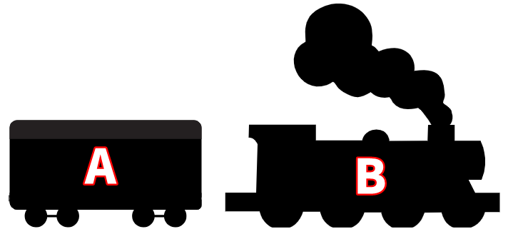

!!! info "Author's note"
    Before you start using this grammar, I would like to clarify one thing.

    - Some example of Japanese sentences will have weird English translation.

    This is because I'm trying to convey the original Japanese meaning without losing any nuances while still using English. After all, the best language to explain Japanese is Japanese (the same way the best language to explain English is English). So, expect some sentences to have weird sounding translations in this guide.

# Sentence Structures

## Subject-Object Structure

Every Japanese sentence at its core is composed of two elements:

<table>
  <td style="border: 1px solid black">A</td>
  <td style="border: 1px solid black">B</td>
</table>

Let's imagine the sentence as a train, where "A" is the **main wagon** and "B" is the **engine**:

We will visualize the train as the following table moving forward:

Main wagon "A" | Engine "B"
:---: | :---:
- | -

The engine "B" tells us **what the main wagon "A" is doing**. The main wagon "A" tells us **WHO or WHAT is doing engine "B"**. We can add more wagons to the train to: 

- say more about "A"
- say more about "B" 
- combine sentences (clauses) together to make complex sentences
- etc. 

but the **core** of the train will always be "A" and "B". This train is what we call "**Subject-Object Structure**".

## Topic-Comment Structure

We learned in the previous section about Subject-Object Structure, which consists of two core elements: the main wagon "A" and the engine "B".

Main wagon "A" | Engine "B"
:---: | :---:
- | -

There's another type of structure: the Topic-Comment Structure, which also consists of two elements:

Topic | Comment
:---: | :---:
- | -

The important point here is that the "Comment" part is actually the *Subject-Object Structure* we just learned. In other words:

<table style="border: 1px solid black">
  <tr>
    <th rowspan="2" style="text-align: center; vertical-align: middle; border: 1px solid black">Topic 🏳️</td>
    <th colspan="2" style="text-align: center; border: 1px solid black">Comment</td>
  </tr>
  <tr>
    <th style="text-align: center; border: 1px solid black">Main wagon "A"</th>
    <th style="text-align: center; border: 1px solid black">Engine "B"</th>
  </tr>
  <tr>
    <td style="text-align: center; border: 1px solid black">-</td>
    <td style="text-align: center; border: 1px solid black">-</td>
    <td style="text-align: center; border: 1px solid black">-</td>
  </tr>
</table>

Notice that I've depicted the topic as a flag 🏳️. If the "Comment" is the "train" (main wagon "A" + engine "B"), then the "Topic" is like a flag in this analogy. The flag is not part of the train. The flag simply tells us the topic of the sentence/train.

A simpler visualization can be represented as following table:

<table>
  <tr>
    <th colspan="2" style="text-align: center; border: 1px solid black">Topic 🏳️</th>
  </tr>
  <tr>
    <th style="text-align: center; border: 1px solid black">Main wagon "A"</th>
    <th style="text-align: center; border: 1px solid black">Engine "B"</th>
  </tr>
  <tr>
    <td style="text-align: center; border: 1px solid black"> - </td>
    <td style="text-align: center; border: 1px solid black"> - </td>
  </tr>
</table>

???+ question "Why is it important to make the distinction between the two structures?"
    English is a subject-prominent language, but Japanese is a topic-prominent language. This difference in prominence is one of the reasons why a lot of people who learn Japanese whose native language is English, struggle to understand the difference between the particle 「は」 and the particle 「が」. We will learn more about particles in a later section.