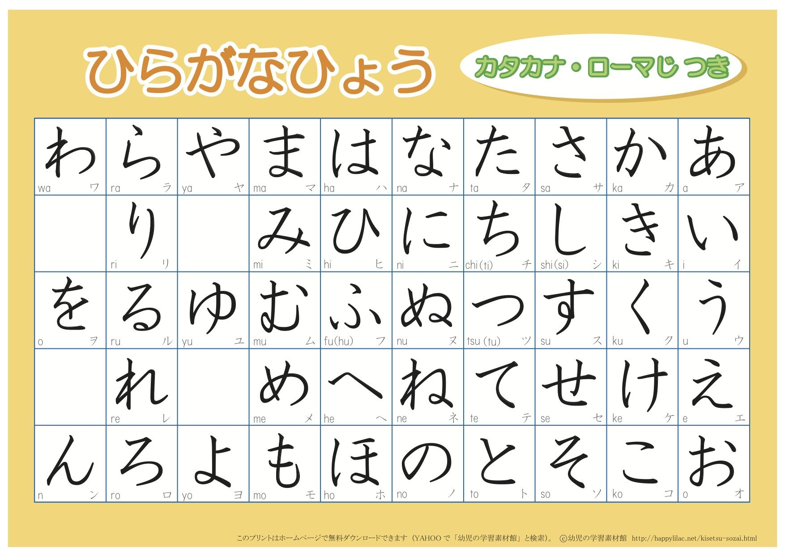
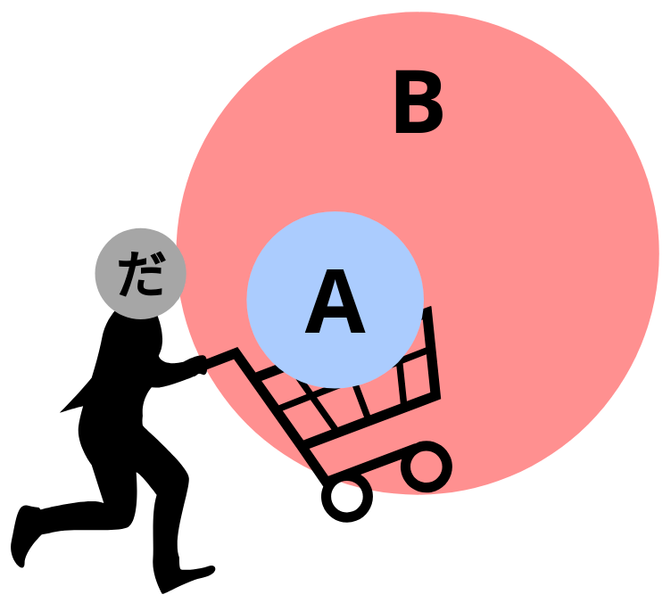

# "A" and "B"

## Main car "A"

We learned in the "Sentence Structure" section about the core of a Japanese sentence:

Main car "A" | Engine "B"
:---: | :---:
- | -

We also learned that:

> The engine "B" tells us what the main car "A" is doing. The main car "A" tells us WHO or WHAT is doing engine "B".

Now, let's learn a little bit more about the main car "A". Suppose we have these two sentences as examples:

1. Sakura walks.
2. Sakura is Japanese.

If we put those sentences into the train analogy, they will look like this:

Main car "A" | Engine "B"
:---: | :---:
Sakura | walks
Sakura | is Japanese

In these two sentences, the engine is telling us that the main car "A" is doing: "walks" and "is Japanese", respectively. The main car "A" is telling us that the engine "B" is being done by: "Sakura".

However, in Japanese we need to mark "Sakura" as the main car "A". To do that, **we use the particle 「が」**. We attach 「が」 at the end of "Sakura" to mark "Sakura" as the main car "A", like so:

Main car "A" | Engine "B"
:---: | :---:
Sakura が | walks
Sakura が | is Japanese

!!! note
    We will learn more about particles in a later section.

### Invisible main car "A"

We already know that the core of a Japanese sentence is composed of:

Main car "A"  | Engine "B"
:---: | :---:
- | -

However, you can't always see both of them. **You can always see the engine "B", but sometimes you can't see the main car "A"**. Why not? Because the main car became an invisible car. Even though you can't see it, it's still there. What is the invisible car? In English, the closest equivalent is the word "*it*". Let's begin by examining what "*it*" does in English. Let's look at the following sentence:

- The ball rolled down the hill. When the ball go to the bottom, the ball hit a sharp stone. The ball was punctured and all the air came out of the ball.

Would any native English speaker say it like that? Most likely not, because once we have established what we are talking about, we replace it with "*it*". So, a more natural way of saying the sentence would be:

- The ball rolled down the hill. When **it** got to the bottom, **it** hit a sharp stone. **It** was punctured and all the air came out of **it**.

Now, let's suppose a small child tries to say the same sentence but ends up saying:

- Ball rolled down hill, got to bottom, hit sharp stone, got punctured, all the air came out.

Is that difficult to understand? No, it's not. Because, in fact, we don't need to use the "*it*" marker everytime, over and over again. Technically speaking, English grammar demands it but there's no actual communicative need to do it. In Japanese grammar, "*it*" is not demanded at all. 

"*It*" by itself means nothing because it can mean anything. You will know what "*it*" is from context. If a small child came to the kitchen and said:

- Got really hungry. Came down to eat something.

there's nothing confusing or difficult about this. The child meant 

- **I** got really hungry. **I** came down to eat something.

In English, skipping the "I" is not a proper sentence, but in Japanese it is. All those English pronouns like "it", "she", "he", "I", "they", can be replaced by the invisible car "**the zero-pronoun (Ø)**" in Japanese. The important thing to remember is that the main car "A" is still there, but it's just invisible. 

Alright, let's look at how this is done in Japanese. Suppose we want to say:

- I am Japanese.

Main car "A" | Engine "B"
:---: | :---:
I | am Japanese

To say that sentence in Japanese, it would be:

- 私が日本人だ。

Main car "A" | Engine "B"
:---: | :---:
私が | 日本人だ

However, it is a perfectly valid and proper sentence if we just say:

- 日本人だ。

Main car "A" | Engine "B"
:---: | :---:
Øが | 日本人だ

The literal translation of 「日本人だ」 would be "is Japanese". The *full* sentence of 「日本人だ」 would be:

- Øが日本人だ。

and the zero-pronoun can be assumed to be "I" in this context. The zero-pronoun, just like the English word "it", will always have a different meaning based on context. For example, if we hear a rustling in the woods and and then we look over in the direction of the rustles, and say:

- うさぎだ!

Main car "A" | Engine "B"
:---: | :---:
Øが | うさぎだ!

*Literal translation*: "is rabbit!"

In normal English, we would say "it is a rabbit!". What is "*it*"? Well, "*it*" in this context means "*that thing we just saw towards the rustling in the trees*". *That* is a rabbit. Another example is, let's say:

- 土曜日だ。

Main car "A" | Engine "B"
:---: | :---:
Ø が | 土曜日だ

*Literal translation*: "is Saturday"

Or in normal English, we would say "it is Saturday". What is "*it*"? "*It*" could mean "today". Or it could mean "tomorrow", or any other word, depending on the context.

All these sentences are complete Japanese sentences, with two parts: 1. the main car "A", and 2. the engine "B". In each of these cases, the main car is invisible - but it's still there.

This might sound like unecessary emphasis on the fact that the main car is still there even though it's invisible. However, the importance of this emphasis will become more apparent as sentences become more complex. Without a good understanding of this concept, complex sentences are going to start sounding extremely vague and hard to understand.

## Shortest proper sentence

Earlier, we learned that:

> You can always see the engine "B", but sometimes you can't see the main car "A"

Let's examine what this statement means.

In English, the shortest proper sentence has to have at least the main car "A" AND the engine "B".

- Sakura runs

Main car "A" | Engine "B"
:---: | :---:
Sakura | runs

If you are missing either one of them, it's not a proper sentence.

In Japanese, the shortest proper sentence only requires the engine "B".

- 走る  

Main car "A" | Engine "B"
:---: | :---:
Ø が | 走る

## Linguistic words

Before we learn about the engine "B", it'd be a lot easier for us to understand the engines if we first learn the definition of three basic linguistic words:

- Verb
- Noun
- Adjective

### Verb

A verb is a word that expresses action or state of being. 

Examples of verbs are:

- read
- swim
- study
- sing
- sit
- run
- think
- play
- go
- live
- be

### Noun

A noun is a word that functions as the name of a specific object or set of objects, such as living creatures, places, actions, qualities, states of existence, or ideas.

Examples of nouns are:

- student
- mountain
- ocean
- building
- cat
- house
- John
- Bob
- Sakura
- banana
- love
- wealth
- happiness
- history
- rice
- water
- music
- victory

### Adjective

An adjective is a word that expresses quality, property, or attribute of a noun.

Examples of adjectives are:

- tall
- pretty
- small
- bright
- friendly
- warm
- cold
- angry
- happy

## Engine "B"

First, we need to learn that there are three types of sentences. Each sentence type is an answer to an implicit question.

1. Implicit question: What does "A" do?  
Answer: "A" does "==B==".  
Example: Flowers ==bloom==.

2. Implicit question: What is "A"?  
Answer: "A" is "==B==".  
Example: Flowers are ==plants==.

3. Implicit question: What is "A" like?  
Answer: "A" is "==B==".  
Example: Flowers are ==pretty==.

The first type of sentence is used to express the action of "A". In this case, "A" is "flowers". What do flowers do? They bloom. Here, "B" is "bloom". In other words, "B" is a **==verb==**.

The second type of sentence is used to express what "A" is. In this case, we're saying that "flowers" are "plants". Here, "B" is "plants". In other words, "B" is a **==noun==**.

The third type of sentence is used to express state, quality, property of "A". In this case, the quality of "flowers" is "pretty". Here, "B" is "pretty". In other words, "B" is an **==adjective==**.

We can now look at the three type of Engines that exist in Japanese.

Engine name | Used when "B" is:
:---: | :---:
う-engine | Verb
だ-engine | Noun or Adjective (na-adjective)
い-engine | Adjective (i-adjective)

Notice that:

- Adjectives in Japanese are divided into two groups: *na-adjective* and *i-adjective*. 
- na-adjectives and nouns use the same engine.

We will learn the reason behind this when we learn about the だ-engine.

!!! info "Author's note"
    According to how grammar is taught in Japan, dividing the engine into these three types isn't exactly correct. But, for the sake of simplicity and to make things easier to understand for us, we will stick to this model.

### う-engine

#### When "B" is a verb

This engine is used for expressing sentences like "A does B", where "B" is a **verb**. Verbs in Japanese can be divided into two categories: __*one-row*__ and __*five-rows*__. All *one-row* verbs end in 「る」, while *five-rows* verbs can end in 「く」、「す」、「つ」、「ぬ」、「む」、「る」、「ぐ」、「ぶ」. Therefore, if a verb does **not** end in 「る」then it must be a *five-rows* verb. Notice that all verbs end with an 「う」 u-vowel sound. Hence the name of this engine: う-engine.

???+ tip 
    **How to tell if a verb is *one-row* or *five-rows* if it ends in 「る」?**

    For verbs ending in 「る」, if the vowel sound preceding the 「る」 is an 「あ」、「う」 or 「お」 vowel sound, it will **always** be a *five-rows* verb. Otherwise, if it is 「い」 or 「え」, it will be a *one-row* verb **in most cases**. If you're unsure which category a verb falls into, you can verify with most dictionaries.

    - Example of *five-rows* verb: 「分かる」（わかる）. The preceding kana of「る」is「か」, which has an 「あ」 vowel sound. Therefore it is a *five-rows* verb.
    - Example of *one-row* verb: 「食べる」（たべる）. The preceding kana of「る」is「べ」, which has an 「え」 vowel sound. Therefore it is likely to be a *one-row* verb. It is, in fact, a *one-row* verb.
    - Example of *five-rows* verb: 「知る」（しる）. The preceding kana of「る」is「し」, which has an 「い」 vowel sound. Therefore it is likely to be a *one-row* verb. However, it's actually a *five-rows* verb.

???+ question "Why is it called "one-row" and "five-rows"?"
    First, we need to bring up the hiragana chart.

    {: width=400 }

    Next, we need to understand the concept of "inflection". We will learn more about inflections in a later section, but for now, you just need to know that we can change part of the verb (and the other two engines as well) to express additional information. Let's look at two verbs as examples:

    - 食べる  
    *Eat*

    - 書く  
    *Write*

    We can inflect them to express negative by attaching the helper verb 「ない」 like so:

    - 食べ{++ない++}  
    *Not eat*

    - 書 ==か== {++ない++}  
    *Not write*

    Notice that in 「書 ==く== 」→「書 ==か== {++ない++}」, we changed 「く」 to 「か」, and then attached 「ない」. If we were to attach a different helper verb, then the 「く」 might have to change to 「き」、「け」、or 「こ」. If we look at the hiragana chart above, that's all 5 rows for the /k/ column: 「か」、「き」、「く」、「け」、「こ」. These type of verbs will have its last kana changed to any of the 5 variants depending on the inflection, hence they are called **"five-rows" 「五段」**. Some textbooks call this "u-verb".

    Now, notice that in 「食べ{--る--}」→「食べ{++ない++}」, we simply dropped 「る」 and attached 「ない」. If we were to attach a different helper verb, the 「食べ」 part will still not change. In the case of 「食べる」, the 「食べ」 part ends with the kana 「べ」, and this kana never changes no matter what inflection we do to the verb. If we look at the hiragana chart above, the 「べ」 "stays" on the same row regardless of inflection, hence they are called **"one-row" 「一段」**. Some textbooks call this "ru-verb".

Examples:

Example of one-row verbs | Example of five-rows verbs | Irregular verbs
:---: | :---: | :---:
⾷べる | 分かる | する
⾒る | 話す | 来る
寝る | 聞く
起きる | 泳ぐ
考える | 遊ぶ
教える | 待つ
出る | 買う
いる | ある
着る | 死ぬ

!!! warning "There are two irregular verbs"
    The verb: 「する」 and 「来る」 are considered as irregular. The reason is that these two verbs do not inflect in quite the same way as the other two categories do. We will learn about inflections in a later section.

An example sentence using the う-engine is:

- Sakura walks.

In this sentence, "A" is "Sakura" (the main car) and "B" is "walks" (the thing Sakura does; the engine of the sentence). In Japanese, "Sakura" is 「さくら」, and "walk" is「歩く」(あるく). To say **"Sakura walks"** in Japanese is:

- さくらが歩く。

Main car "A" | Engine "B"
:---: | :---:
さくらが | 歩く

Some more example sentences using the う-engine:

Main car "A" | Engine "B" | English
:---: | :---: | :---:
さくらが | 勉強する | Sakura studies
アリスが | 泳ぐ | Alice swims
ボブが | 読む | Bob reads
私たちが | 食べる | We eat

### だ-engine

#### Copula

Before we continue with the だ-engine, we need to learn about another linguistic word: the **copula**. A copula is a word that is used to declare that "A" belongs to the set of "B". 

!!! example "Example 1"
    Back when we learned the three type of sentences, the second sentence answers the question *What is "A"?* The sentence that we used as example was:

    - Flowers are plants.

    In this case, "A" is "flowers" and "B" is "plants". Then, we connect "A" and "B" with the word "==are==", to say that "flowers" belong to the set of "plants".

    What are flowers? → Flowers are plants.

!!! example "Example 2"
    Let's look at another example:

    - Sakura is a Japanese person.

    Here, "A" is "Sakura" and "B" is "Japanese person". Then, we connect "A" and "B" with the word "==is==", to say that "Sakura" belongs to the set of "Japanese people".

    What is Sakura? → Sakura is a Japanese person.

In English, the word "be" (and its conjugation am, is, are, was, were, being, been) is used as the copula.

In Japanese, we use the hiragana 「だ」 as the copula (hence the name of this engine: だ-engine).

So, to say the previous two examples in Japanese, it would be:

Main car "A" | Engine "B" | English
:---: | :---: | :---:
花が | 植物 ==だ== | Flowers ==are== plants
さくらが | 日本人 ==だ== | Sakura ==is== a Japanese person

It is helpful to think of 「だ」 as a person placing "A" into the set "B", like so:

{: width=300 }

So, if we use "Sakura is a Japanese person" as an example again, then the copula 「だ」 is placing "Sakura" into the set of "Japanese people".

#### When "B" is a noun

As we saw earlier when we learned about the copula, the だ-engine is used in the sentences of type "A is B", which implicitly answer the question "What is A?". In this case, when we answer that question by saying "A is B", the "B" is a **noun**.

Example sentences using the だ-engine, where "B" is a noun:

Main car "A" | Engine "B" | English
:---: | :---: | :---:
さくらが | 日本人だ。 | Sakura is a Japanese person.
ボブが | 声優だ。 | Bob is a voice actor.
私が | アリスだ。 | I am Alice.
その人が | アリスだ。 | That person is Alice.
私たちが | 学生だ。 | We are students.
先生が | 女の人だ。 | Teacher is a woman.
２が | 数字だ。 | 2 is a number.
トムが | 医者だ。 | Tom is a doctor.

#### When "B" is an adjective (na-adjective)

Going back again to when we learned the three type of sentences, the third sentence that we saw answers the question *What is "A" like?* We answer this question by saying "A is B". Example:

- What are flowers like? Flowers are pretty.

This type of "A is B" sentence is fundamentally different from the "A is B" that is used when "B" is a noun. Here, the "B" is not a noun; it's an adjective. When we say "flowers are pretty", the "B" is "pretty", which is an adjective. Nevertheless, we can still use the だ-engine when "B" is an adjective. More specifically, we can use it when "B" is a **na-adjective**. 

Example sentences using the だ-engine, but "B" is a na-adjective:

Main car "A" | Engine "B" | English
:---: | :---: | :---:
さくらが | 有名だ。 | Sakura is famous.
街が | 静かだ。 | Street is quiet.
辞書が | 便利だ。 | Dictionary is convenient.
友達が | 大切だ。 | Friends are precious.
書類が | 必要だ。 | Document is necessary.
アリスが | 親切だ。 | Alice is friendly.
私が | 真面目だ。 | I am honest.

!!! tip "Did you know"
    na-adjectives are actually derived from nouns[^1], which is why they both behave so similarly. We will learn the history behind this in a later section when we learn about the so called "no-adjective".

[^1]: [形容動詞 - Wikipedia](https://ja.wikipedia.org/wiki/%E5%BD%A2%E5%AE%B9%E5%8B%95%E8%A9%9E#%E6%A6%82%E8%A6%81)

### い-engine

#### When "B" is an adjective (i-adjective)

This engine is also used for "A is B" sentences where "B" is an adjective. More specifically, it is used for **i-adjectives**. All i-adjectives end with the kana 「い」, hence the name of this engine: い-engine.

!!! warning "Some na-adjectives look like an i-adjective"
    There are some na-adjectives that look like an i-adjective because they also "end with the kana 「い」". The two most common examples are:

    - きれい  
    *pretty*

    - きらい  
    *hated*

    However, if we write them in Kanji, we quickly realize that they aren't i-adjectives.

    - 綺麗（きれい）
    - 嫌い（きらい）

    Notice that 「嫌い」 still ends with the kana 「い」 even if we write it in Kanji. But that's because 「嫌い」(hated) actually comes from the verb 「嫌う」(to hate). Interestingly, 「好き」(liked) comes from the verb 「好く」(to like).

Example sentences using the い-engine:

Main car "A" | Engine "B" | English
:---: | :---: | :---:
ペンが | 赤い。 | Pen is red.
ビルが | 高い。 | Building is tall.
天気が | 暑い。| Weather is hot.
脳が | 大きい。 | Brain is big.
学費が | 安い。 | Tuition is cheap.
さくらが | 優しい。 | Sakura is kind.

!!! warning "Do not use 「だ」 with i-adjectives"
    Notice that we don't use the copula 「だ」 with i-adjectives, even though this is an "A is B" type sentence. There are many ways to explain the reason behind this, but we'll use this following explanation because it's the easiest to understand:

    Unlike nouns and na-adjectives where we have to use the copula 「だ」, i-adjectives already have the copula built into them, which is the last kana 「い」. For example, 「優し ==い==」 does NOT mean "kind", it means "==is== kind".

## Copula vs Exist

In English, the verb "**be**" (and its conjugation am/is/are/was/were/being/been) has **two functions**:

Example | "is" is functioning as:
:--- | :---
Sakura ==is== a Japanese person. | Copula
Sakura ==is== at the stadium. | Exist

The "is" from the first sentence is expressing "Sakura belongs to the set of Japanese people". The copula allows us to express declarations about what something is. We already learned this when we learned about the だ-engine. 

The "is" from the second sentence, however, is not expressing "Sakura belongs to the set of stadium". It's not expressing that Sakura is literally a stadium. Instead, it is expressing "Sakura *exists* in a stadium".

In English, the word "be" is used as the copula and also used to express "exist". 

Japanese on the other hand:

- The hiragana 「だ」 is used as copula.
- To express "exist", there are two verbs: 「いる」 and 「ある」.

We say ==「いる」== for animate objects, and ==「ある」== for inanimate objects.

!!! danger "BIG DISCLAIMER"
    Separating 「いる」 and 「ある」 into animate and inanimate objects, respectively, is not always true. But we can use this as a general rule of thumb.

Animate objects are things that have life: humans, animals, etc.  
Inanimate objects are things that don't.

For example:

- 教室に椅子が ==ある==  
*The chairs ==are== in the classroom* / *There ==are== chairs in the classroom*
- 机の上に鉛筆が ==ある==  
*The pencil ==is== on the desk* / *There ==is== a pencil on the desk*
- 教室にジョンさんが ==いる==  
*John ==is== in the classroom*
- 庭に犬が ==いる==  
*The dog ==is== in the garden* / *There ==is== a dog in the garden*
- 猫は部屋に ==いる==    
*The cat ==is== in the room.* / *There ==is== a cat in the room*

Now let's look at one example where the aforementioned rule (anime vs inanimte) doesn't apply.

- ❌ チューリップがいる
- ⭕ チューリップがある  
*There is a Tulip*

So, plants can't be used with 「いる」 even though it is a living thing? Then it just seems like the rule should be "things that move" vs "things that don't move", right? Not true either. Let's look at the following sentences:

- ❌ 人形がある
- ⭕ 人形がいる  
*There is a doll*
- ⭕ 電車がある 
- ⭕ 電車がいる  
*There is a train*
- ⭕ タクシーがある
- ⭕ タクシーがいる  
*There is a taxi*
- ⭕ バスがある
- ⭕ バスがいる  
*There is a bus*
- ⭕ トラックがある
- ⭕ トラックがいる  
*There is a truck*
- ⭕ フィギュアがある
- ❌ フィギュアがいる  
*There is a figurine*
- ⭕ 扇風機がある
- ❌ 扇風機がいる  
*There is an electric fan*
- ⭕ シーリングファンがある
- ❌ シーリングファンがいる  
*There is a ceiling fan*

Vehicles (in the broadest sense of the word) such as trains, cars, boats, etc, are generally used with 「いる」 because there are *people* inside those vehicles. Of course, vehicles can be used with 「ある」 as well, but the nuance changes slightly. If we use 「いる」 to refer to a vehicle, it's implied that we're talking about the people inside the vehicle. If we use 「ある」 to refer to a vehicle, then: 1. we're talking about the vehicle itself or 2. we're implying that the vehicle has no one in it. 

There was a news article by the NHK with the title:

- 不審な ==船== が{++いる++}

Here, ==「船」== means "ship", and it's being used with {++「いる」++} which is for animate objects according to our rule of thumb. However, by using 「いる」 here, it is implied that the title is referring to the people inside the ship.[^2]

[^2]: [NHKニュース　「不審な船がいる」の「いる」について](https://lang-8.com/293700/journals/1257964)

Generally speaking, it is OK to simply use 「いる」 for humans and animals, and 「ある」 for the rest. If an exception comes up when you're reading or listening to something, like the ones you see above, then you just have to memorize and get used to those few exceptions.
