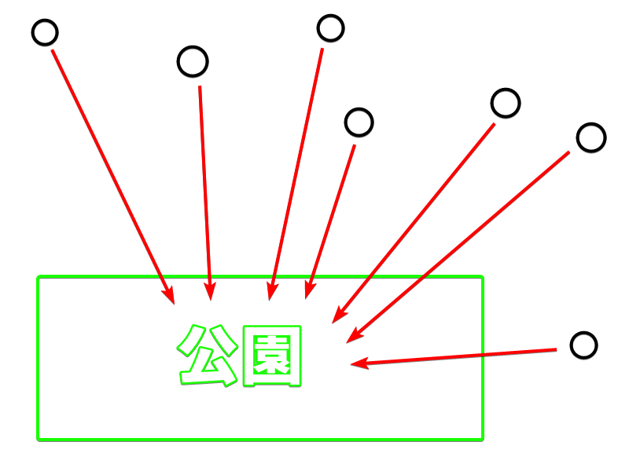
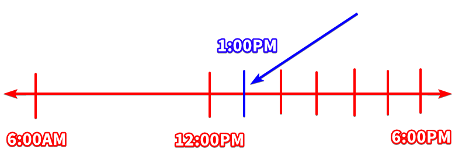

# Contrast of particles

### 「は」 vs 「も」

We learned in the first function of 「も」 that:

!!! quote
    The comments must be consistent (old and new).

Let's see what we mean by "consistent" by comparing 「も」 to 「は」.

!!! info "The main difference between 「は」 and 「も」"
    - 「は」 changes the topic, and implies that the comment of the new topic is **different** from the comment of the old topic.

    - 「も」 also changes the topic, but it implies that the comment of the new topic is the **same** as the comment of the old topic.

This is why 「も」 can only be used when the comment is "consistent" with the previous comment. Furthermore, the particle 「は」 has a **contrastive** property (as opposed to 「も」 which is **inclusive**) precisely because the comment of the new topic is *different* from the comment of the previous topic.

Suppose we have a first topic "Alice", and the comment about her is "is student":

- アリスは学生だ。  
*As for Alice, is student.*

Then, we introduce a second topic "Tom", and the comment about him is "is student":

- トムは学生だ。  
*As for Tom, is student.*

Then, we **can** use 「も」 in the second topic, because the *comment* of both topics are the same.

- アリスは学生だ。
- トム ==も== 学生だ。

!!! warning "Be careful how you use 「は」 and 「も」 in certain set phrases"

    For example, the following phrase is often said when greeting someone during New Year:

    Note: 「今年」（ことし）＝ this year

    - 「今年 ==も== よろしくお願いします。」

    A very rough translation of this phrase in English can be 

    - "This year too, I hope you take good care of me"
    - "This year too, I hope you look after me"

    which can be used to greet anyone. The important point here is that we're using 「も」 to say "this year too".
    
    Let us remind ourselves that the particle 「は」:

    > implies that the comment of the new topic is **different** from the comment of the old topic

    So, if we say 「今年 ==は== 。。。」, we're implying that "this year (new comment) is different from previous years (old comments)". In other words, it implies that your relationship with that person in previous years was not a good one. It implies that the relationship in previous years was not pleasant for you. You're essentially saying, "This year, **as opposed to previous years**, I hope you take good care of me".

    This is why the correct way of saying the phrase is 「今年 ==も== よろしくお願いします」 because you want to express "this year too".

To expand a little bit more on the **contrastive** property of the the particle 「は」, let's look at some examples:

**Example 1**

- ==イチゴは== あるけど、==バナナは== ない。  
Literally: *==As for strawberry==, there is, but ==as for banana==, there isn't*  
Normal English: *There is strawberry, but there's no banana*

**Example 2**

- ==君は== 知らないけど ==僕は== 知ってる。  
Literally: *==As for you==, (you) don't know, but ==as for me==, (I) know*  
Normal English: *You don't know but I do*

**Example 3**

- アフリカは ==ライオンは== いるけど、==トラは== いない。  
Literally: *As for Africa, ==as for lions==, (they) exist but ==as for tigers==, (they) don't exist*  
Normal English: *In Africa, there are lions but there are no tigers.*

### 「は」 vs 「が」

ordinary usage of は and が (no emphasis)

emphatic usage of は and が

!!! warning
    **I have been using 「が」 in a lot of example sentences as the main car "A" so far. Although that is technically correct, that's NOT how Japanese people normally speak when they want to express sentences like "A is B" or "A does B".** We'll see the reason behind this in this section.

We learned about the grammatical usage of 「は」 and 「が」: one is a flag, the other is the main car. However, it might still be confusing for some people. Unlike English, which is a very Subject-Object oriented language, **Japanese is a very Topic-Comment oriented language**. This is why you see 「は」 more often than 「が」 in a normal sentence like "A is B" or "A does B".

Let's see the difference between 「は」 and 「が」 again, but not from the perspective of grammar. *How do native speakers use those particles?* Or more precisely, what kind of impression do native speakers get when they see/hear 「は」 or 「が」?

!!! danger
    **「が」 is the identifier particle**. What do I mean by that? Let's say I want to ask "Who is the student?". If I use the topic particle 「は」, the question would become 

    Note: 「誰」（だれ） means "who"

    - 誰は学生？

    *"As for who, is (it) a student?"*

    and that doesn't make any sense because "who" is not an actual person. This is where 「が」 comes into play. We already learned from the section about main car "A" that 「が」 attaches to a word to mark it as the main car "A". 

    Suppose the student is "Alice". Then, we can say "Alice is student" like so:

    - アリスが学生だ

    Main car "A" | Engine "B"
    :---: | :---:
    アリスが | 学生だ

    But if we are asking the question "Who is the student?", that means we don't know what is inside the main car "A". It means that the main car "A" is unknown. To illustrate:

    Main car "A" | Engine "B"
    :---: | :---:
    ❓ が | 学生

    So, all we need to do is put 「誰」 in the main car. The question now becomes:

    - 誰が学生？

    *Who is student?*

    Makes sense right? The 「が」 particle marks the main car "A". It marks the subject. It marks the doer. It tells us *who*/*what* is doing/being "B". But didn't we say earlier that the particle 「が」 is the **identifier particle**?. That's right. The particle 「が」 marks the main car "A", therefore it tells us *who*/*what* is doing/being "B". It **identifies** "A" for us.

    Let's look at an example:

    - ボブ：誰が学⽣？  
    *Bob: Who is the one that is student?*  

    - アリス：ジョンが学⽣。  
    *Alice: John is the one that is student*

    Bob wants to identify *who* -among all the possible candidates- is a student. Alice responds that *John* is the one. Notice that Alice could also have answered with the topic particle to indicate that, "Speaking of John", she knows that he is **a** student (maybe not **the** student that Bob is looking for). Let's illustrate this difference again. If Bob asks:

    - ボブ：誰が学⽣？  
    *Bob: Who is the one that is student?* 

    Then Alice can answer in two ways:

    - アリス：ジョンが学⽣。  
    *Alice: John is the one that is student.*

    - アリス：ジョンは学⽣。  
    *Alice: As for John, (he) is student. (As for other people, they could be students too.*

    It is helpful to translate 「は」 as "as for...; about...; speaking of...; in relation to..." and 「が」 as "the one; the thing" to illustrate the difference.

    Let's look at one more example:

    1. 私は学⽣。  
    *As for me, (I am) student.*

    2. 私が学⽣。  
    *I (am) the one (that is) student.*

    The 「は」 and 「が」 particles are actually quite different if we use the train analogy to illustrate the sentence. 

    <table>
      <tr>
        <th colspan="2" style="text-align: center">私は 🏳️</th>
      </tr>
      <tr>
        <th style="text-align: center">Main car "A"</th>
        <th style="text-align: center">Engine "B"</th>
      </tr>
      <tr>
        <td style="text-align: center">Ø が</td>
        <td style="text-align: center">学生だ</td>
      </tr>
    </table>

    The 「が」 particle identifies a specific entity as *the* thing while the 「は」 particle is used only to bring up a new topic of conversation. This is why, in longer sentences, it is common to separate the topic with commas to remove ambiguity about which part of the sentence the topic applies to.

    https://twitter.com/uni_Kayafu_/status/1135718991261970432?s=19

    まふくんが！？午前中に！？今日はなにか良いことがあるかもしれませんね！おはようございます！！
    
#### Mark the same thing

First, let's look at the scenario when the topic (marked by は) and the subject (marked by が) are the same thing.

What do I mean by "same thing"? Let's use this sentence as example:

- ==私== は学生だ。  
*As for ==me==, (I) am student.*

If we were to write out the full sentence (although very unnatural), it would be:

- ==私== は {++私++}が学生だ。  
*As for ==me==, {++I++} am a student.*

Here, 「私」 is the topic and also the subject. In scenarios where the topic and the subject are the same thing, it's more natural to omit one of the two, such as:

- 私 ==は== 学生だ。(私は{--Øが--}学生だ。)
- 私 ==が== 学生だ。({--Øは--}私が学生だ。)

There are two ways you can look at the difference between these two particles.

!!! info "First way to look at the difference bewtween 「は」 and 「が」"

    - 「は」 talks about **something in general**.
    - 「が」 **singles something out**  to say "THAT is *the thing*".

What do I mean by that? Let's compare it to English.

!!! info "The English equivalent of 「が」"
    Japanese is a topic-prominent language, and there is one particle for topic (「は」) and one for subject (「が」) . This allows Japanese speakers to emphasize either the topic or the subject, by simply using the corresponding particle.

    English, on the other hand, is subject-prominent language. On top of that, English doesn't use particles. In English, when we want to express "emphasis on the subject" the same way 「が」 does in Japanese, we would usually do it in these two ways:

    1. I am the one who bought the book.
    2. *I* bought the book.
    3. **I** bought the book.

    The first way is to explicitly say "I am the one who..." or "she is the one who..." or "they are the ones who..." or "this is the thing that...".

    The second way is to ーif it's written communicationー stylize the "I" with italics or with bold (or both). The equivalent of this in spoken speech is to say "I" louder or longer (or both).

    **On a related note**: If we want to retain as much nuances as possible when translating from Japanese into English, this is how we would probably do it:

    - 私は日本人だ。  
    *I am Japanese.*

    Notice that in Japanese, 「私」 is the **topic**. But in English, "I" is the **subject**. Now, let's look at the next sentence:

    - 私が日本人だ。  
    *I am the one who is Japanese.*

    Because normal English sentences is already subject-prominent, when we want to emphasize on the subject the same way 「が」 does in Japanese, we end up resorting to phrases like "the one" or "the thing".

Let's look at a few examples to understand these nuances.

**Example 1**:

Grammatically speaking, the following two sentences are correct.

Note: 「これ」＝ this  
「携帯」（けいたい）＝ cellphone

- これ ==は== 携帯だ。  
*As for this, (it) is cellphone.*

- これ ==が== 携帯だ。  
*This is the thing that is cellphone.*

Both sentences are generally translated the same way into normal English as: "This is a cellphone".

But the one that is used more often is 「これは携帯だ」. You only use 「が」 when you one to single something/someone out. When you want to say that **something in particular ーas opposed to other random thingsー is/does X**, you use 「が」:

- Something ==が== is X
- Something ==が== does X

**Example 2**:

- ⭕ 誰 ==が== 学⽣？
- ❌ 誰 ==は== 学⽣？

The question is asking "Who is a student?".

The first question 「誰が学⽣？」 is grammatically correct, while the second question 「誰は学⽣？」 is not. In this example, there are many people who could be a student, and you want to know *who* is a student among them; you want to single out one person. You are comparing all those candidates to each other, and then choosing one person and saying "*that* is the student". Comparing in this manner is the only way 「が」 is used.

**Example 3**:

If you want to say "I am a medical student", normally you would say:

Note: 「医学生」（いがくせい）＝ medical student

- 私 ==は== 医学生だ。

but if you say this instead:

- 私 ==が== 医学生だ。

you will end up implying *"He's not a medical student. She's also not a medical student. Then who is the medical student here? That's right. __I am__ the medical student. I am differrent from the other students"*. You are essentially comparing yourself to the other students and saying "**I am** the medical student". You will end up putting too much emphasis on 「私」 and you could sound rude depending on the situation you're in.

**Example 4**:

This is also why during self-introduction, you should say:

- 私 ==は== さくらだ。  
(This still sounds unnatural and disrespectful, but for other reasons that we haven't looked at yet.)

However, if you say this during self-introduction:

- 私 ==が== さくらだ。

you will end up sounding like "I am **the** Sakura. I am the Sakura that **everyone knows about**. That's **me**".

**Example 5**:

In a certain way, 「は」 works like the English word "*the*", but only in this one respect, that it can't mark **new information**. To illustrate this "old information" vs "new information" concept, let's look at some examples of the English word "the". If we say:

- I fed the iguana.

unless people already know about this iguana, their immediate thought is going to be "What iguana? You never talked about any iguana before. What do you mean *the* iguana?". But if we say:

- I fed an iguana.

that's alright. However, you can in fact say:

- I fed the dog.

without anybody knowing that you even had a dog, because it's very *normal and natural* for a person to have a dog. It not necessary to "introduce" the dog into the conversation first to then say "the dog". But if I said "I fed the iguana", that's a conversation stopper, isn't it? If I don't introduce the iguana first, nobody is just going to assume that I have an iguana at home as pet, because it's not common. So, while we say "new information" vs "old information", it's actually a bit more subtler than that. It's actually "new, important and relevant information" vs "old information or information that can be commonly agreed on".

**Example 6**:

Another example of "old information" vs "new information":

Note: 「昔々」（むかしむかし）＝ once upon a time / long time ago  
「姫」（ひめ）＝ princess  
「美しい」（うつくしい）＝ beautiful

- 「昔々姫 ==が== いた。姫 ==は== 美しかった。」 
*Once upon a time, there was __a__ princess. __The__ princess was beautiful.*

Notice that in the first sentence 「が」 was used, and in the second sentence 「は」 was used. But didn't we just learn that 「が」 is used for comparison? So who are we comparing 「姫」 to? We are essentially saying: 

*"Once upon a time, there was a __princess__. Not a prince, not a queen, not a farmer, but a princess. The princess is the focus of the story".*

"Princess" is someone we didn't know yet. "Princess" is "new information". We were introducing her for the first time in the story. After introducing the princess, we can now say 「姫**は**。。。」 as in "**The** princess..." because "princess" is now "old information". If we don't first introduce the princess in the first sentence and go straight to the second sentence "As for **the** princess, ...", you as the reader might wonder "*As for the princess? What princess? Which princess are we talking about specifically?*".

**Example 7**:

「が」 can also mark particularities as opposed to generalities. For example, if we say:

- 花 ==は== きれいだ

it's likely that we're saying 

- Flowers (in general) are pretty. 

But if we say:

- 花 ==が== きれいだ

we're stressing 「花」 as the subject. We're emphasizing 「花」 to mean:

- This flower/these flowers (in particular) is/are pretty.

**Example 8**:

Let's look at another example. Suppose you are with a friend who has never seen what a ramen looks like. There are three dishes in front of you two: sushi, curry rice, and ramen. You want to single out one dish, point at it, and tell your friend that "*that* is ramen". In this scenario, you can say:

- あれ ==が== ラーメン

Using 「が」 in this manner implies "*That dish* (sushi) is not ramen. *That dish* (curry rice) is also not ramen. *THAT dish* (ramen) is the one that's ramen". You are comparing and singling out the one dish that *is* ramen.

**Example 9**:

Another example that might not seem as straightforward to understand is this sentence:

- 私 ==が== 高校生の時サッカーが好きだった

This sentence roughly translates to "I liked playing soccer when I was in highschool". This sentence might look too complicated for someone who just started learning Japanese. But the point I want to make is that 「が」 was used in the sentence, instead of 「は」. Earlier, we learned that 「が」 is only used for comparison. So who are we comparing 「私」 to? We are comparing "myself" to "myself". More accurately, we are comparing the "present me" to the "past me" or "the highschool me".

!!! info "Second way to look at the difference bewtween 「は」 and 「が」"
    - 「は」 puts the emphasis on the sentence **after** it
    - 「が」 puts the emphasis on the sentence **before** it.
    
    This makes sense if we look at what we learned at the beginning of this section:
    > Japanese is a very Topic-Comment oriented language.

    which is why a sentences usually use 「は」. 

To illustrate this change of emphasis, let's look at the following 3 sentences:

Note: 「本」（ほん）＝ book  
（買う）（かう）＝ buy

1. 本を買った。
2. 私は本を買った。
3. 私が本を買った。

In the **first sentence**, it doesn't put any particular emphasis on anything; it's just saying, neutrally, "I bought a book". (Remember that in Japanese, omitting the main car "A" is allowed)

If we choose to stress "I" as the topic and say the **second sentence**, we're changing the topic to "I" and saying that "I bought a book". The particle 「は」, aside from marking something as the topic, it also implies that the "*comment*" on said topic is different from the comment on "old topics" or on "other topics" (we learned this in the section about 「は」 vs 「も」). In other words, we are implying:

"*__I__ bought a book. __You__ may have bought something else. __Other people__ may not have bought anything at all. __Other people__ may have also bought a book, but I don't know about it. All I know is that __I__ bought a book. *".

The second sentence is implicitly answering the question "**What did I do?**" The answer is "I *bought a book*".

Now, if we say the **third sentence**, we've now changed the emphasis. Under what circumstances do we say the third sentence? Suppose that people are looking at an empty bookshelf and wondering who bought the last book, and you say 「私**が**本を買った」. In other words, you're saying "**I am the one** who bought the book". We all know and see that the bookshelf is empty, so "buying the book" is "old information". People want to know the "new information"; people want to know **who** bought the book, which is why you should answer with 「私**が**本を買った」. 

While the second sentence is implicitly answering the question "What did I do?", the third sentence is implicitly answering the question "**Who bought the book?**" The answer is "*I am the one* who bought the book".

!!! note
    The last three examples sentences that we just looked at:

    1. 本を買った。
    2. 私は本を買った。
    3. 私が本を買った。

    in "full sentence" are actually :

    1. ØはØが本を買った。
    2. 私はØが本を買った。
    3. Øは私が本を買った。

    Japanese grammar allows you to omit the topic or the subject (main car "A") or both. In fact the only component needed to make a complete and proper sentence is the engine "B". This means that, when we choose to explicitly say the topic or the subject out loud, we do so because we want to say it with a certain nuance, or with a certain emphasis.

#### Mark different things

Now let's look at a scenario where the topic and the subject are different things.

**Example 1**:

- 君 ==が== 好きだ  
*I like you*

which translates literally to "You are liked". We want to express that "**YOU** are the one" that is liked; not person A, nor person B, but **YOU**. If we instead use 「は」 like so:

- 君 ==は== 好きだ

it will sound like we are saying "As for you, (you) are liked. As for other people, they are hated" (remember the contrastive property of 「は」), which is not what we were trying to convey/express.

Why is this example under "Mark different things"? Because the topic (marked by 「は」) is indeed different from the subject (「君」 which is marked by が」). Let's write out the full sentence:

- 私は君が好きだ  
*As for me, you are liked*

The 「私は」 is often omitted because it's obvious from context. In fact, 「君が」 is also often omitted because it's obvious from context. If you are talking to your crush one-on-one, you can in fact just say 「好きだ」 (lit: (you) are liked).

!!! warning "This is an 'A is B' sentence, not an 'A does B' sentence"
    Notice that we are using the だ-engine. This means that the sentence is of type "A is B", NOT "A does B". Although in English, the natural way of saying it is "I like you", where "I" is *doing* the action of *liking someone* ("A does B" sentence), in Japanese it's more natural to say "You are liked" ("A is B" sentence), where "liked" is an adjective. 
    
    The same way we say "You are pretty" (where "pretty" is an adjective), we are saying in this case "You are liked". It might be a bit hard to see "liked" as an adjective for some people, since "liked" looks like the past-tense of the verb "like", but that's just an unfortunate coincidence in English (happens a lot tbh). We could translate 「君が好きだ」 with other words (although not as accurate) so we can better see "liked" as an adjective in this sentence.

    Other (not-as-accurate) translations of 「君が好きだ」 could be:

    - You are favorite
    - You are pleasing
    - etc...    

**Example 2**

- 象は鼻が長い。  
*As for elephants, nose is long*

In normal English, we might say "Elephant's nose is long". Again, it's possible to literally say word for word "Elephant's nose is long" in Japanese, but it's more natural to say it as "As for elephants, nose is long".

**Example 3**

- 私は魚だ。  
*As for me, (it) is fish*

Ah, yes. Remember this example from the section about 「は」? When you're with a group of friends ordering at a restaurant, it's common to say 「私は。。。」 because you want to make a contrast from your friends (remember the contrastive property of 「は」). If your friend orders pancakes, and you want to order something else, you should say 「私は。。。」 (not 「私が。。。」) to make use of the contrastive property of 「は」. If you want to order the same thing, then you can of course say 「私も。。。」.

I digress. In this sentence, the topic is "I" and the subject is "it". Based on context, "it" refers to "the dish that I want to order".

**Example 4**

Following example 3, let's say you ended up ordering fish. After a while, the waiter comes back with a plate of fish and asks you and your friend:

- Who ordered the fish?

It's also possible to ask the same question as:

- Who is the fish?

This is pretty common in restaurant settings (even in English). Now, let's see how this exchange goes down in Japanese:

- どちら様が魚ですか？  
*Who is the fish?*

「どちら様」 is just a respectful and polite way of saying "who". You can then reply to the waiter with:

- 私が魚です。  
*I am the fish*

In this sentence, it *actually* means quite literally "I am the fish" (as opposed to 「私は魚だ」). But everyone can infer from context that you're not literally saying you are a fish; you are just saying that you are the one who ordered fish.

!!! tip
    The difference between these two particles will become more apparent and easier to tell apart as you do more **immersion**.

### 「に」 vs 「を」

**Example 1**

1. 山 ==に== 登る
2. 山 ==を== 登る

In the first sentence, 「に」 is being used to "mark the destination of a verb".  
In the second sentence, 「を」 is being used to "mark the path/place of motion verbs".  

The difference between these two sentences is:

1. 山 ==に== 登る  
The focus of this sentence is: the goal is the summit of the mountain.
2. 山 ==を== 登る  
The focus of this sentence is: the path itself; the uphills of the mountain. The summit may or may not be or goal.

The difference in focus makes sense if we look at the function of each particle. 「に」 is marking the destination of 「登る」. This is why I like to think of 「に」 as an arrow. In this case, 「に」 is an arrow that is pointing towards the summit. However, 「を」 is marking the path of 「登る」: the uphills. This means that the focus is on the action of climbing （登る） itself. In Japanese, it's more common to say 「～に登る」 instead of 「～を登る」.

**Example 2**

「を」でも「に」でも言える場合、意味に次のような違いがある。「野—行く」と「野に行く」とでは、後者がその野を静的目標としてとらえ、それを目当てに進むことを言う（従って野に到達すれば大概は進行を止めるだろう）のに対し、前者はその野を動的目標としてとらえ、例えば野の中を動いて行くとか野を横切って更に進むとかすることを表す。「庭—出る」は庭から外部（例えば屋敷に沿う道）に出ることを言い、「庭に出る」は家の中（例えば庭に面した座敷）から庭に出ることを言う。

**Example 3**

＃動的にとらえた対象を「を」で、静的にとらえた対象を「に」で示す。「長き—わたる闘病生活」のように文語残存形を使うことも珍しくない。特に、
＃ 《移動に関する動詞と共に使って》動作・作用による到達点を示す。「京都—着く」「山—行く」「庭—出る」＃「庭を出る」のように「を」でも言える場合との意味の違いは、[参照]を[格助](３)

③ 《移動に関する動詞と共に使って》起点、経過する時・所、相対的位置、または限界を示す。「席—立つ」「家—離れる」「空—行く雲」「夏—軽井沢で過ごす」「年—経た松」「川—越える」「峠—越した」「乱世—生き延びる」「先頭—進む」「一番手—走る」「２万円の大台—割り込む」

### 「に」 vs 「へ」

If we revisit the functions that 「へ」 has, we will realize that two of 「へ」's functions can also be done by 「に」:

- Function 2 **REMOVE THE NUMBER**: Marks the destination of a verb
- Function 3 **REMOVE THE NUMBER**: Marks the Indirect Object (recipient of action)

However, there is one function that 「へ」 can do but 「に」 cannot:

- Function 1 **REMOVE THE NUMBER**: Marks the direction of a verb

For this reason, 「へ」 is usually only used for this "function #1": to mark the direction of a verb. Let's look at an example:

1. 日本 ==に== 行く
2. 日本 ==へ== 行く

In the first sentence, we're saying 「日本」 is the final destination of 「行く」. This implies that after we arrive at 「日本」, we could be staying in there for a while. In the second sentence, we're saying 「日本」 is the direction of 「行く」. This implies that 「日本」 is not necessarily our final destination, and we could be going somewhere else after we arrive at 「日本」.

Let's look at another example:

1. 台風は北 ==に== 向かっている
2. 台風は北 ==へ== 向かっている

In the first example, we're implying the destination of the 「台風」. In the second sentence, we're implying the general direction of the 「台風」. In the context of alarming citizens of where the 「台風」is headed towards, it is more natural to say the second sentence.

**Another example**

⒟（一） ㊂ で移動性動作の到達点を表わす点から「に」を用いることが期待されるところに、格助詞「へ」が用いられることもある。「へ」は元来、移動の方向・方角を表わすものであり、到達点までは含意していないのであるが、移動の方向・方角と到達点が結果としては同じになることが多いので、「行く」 「来る」などの動詞をあとに伴う場合、「へ」と「に」が混用されるようになったと考えられる。観光ポスターなどで「水のきれいな○○の海へ」のように、あとに「行こう」といった述語が省略されている表現では、「へ」の本来の意味が保存されている。

方向・方角は普通「へ」で示すが、「東—５キロの所」など向かう先に重点を置いた表現なら「に」を使う。

㋒《移動や設置などを表す動詞とともに使って》移動先や設置の場所や方向を表す。「成田に着く」「東京に向かう」「プールに飛び込む」「銃口を市民に向ける」「リボンは胸に付けなさい」「服に泥が付く」「南に向いた窓」 ものの設置よりも、動きの方向性を重視するときは「へ」に言い換えられる。→へ（格助）

**asdf**

Where did the thief go?

強盗はどこに行った？

台北に行きました
台北へ行きました

### 「に」 vs 「で」

⑵ ⒜格助詞「で」にも場所を表わす用法があるが、両者には以下のような違いがある。「で」は動作主〔=その動作をする人〕が何らかの動作を行なう場所を表わす。それに対し、「に」は動作主から何らかの行為を受けた対象物が結果として存在する場所を表わす。「庭で木を植える」は動作主に着目した表現であり、「庭に木を植える」は植えられた木に着目した表現であるということになる。両者が同じ場所である場合には、「（動作主が）庭で庭に木を植える」ということになるのだが、そのような場合には一般にどちらか（多く「庭で」）が消去されて「庭に木を植える」となることが多い。両者が異なる場合には当然「ベランダでプランターに菊の苗を植える」となる。⒝⒜と同様に、「門の前で車を止める」は運転者が止める行為を行なう場所が「門の前」だということを表わす。「門の前に車を止める」は止められた車の存在する場所が「門の前」だということを表わすのである。⒞「駅の近くで火事があった」 「駅の近くに火事があった」の「で」と「に」の違いも、「火事」を発生から鎮火に至るまでの動的な変化の出現ととらえるか、結果に着目した単なる非日常的な状態の存在と見るかによるものだと解される。

場所を「で」で示す場合との区別は、[参照]で[格助](３)。

③ その事が現れる（行われる）場所や時を示す。「ドイツの大学—学んだ」「報告書—も指摘しておいた」「ここ—（＝この場で。または、今）新しい説を紹介しましょう」「あと—ぼくがかたづける」「今—はまじめに暮らしている」「一週間—直せる」＃場所や時を示すには「に」も使えるが、「銀座—会う」「銀座に在る」を比べて分かるとおり、「に」は存在（に関連すること）の場所、「で」は（活動的な）物事の起こる場所を言う。「いなか—暮らす」「いなかに住む」も、「住む」が「暮らす」より静的な意味の表現である点で言い分ける。「店は７時—閉めます」と「店は７時に閉めます」との意味の違いも、前者は営業を終わらせる行為を積極的に背景とした言い方で営業時間の限度が７時だという含みが伴いやすく、後者はその日の営業をやめ閉店状態になるのが７時だということ。

**Example 1**

Note: 集まる means "gather", "collect", "meet up"

1. 公園 ==で== 集まる
2. 公園 ==に== 集まる

In the first sentence, 「で」 is being used to "mark the place where an action takes place".  
In the second sentence, 「に」 is being used to "mark the destination of a verb".

The difference between these two sentences is:

1. 公園 ==で== 集まる  
The focus of this sentence is: the action itself of 「集まる」, which will take place in 「公園」.
2. 公園 ==に== 集まる  
The focus of this sentence is: the destination where they will "meet up" (集まる), which is 「公園」.

This is another case where imagining 「に」 as an arrow is useful.

{: width=400 }

The park (公園) is depicted with the green rectangle, and the people that are going to meet up are depicted with the little black circles. Those people will gather "towards" the destination: 「公園」. In Japanese, it is more natural to say 「～に集まる」.

**When they are used with time**

＃「に」も使えるが、「に」は存在する（に関連すること）の場所、「で」は（活動的な）物事の起こる場所を言う
　　「いなかで暮らす」と「いなかに住む」も、「住む」が「暮らす」より性的な意味の表現である点で言い分ける。
　　「店は七時で閉める」と「店は七時に閉める」も、前者は営業を終わらせる行為を積極的に背景にした言い方で営業時間の限度が７時だという含みが伴いやすく、後者はその日の営業をやめ閉店状態になるのが７時だということ。

「当店は５時で／に閉める」では、前者は開店の期限を、後者は閉店の時点を表す。

**Example 2**

Let's look at another example where 「に」 and 「で」 is used for time-related word, such as 「後」(after):

1. 晩ご飯を食べた後 ==で== 宿題をやる
2. 晩ご飯を食べた後 ==に== 宿題をやる

In the first sentence, 「で」 is being used to "mark the circumstance in which an action happens".  
In the second sentence, 「に」 is being used to "mark specific temporal location".

1. 晩ご飯を食べた後 ==で== 宿題をやる  
The focus of this sentence is: the action itself of 「宿題をやる」, which will take place under the circumstance of "after dinner" (晩ご飯を食べた後)
2. 晩ご飯を食べた後 ==に== 宿題をやる  
The focus of this sentence is: to emphasize the specific point in time where the action 「宿題をやる」 will take place: "after dinner".

Before we continue with the explanation, let's revisit two examples we saw in the section about the particle 「に」:

- 1時に食べる。  
*Eat at one o'clock*

{: width=500 }

As you can see, imagining 「に」 as an arrow is also useful here. The 「に」 is an arrow that is pointing at a specific point in time: 1:00PM.

- 3年生の3月にある就活のイベント。  
*Job hunting event in March of junior year*

{: width=500 }

Here, 「に」 is again pointing at a specific point in time: March of junior year.

Now, let's see how this arrow is applied to 「晩ご飯を食べた後 ==に== 宿題をやる」.

{: width=500 }

Here, 「に」 is pointing at a specific point in time: 「後」. It tells  us *when* 「宿題をやる」 will start. As a result, the nuance that 「～後に」 carries is **the order** in which the actions will take place. First 「晩ご飯を食べた」 then 「宿題をやる」. 「で」, however, puts emphasis on the the fact that the action 「宿題をやる」 will ONLY happen under the circumstance of "after dinner" (晩ご飯を食べた後). This can also be seen as "「宿題をやる」 will happen once 「晩ご飯を食べる」 is finished".

**Example 3**

1. 後 ==で== する
2. 後 ==に== する

In the first sentence, 「で」 is exactly the same as the 「で」 from Example 2.  
In the second sentence, 「に」 is also the same as the 「に」 from Example 2. However, 「～にする」 is an expression on its own, and we will learn about this expression in a later section. I simply wanted to bring this example up so you're aware of it for now. 

**Example 4**

- ⭕ また後 ==で== ね！
- ❌ また後 ==に== ね！

Japanese people often say 「また後でね！」 when saying goodbye. This phrase is often translated as "**See you later!**". Let's break down the phrase and see what it really means.

「また」 means "again". 「後」 means "after" or "later". 「ね」 is just a sentence ending particle, which we can ignore for now. So, the phrase is essentially saying "again later". If we were to write the complete phrase, it would be 「また後で会おうね！」. Now we can see that it's saying "again later meet"; or in normal English "See you later!".

Now, why is it incorrect to use 「に」 in this phrase? If we recall from Example 2, using 「に」 expresses the order in which things will happen. When we are expressing "I'll see you later!", we're not necessarily concerned about the order in which things will happen. We're not trying to express "X will happen, then Y will happen, then we will see each other again". Instead, we are simply trying to express "I'll see you/meet you sometime after". For this reason, we must use 「で」. This is because

後 and 前 are used as "time frame", so they can be used with 「で」.

後 and 前 can aslo be used as "specific point in time", so they can also be used with 「に」.
先 can only refer to "order", so it can only go with 「に」.

**Example 5**

Let's look at an example where 「に」 and 「で」 is used with 「間」(during).

1. 昼休みの間 ==で== 宿題をやった。
2. 昼休みの間 ==に== 宿題をやった。

In the first sentence, 「で」 is being used to "mark the time frame in which an action is completed".  
In the second sentence, 「に」 is again being used to "mark specific temporal location".

1. 昼休みの間 ==で== 宿題をやった。  
The focus of this sentence is: the action 「宿題をやる」 was completed within the time frame of 「昼休みの間」.
2. 昼休みの間 ==に== 宿題をやった。  
The focus of this sentence is: the action 「宿題をやる」 was taken place at some point during 「昼休みの間」. It doesn't necessarily indicate if the action 「宿題をやる」 was finished or not.

It is important to note that in the first sentence, it implies that the action 「宿題をやる」 was **completed**. It could've been only a few minutes of your lunch break (昼休みの間), or it could've been the entire duration of it. Either way, the focus is that the task was *completed* within that time frame.  
In the second sentence, we are using 「に」 as an arrow to point at a specific point in time within 「昼休みの間」 to simply say that the action 「宿題をやる」 was taken place at some point. It doesn't carry the nuance that the action itself was or was not completed.

It's also possible to say:

- 昼休みの間宿題をやった。

Yes. This version doesn't have either 「に」 or 「で」. How is this different from the other two? The nuance that this one carries is: the action 「宿題をやる」 was taken place throughout the time frame 「昼休みの間」; from the beginning of the time frame all the way until the end of it. Now, this doesn't necessarily mean that the task itself 「宿題をやる」 was completed. If you spent all your lunch break (昼休みの間) doing homework (宿題をやる) but you still couldn't finish the homework, then you can say 「昼休みの間宿題をやった」 without either 「に」 or 「で」.

**Example 6**

1. 店は七時 ==で== 閉める。
2. 店は七時 ==に== 閉める。

In the first sentence, 「で」 is being used to "mark the deadline of an action".  
In the second sentence, 「に」 is being used to "mark specific temporal location".

1. 店は七時 ==で== 閉める。  
The focus of this sentence is: the action itself of closing the shop (閉める), which has a deadline of 7 o'clock (七時). It tells us the time to terminate the action (shop is open) that has been going on until then (7 o'clock). The operating hours is until 7 o'clock.
2. 店は七時 ==に== 閉める。  
The focus of this sentence is: the time itself of 7 o'clock (七時), which is when the shop will have its status go from "open" to "closed".

**Example 7**

1. 駅の前 ==に== いる
2. 駅の前 ==で== 待つ

In the first sentence, 「に」 is being used to "mark the location of existential verbs".  
In the second sentence, 「で」 is being used to "mark the the place where an action takes place".

As we can see, this example is not a matter of 「に」 vs 「で」, but more a matter of "the correct particle for the corresponding verb". However, if we had to draw some sort of nuance between the two, then the first sentence would have a focus on *where* you are: "in front of the station"（駅の前）; and the second sentence would have a focus on *what* you are doing in front of the station: "to wait" (待つ).

**Example 8**

http://www.ritsumei.ac.jp/acd/cg/lt/rb/633/633PDF/sano.pdf

**Example 9**

勉強に疲れた (心理的)
勉強で疲れた (肉体的)

### 「に」 vs 「と」

に会う
と会う

になる
となる

「a 弟 と／に 相談する」「b 彼女 と／に キスをする」「c 喫茶店で先生 と／に 会う」のように「に」で言い換えると、対等の立場の相手から動作の向かう相手の意となり、〈a 弟の方が立場が上〉、〈b 合意に基づかない一方的な動作〉、〈c 礼にかなった穏当な言い方〉となる点などに意味の違いが現れる。

「（顔立ちが）子は父に似ている」とは言えても「父は子に似ている」とは言い難い。

＃ 《変化・作成に関する動詞と共に使って》その結果として到達する帰結の状態（であるもの）を示す。「大きくなったら医者—なる」「長男を医者—する」「計画は失敗—終わった」「３人—減ってしまった」「さかなを三枚—おろす」「美しい姿を絵—描く」「参考の一端—供する」＃「と」でも表せる場合の「と」との意味の違いは、[参照]と[格助](２)(ア)。「ぴかぴか—光る」はこの種の動詞を使っていないが、磨き上げた結果そのありさまになる意で、「ぴかぴかと光る」とは異なる。このように推移が予想できる言い方は(イ)の用法に含まれる。

② 次に来る述語が表す動作・作用の状態や内容・名称を示すのに使う。
＃ 動作・作用が加わって転化した結果を示す。「戦禍をこうむって流民—なる」「日取りを来月３日—決定した」「これ—限った話ではない」「石—化す」「人間—生まれた以上は」「だらしない人間—は見えないが」＃(２)(ア)は一般に「に」でも表せるが、「に」がその帰結を全く自然だととらえた表現なのに対して、「と」は多少とも意外またはあえて言うという気持を伴う。

に似てる
と似てる

Saying "merge fix into master" is not the same as "merge master into fix"

### 「を」 vs 「から」

https://hinative.com/ja/questions/5665426

### 「を」 vs 「で」

公園を散歩する
公園で散歩する

山を登る
山で登る
山で階段を登る
