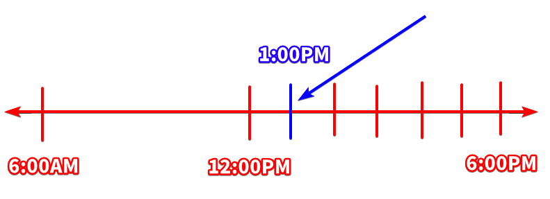
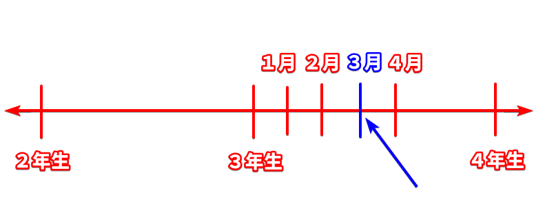

# Particles (basic)

!!! tip "Author's note"
    Particles can be very confusing especially for a beginner. If there's anything that I don't expect you to fully understand it by reading it once only, it will the particles. You should expect to come back and revisit this page (or any other resource) often if you encounter a particle in your input (reading and listening) that you don't understand. That being said, this page does not teach all the particles, nor does it teach all the different functions of each particle. If you're at intermediate level, I suggest you to look up the particle on a monolingual dictionary. Monolingual dictionaries give the best explanations.

## What are particles?
Let's use the following sentence to illustrate what a particle is:

Note: 「魚」 means "fish"  
「食べる」 means "eat"

- 魚食べる。

What is that sentence saying?

- Fish eats (something)
- (Something) eats fish

The answer is: it can be either one. So how do we know if "fish" is doing the "eating", or if "fish" is "being eaten"? In English, we can tell by simply looking at the word order: "fish eats X" vs "X eats fish". In Japanese, we can tell by looking at the particle.

Particles are one or more hiragana characters that attach to **the end of a word** to define the grammatical function of that word in the sentence. In other words, a particle defines the "role" of a word in a sentence. Using the correct particle is very important because the meaning of a sentence can completely change just by changing the particle.

For example:

- 魚 ==が== 食べる。  
Means "Fish eats (something)"
- 魚 ==を== 食べる。  
Means "(Something) eats fish"

We can finally put the knowledge from Sentence Structures into use. As a reminder, this is how we visualize our train analogy:

<table>
  <tr>
    <th colspan="2" style="text-align: center; border: 1px solid black">Topic 🏳️</th>
  </tr>
  <tr>
    <th style="text-align: center; border: 1px solid black">Main wagon "A"</th>
    <th style="text-align: center; border: 1px solid black">Engine "B"</th>
  </tr>
  <tr>
    <td style="text-align: center; border: 1px solid black"> - </td>
    <td style="text-align: center; border: 1px solid black"> - </td>
  </tr>
</table>

Let's begin learning some basic particles. Each particle has more than one function. We will only learn a few basic usage for each particle for now.

## Topic particles

If we follow the analogy of the train, then topic particles are the particles that go into the "Topic 🏳️" part of the train. We will learn what this actually means when we learn about the particles themselves. There are two topics particles in Japanese: 「は」 and 「も」.

### 「は」

**「は」 is the topic particle**. To follow the analogy of our hypothetical train, **「は」is like a flag**. Why do we depict it as a flag? Because that's what it does. **It flags something as the topic of the sentence**. While the kana 「は」 is normally pronounced as 「は」, it is pronounced as 「わ」 when it is being used as the topic particle.

Let's look at an example sentence:

- 私は日本人だ

literally means:

- "As for me, (I) am Japanese" 
- "Speaking of me, (I) am Japanese"
- "In relation to me, (I) am Japanese" 

To visualize this, here's how it looks by using our train analogy:

<table>
  <tr>
    <th colspan="2" style="text-align: center">私は 🏳️</th>
  </tr>
  <tr>
    <th style="text-align: center">Main wagon "A"</th>
    <th style="text-align: center">Engine "B"</th>
  </tr>
  <tr>
    <td style="text-align: center">Ø が</td>
    <td style="text-align: center">日本人だ</td>
  </tr>
</table>

The full sentence in Japanese is 「私はØが日本人だ」. The zero pronoun (Ø) means "I" in this context (we learned this in the "Invisible main wagon "A" section). We marked 「私」 as the topic of our sentence by attaching the 「は」 particle to it. That same sentence in English would be:

<table>
  <tr>
    <th colspan="2" style="text-align: center">As for me 🏳️</th>
  </tr>
  <tr>
    <th style="text-align: center">Main wagon "A"</th>
    <th style="text-align: center">Engine "B"</th>
  </tr>
  <tr>
    <td style="text-align: center">I</td>
    <td style="text-align: center">am Japanese</td>
  </tr>
</table>

Now, you might ask yourself, "Isn't this overcomplicated? Can't we just pretend that 「私は」 is the main wagon "A" and translate the sentence as simply "I am Japanese?". The answer is **NO**. Although it works in this example sentence, it doesn't work in every case and that's why you shouldn't do it. When you run into sentences where "pretending that 「は」 is the main wagon" doesn't work, now you suddenly can't understand the sentence and you get lost.

To illustrate why you shouldn't pretend that the topic is the main wagon, let's take a look at the following sentence:  

*A group of friends are dining at a restaurant, and one person tells the waiter:*

- 私は魚だ

The joke is that the person has literally said "I am a fish". After all, if 「私は日本人だ」 means "I am Japanese", then 「私は魚だ」 must mean "I am a fish", right? That makes perfect sense, except that 「私は日本人だ」 doesn't actually mean "I am Japanese"; it means "As for me, (I) am Japanese". This is why it is important to not pretend that the "topic" is the main wagon "A". If we look at the train for 「私は日本人だ」:

<table>
  <tr>
    <th colspan="2" style="text-align: center">私は 🏳️</th>
  </tr>
  <tr>
    <th style="text-align: center">Main wagon "A"</th>
    <th style="text-align: center">Engine "B"</th>
  </tr>
  <tr>
    <td style="text-align: center">Ø が</td>
    <td style="text-align: center">日本人だ</td>
  </tr>
</table>

Ø can be assumed to be "I" based on context. However, in the case of 「私は魚だ」, the train looks like this:

<table>
  <tr>
    <th colspan="2" style="text-align: center">私は 🏳️</th>
  </tr>
  <tr>
    <th style="text-align: center">Main wagon "A"</th>
    <th style="text-align: center">Engine "B"</th>
  </tr>
  <tr>
    <td style="text-align: center">Ø が</td>
    <td style="text-align: center">魚だ</td>
  </tr>
</table>

where Ø means "it". What is "it"? "It" is the thing we are talking about: *what we are eating for dinner*. So, the sentence 「私は魚だ」 actually means:

- As for me, (it) is fish.

Or in normal English, we would say "I'll have the fish" or "I'll go with the fish".

To better understand what the topic particle **does** and what it **doesn't do**, let's look at another example sentence without 「は」.

Note: 「投げる」(なげる) means "throw"  
「ボール」 means "ball"

- 私がボールをさくらに投げる

Main wagon "A" | Wagon 「を」 | Wagon 「に」 | Engine "B"
:---: | :---: | :---: | :---:
私が | ボールを | さくらに | 投げる

This sentence means "I throw a ball at Sakura" or "I throw a ball to Sakura". All three particles in this sentence -「が」,「を」and 「に」 tell us the "role" of each word that it's attached to. 「が」 tells us *who* threw the ball, 「を」 tells us *what* was thrown, 「に」 tells us *to whom* the ball was thrown.

!!! note
    We will learn more about 「が」,「を」and 「に」 in a later section.

Now that we've seen how those particles can affect the "role" of a word, let's introduce the 「は」 particle into the sentence to see what a topic particle does.

- 私はさくらにボールを投げる

<table>
  <tr>
    <th colspan="4" style="text-align: center">私は 🏳️</th>
  </tr>
  <tr>
    <th style="text-align: center">Main wagon "A"</th>
    <th style="text-align: center">Wagon 「に」</th>
    <th style="text-align: center">Wagon 「を」</th>
    <th style="text-align: center">Engine "B"</th>
  </tr>
  <tr>
    <td style="text-align: center">Ø が</td>
    <td style="text-align: center">さくらに</td>
    <td style="text-align: center">ボールを</td>
    <td style="text-align: center">投げる</td>
  </tr>
</table>

This means "As for me, (I) throw the ball at Sakura".

We can give the flag to the "ball" instead:

- ボールは私がさくらに投げる

<table>
  <tr>
    <th colspan="4" style="text-align: center">ボールは 🏳️</th>
  </tr>
  <tr>
    <th style="text-align: center">Main wagon "A"</th>
    <th style="text-align: center">Wagon 「に」</th>
    <th style="text-align: center">Wagon 「を」</th>
    <th style="text-align: center">Engine "B"</th>
  </tr>
  <tr>
    <td style="text-align: center">私が</td>
    <td style="text-align: center">さくらに</td>
    <td style="text-align: center">Ø を</td>
    <td style="text-align: center">投げる</td>
  </tr>
</table>

This means "As for the ball, I throw (it) at Sakura". 

Notice how the logical meaning of the sentence doesn't change at all. Let us remind ourselves of the relationship between Topic-Comment and Structure-Object.

<table style="border: 1px solid black">
  <tr>
    <th rowspan="2" style="text-align: center; vertical-align: middle; border: 1px solid black">Topic</td>
    <th colspan="4" style="text-align: center; border: 1px solid black">Comment</td>
  </tr>
  <tr>
    <th style="text-align: center; border: 1px solid black">Main wagon</th>
    <th style="text-align: center; border: 1px solid black">「に」</th>
    <th style="text-align: center; border: 1px solid black">「を」</th>
    <th style="text-align: center; border: 1px solid black">Engine "B"</th>
  </tr>
  <tr>
    <td style="text-align: center; border: 1px solid black">ボールは</td>
    <td style="text-align: center; border: 1px solid black">私が</td>
    <td style="text-align: center; border: 1px solid black">さくらに</td>
    <td style="text-align: center; border: 1px solid black">Ø を</td>
    <td style="text-align: center; border: 1px solid black">投げる</td>
  </tr>
</table>

The "Topic" simply brings something up as... well, the topic of the conversation. It doesn't tell us anything *about* it. That's what the "Comment" is there for. The "Comment" is what tells us logical information. This is why the "Topic" doesn't change the logical meaning of the sentence.

**It is important to note that giving the 「は」 flag to a word can change the nuance of the sentence every so slightly**, but we don't have to worry about it for now. We will have a deeper look at these nuances in a later section.

### 「も」

**「も」 is the inclusive topic particle**. It is essentially the topic particle with the additional meaning of the English words "also" and "too". Basically, it can introduce another topic in addition to the current topic.

The particle 「も」 (and the English words "also" and "too" for that matter) can be broken down into two functions:

- Function 1: One person/thing "is" or "does" the same thing as another person/thing.  
Example:  
*Alice is studying. Bob is studying ==too==.*  
*Alice is studying. Bob is ==also== studying.*

- Function 2: If a person/thing "is" or "does" something, you can provide additional information about that person/thing.  
Example:  
*He is a brilliant linguist. He is ==also== interested in botany.*  
*He is a brilliant linguist. He is interested in botany ==too==.*

???+ info "Function 1: the comment of the new and old topic are the same"
    - 私 ==も== 学生だ。

    <table>
      <tr>
        <th colspan="2" style="text-align: center">私も 🏳️</th>
      </tr>
      <tr>
        <th style="text-align: center">Main wagon "A"</th>
        <th style="text-align: center">Engine "B"</th>
      </tr>
      <tr>
        <td style="text-align: center">Ø が</td>
        <td style="text-align: center">学生だ</td>
      </tr>
    </table>

    *As for me ==too==, (I) am student.*

    Let's look at 「も」 in dialogues:

    **Example 1**

    ボブ： アリスは学⽣？  
    アリス： うん、トム ==も== 学⽣。

    *Literal translation*  
    Bob: As for Alice, are (you) a student?  
    Alice: Yes. As for Tom ==also==, (he) is a student.

    *Normal English*  
    Bob: Are you a student?  
    Alice: Yeah, Tom is student ==too==. / Yeah, Tom is ==also== a student.

    **The comments must be consistent (old and new)**. It would not make sense to say, "*I am a student (old comment), and Tom is not a student too (new comment).*" If the comments are NOT the same, we should use 「は」 to make a **contrast**. Let's look at the next example.

    !!! note 
        We will learn more about the **contrast** property of 「は」 in a later section when we compare 「は」 vs 「も」.

    **Example 2**

    ボブ： アリスは学⽣？  
    アリス： うん、でもトム ==は== 学⽣じゃない。

    *Literal translation*  
    Bob: As for Alice, are (you) a student?  
    Alice: Yes, but, as for Tom, (he) is not.

    *Normal English*  
    Bob: Are you a student?  
    Alice: Yeah, but Tom is not.

    **Example 3**

    If both comments are consistent, then we can use 「も」, just like we did in Example 1.

    ボブ：アリスは学⽣？  
    アリス：ううん、トム ==も== 学⽣じゃない。

    *Literal trasnlation*  
    Bob: As for Alice, are (you) a student?  
    Alice: No, as for Tom ==also==, (he) is not a student.

    *Normal English*  
    Bob: Are you a student?  
    Alice: No, Tom is not student either.

???+ info "Function 2: Provide additional relevant information"
    **Example 1**

    Person A: （私は）==君のことが好きだ==  
    Person B: 私も ==（君のことが）好きだ==

    *Literal translation*  
    Person A: (As for me), ==you are liked.==  
    Person B: As for me also, ==(you) are liked.==

    *Normal English*  
    Person A: I like ==you==.  
    Person B: I also like ==you==. (I like you too)

    This usage of 「も」 is simply providing us the additional information of "I like you too" (from Person B), on top of the previous information "I like you" (from Person A).

    **Example 2**

    Suppose you were working on something on a Sunday night. There's someone who is staying up with you to help you finish your task. Then you realize that it's already midnight and you want to let the other person know that it's OK to go to sleep now. You could say to the other person:

    - もう寝ていいよ。{++疲れた++}でしょう？明日は月曜日だから{++仕事 ==も== あるし++}。  
    Literally: *It's OK to sleep. {++Tired++}, right? Tomorrow is Monday so {++there is ==also== work++}.*  

    Or in normal English:

    *You can go to sleep now. {++You must be tired++}, right? It's Monday tomorrow so {++you ==also== have to work++}.*

    In this example, 「も」 is simply adding one more reason why that person should go to sleep now: "{++you have work tomorrow++}". The previous reason was "{++you must be tired++}".

**「も」 doesn't change the logical meaning of a sentence**

Just like 「は」, 「も」 doesn't change the logical meaning of the sentence either. After all, 「も」 is also a topic particle. This is true regardless of which function (function #1 or #2) 「も」 is doing in a particular sentence. Let's use the same example we saw in the section about 「は」 to illustrate how 「も」 doesn't change the logical meaning of a sentence.

- 私がさくらにボールを投げる

Main wagon "A" | Wagon 「を」 | Wagon 「に」 | Engine "B"
:---: | :---: | :---: | :---:
私が | ボールを | さくらに | 投げる

This means "I throw a ball at Sakura".

Now, let's add the 「も」 flag.

- 私もさくらにボールを投げる

<table>
  <tr>
    <th colspan="4" style="text-align: center">私も 🏳️</th>
  </tr>
  <tr>
    <th style="text-align: center">Main wagon "A"</th>
    <th style="text-align: center">Wagon 「に」</th>
    <th style="text-align: center">Wagon 「を」</th>
    <th style="text-align: center">Engine "B"</th>
  </tr>
  <tr>
    <td style="text-align: center">Ø が</td>
    <td style="text-align: center">さくらに</td>
    <td style="text-align: center">ボールを</td>
    <td style="text-align: center">投げる</td>
  </tr>
</table>

This means "As for me too, (I) throw a ball at Sakura". In normal English, we might say "I also throw a ball at Sakura". Notice that the logical meaning of the sentence hasn't changed. The person throwing the ball (marked by 「が」) is still 「私」, the object being thrown is still 「ボール」, the recipient of the ball is still 「さくら」.

This is true regardless of the function of 「も」. If 「も」 is acting as **function #1**, then it could be something like:

- Bob throws a ball at Sakura. ==I also throw a ball at Sakura==.

If 「も」 is acting as **function #2**, then it could be something like:

- One time when I got angry, I punched and broke my TV. ==I also threw a ball at Sakura==.

I don't condone violence, but you get the idea. The logical meaning of the sentence doesn't change.

We can even give the flag to the "ball".

- ボールも私がさくらに投げる

<table>
  <tr>
    <th colspan="4" style="text-align: center">ボールも 🏳️</th>
  </tr>
  <tr>
    <th style="text-align: center">Main wagon "A"</th>
    <th style="text-align: center">Wagon 「に」</th>
    <th style="text-align: center">Wagon 「を」</th>
    <th style="text-align: center">Engine "B"</th>
  </tr>
  <tr>
    <td style="text-align: center">私が</td>
    <td style="text-align: center">さくらに</td>
    <td style="text-align: center">Ø を</td>
    <td style="text-align: center">投げる</td>
  </tr>
</table>

This means "As for the ball too, I throw (it) at Sakura". Again, the logical meaning of the sentence still doesn't change. The person throwing the ball is still 「私」, the object being thrown (marked by 「を」) is still 「ボール」, the recipient of the ball is still 「さくら」.

## Case marking particles

Case marking particles (格助詞) are particles that mark the role of a word in a sentence. This "role" defines the relationship between the word itself and the engine. 

!!! danger "REPEAT AFTER ME"
    **Case marking particles define the relationship between the word that they are marking and the Engine.** 
    
    If the engine is 「食べる」(eat), then we can answer the following questions by simply looking at the case marking particles:

    - Who ate it? (marked by 「が」)
    - What was eaten? (marked by 「を」)
    - When was it eaten? (marked by 「に」)
    - Where was it eaten? (marked by 「で」)
    - With whom was it eaten? (marked by 「と」)
    - etc...

Each case marking particle has **more than one function**. We will learn only the basic functions for now.

### 「が」

???+ info "Function 1: Marks the subject (main wagon "A") of the sentence"
    **Example 1**

    - ==雨が== 降る  
    ==Rain== falls

    Main wagon "A" | Engine "B"
    :---: | :---:
    ==雨が== | 降る

    「が」 marks the subject of the sentence. In other words, it marks the main wagon "A". It marks the *doer*. It tells us *who* or *what* is doing the action of engine "B". Here, the engine "B" is the verb 「降る」(fall). What is falling? Rain is falling.

    **Example 2**

    - ==りんごが== 美味しい  
    ==Apple== is delicious

    Main wagon "A" | Engine "B"
    :---: | :---:
    ==りんごが== | 美味しい  

    Here, the engine is 「美味しい」(is delicious). What is delicious? Apple is delicious.

### 「を」

The kana 「を」 is normally pronounced as 「を」, but when it's used as a particle, it's pronounced as 「お」. You might ocassionally hear it actually being pronounced as 「を」 in some songs.

???+ info "Function 1: Marks the direct object of an action"
    **Example 1**

    - ==水を== 飲む  
    Drink ==water==

    Main wagon "A" | 「を」 | Engine "B"
    :---: | :---: | :---:
    Ø が | ==水を== | 飲む
    
    Here, the engine is 「飲む」(drink). In other words, the action is "drink". What are you drinking? What's the object that you're drinking? You're drinking water.

    **Example 2**

    - ==映画を== 見る  
    Watch ==movie==

    Main wagon "A" | 「を」 | Engine "B"
    :---: | :---: | :---:
    Ø が | ==映画を== | 見る  
    
    Here, the engine/action is 「見る」(watch). What are you watching? You're watching a movie.

    **Example 3**

    - ==ケーキを== 作る  
    Make ==cake==

    Main wagon "A" | 「を」 | Engine "B"
    :---: | :---: | :---:
    Ø が | ==ケーキを== | 作る  

    The engine is 「作る」(make). What are you making? A cake.

???+ info "Function 2: Marks the physical space of movement/motion"
    **Example 1**

    - ==階段を== 上がる  
    Go up ==the stairs==

    Main wagon "A" | 「を」 | Engine "B"
    :---: | :---: | :---:
    Ø が | ==階段を== | 上がる  

    The engine is 「上がる」(go up). In other words, the movement is "go up". What is the physical space in which you "go up"? The stairs.

    **Example 2**

    - ==階段を== 降りる  
    Go down ==the stairs==

    Main wagon "A" | 「を」 | Engine "B"
    :---: | :---: | :---:
    Ø が | ==階段を== | 降りる

    The movement is "go down". What is the physical space in which you are "going down"? The stairs.

    **Example 3**

    - ==空を== 飛ぶ  
    Fly ==in the sky==

    Main wagon "A" | 「を」 | Engine "B"
    :---: | :---: | :---:
    Ø が | ==空を== | 飛ぶ

    The engine is 「飛ぶ」(fly). The movement is "fly". What's the physical space in which you are flying? The sky.

    **Example 4**

    - ==公園を== 散歩する  
    Take a walk ==in the park==

    Main wagon "A" | 「を」 | Engine "B"
    :---: | :---: | :---:
    Ø が | ==公園を== | 散歩する

    The engine is 「散歩する」(stroll). The movement is "stroll". What's the physical space in which you are taking a stroll? The park.

    **Example 5**

    - ==山道を== 登る  
    Climb ==mountain path==

    Main wagon "A" | 「を」 | Engine "B"
    :---: | :---: | :---:
    Ø が | ==山道を== | 登る

    The movement is 「登る」(climb). What's the physical space in which you are climbing up? The mountain path.

    !!! tip
        One way to help remember this function of 「を」, is to treat it as if it was function #1. You can imagine the "physical space" as a literal direct object of your movement, where your footprints get left behind after you "move" across it.

        - ==階段を== 上がる  
        Go up ==the stairs==  
        You leave your footprints on the stairs when you go up the stairs.

        - ==空を== 飛ぶ  
        Fly ==in the sky==  
        You leave your footprints on the sky when you fly across it. (I'm streching this imagination very far. I know.)

        - ==公園を== 散歩する  
        Take a walk ==in the park==  
        You leave your footprints on the park when you walk along it.

        - ==山道を== 登る  
        Climb ==mountain path==  
        You leave your footprints on the mountain path when you climb it.

???+ info "Function 3: Marks the place of departure"
    **Example 1**

    - ==電車を== 降りる  
    Get off ==train==

    Main wagon "A" | 「を」 | Engine "B"
    :---: | :---: | :---:
    Ø が | ==電車を== | 降りる

    The engine is 「降りる」(get off). When you step out of the train, then the train will be the "starting point" of your movement.

    **Example 2**

    - ==家を== 出る  
    Leave ==house==

    Main wagon "A" | 「を」 | Engine "B"
    :---: | :---: | :---:
    Ø が | ==家を== | 出る

    The engine is 「出る」(exit). When you leave(exit) your house, then the house will be the "starting point" of your movement.

    **Example 3**
    
    - ==席を== 離れる  
    Leave ==seat==

    Main wagon "A" | 「を」 | Engine "B"
    :---: | :---: | :---:
    Ø が | ==席を== | 離れる

    The engine is 「離れる」 which means "to separate (from someting)" or "to distant (from something)" or "to go away (from something)". If you are sitting in your seat, and then stand up and leave, then you are separating yourself (physically) from the seat. The seat then becomes the "starting point" of this movement of "separation".

    **Example 4**

    - ==脇道を== 入る  
    Enter ==side road==

    Main wagon "A" | 「を」 | Engine "B"
    :---: | :---: | :---:
    Ø が | ==脇道を== | 入る

    The engine is 「入る」(enter). When enter into a side road, then the side road is the "starting point" of that entrance.

### 「に」

The particle 「に」 also has many functions. I personally like to think of the particle 「に」 as an **arrow**. Why? It will become apparent when we compare 「に」 to other particles in a later section.

???+ info "Function 1: Marks location of static verbs"
    Static verbs are verbs that have no movement. For example, "inhabit", "exist", "sit", "appear", etc.

    **Example 1**

    - ==日本に== 住む  
    Live ==in Japan==

    Main wagon "A" | 「に」 | Engine "B"
    :---: | :---: | :---:
    Ø が | ==日本に== | 住む

    The engine is 「住む」 which means "live" or "inhabit" or "reside". Where do you live? You live in Japan.

    **Example 2**

    - ==机の上に== ノートがある  
    There is a notebook ==on the desk==
    
    「に」 | Main wagon "A" | Engine "B"
    :---: | :---: | :---:
    ==机の上に== | ノートが | ある

    The engine is 「ある」(exist). Where does the notebook exist? Or in normal English, where *is* the notebook? It's on the desk.

    **Example 3**

    - ==冷蔵庫の中に== 牛乳がある  
    There is milk ==inside the fridge==

    「に」 | Main wagon "A" | Engine "B"
    :---: | :---: | :---:
    ==冷蔵庫の中に== | 牛乳が | ある

    The engine is again 「ある」. Where is the milk? It's inside the fridge.

    **Example 4**

    - 先生は ==教室に== いる  
    The teacher is ==in the classroom==

    <table>
      <tr>
        <th colspan="4" style="text-align: center">先生は 🏳️</th>
      </tr>
      <tr>
        <th style="text-align: center">Main wagon "A"</th>
        <th style="text-align: center">「に」</th>
        <th style="text-align: center">Engine "B"</th>
      </tr>
      <tr>
        <td style="text-align: center">Ø が</td>
        <td style="text-align: center">==教室に==</td>
        <td style="text-align: center">いる</td>
      </tr>
    </table>

    The engine is 「いる」(exist). Where is the teacher? Inside the classroom.

    **Example 5**

    - ==あそこに== 座ってる  
    Sitting ==over there==

    Main wagon "A" | 「に」 | Engine "B"
    :---: | :---: | :---:
    Ø が | ==あそこに== | 座ってる

    The engine is 「座ってる」(sitting). Where are you sitting? Over there.

???+ info "Funcion 2: Marks the time or order in which an action will happen"
    **Example 1**

    - ==五時に== 起きる  
    Wake up ==at five o'clock==

    Main wagon "A" | 「に」 | Engine "B"
    :---: | :---: | :---:
    Ø が | ==五時に== | 起きる

    The engine is 「起きる」(wake up). At what time will you wake up? At 5 o'clock.

    **Example 2**

    - 鈴木さんが ==最後に== 食べた  
    Suzuki ate ==last==

    Main wagon "A" | 「に」 | Engine "B"
    :---: | :---: | :---:
    鈴木さんが | ==最後に== | 食べた

    The engine is 「食べた」 which is the past tense of "eat". In what order? Suzuki was the last one to eat. Maybe Suzuki's friends started eating first.

    **Example 3**

    - ==月曜に== 宿題をやる  
    Do homework ==on Monday==

    Main wagon "A" | 「に」 | 「を」 | Engine "B"
    :---: | :---: | :---: | :---:
    Ø が | ==月曜に== | 宿題を | やる

    The engine is 「やる」(do). What are we doing? Homework (marked by 「を」). When will we do it? On Monday.

    **Example 4**

    - ==ゲームをセーブした後に== 寝る  
    (I) sleep ==after (I) save the game==.

    Main wagon "A" | 「に」 | Engine "B"
    :---: | :---: | :---:
    Ø が | ==ゲームをセーブした後に== | 寝る

    The engine is 「寝る」(sleep), and we want to express the order in which we will do things. We will go to sleep *after* we save the game.

    !!! warning
        「に」 can only be used with **specific time**, and NOT **relative time**.

        Examples of specific time:

        - １時 (1 o'clock)
        - ３月 (March)
        - １５日 (15th day of month)

        Relative time means "relative to now". Examples of relative time:

        - 今日 (today)
        - 明日 (tomorrow)
        - 去年 (last year)
        - 来月 (next month)

        There are also some words that can be used with 「に」 **optionally**:

        - morning (朝)
        - noon (昼)
        - midnight (深夜)
        - dawn (明け方)
        - sunset/dusk (暮れ)
        - before (前)
        - after (後)
        - etc

???+ info "Function 3: Marks the destination of movement"
    **Example 1**

    - ==学校に== 行く    
    Go ==to school==

    Main wagon "A" | 「に」 | Engine "B"
    :---: | :---: | :---:
    Ø が | ==学校に== | 行く

    The engine is 「行く」(go). Where is the destination? School.

    **Example 2**

    - ==家に== 帰る  
    Go back ==home==

    Main wagon "A" | 「に」 | Engine "B"
    :---: | :---: | :---:
    Ø が | ==家に== | 帰る

    The engine is 「帰る」 which means "go back" (specifically used for going back to where one is from). Where are we going back to? Home.

    **Example 3**

    - ==日本に== 帰る  
    Go back ==home==

    Main wagon "A" | 「に」 | Engine "B"
    :---: | :---: | :---:
    Ø が | ==日本に== | 帰る

    The engine is 「帰る」 again. Where are we going back to? Japan.

    **Example 4**

    - ==山に== 登る  
    Climb ==mountain==

    Main wagon "A" | 「に」 | Engine "B"
    :---: | :---: | :---:
    Ø が | ==山に== | 登る

    The engine is 「登る」(climb). Where is the destination of climbing up? The (summit of the) mountain.

    **Example 5**

    - ==電車に== 乗る  
    Get on ==train==

    Main wagon "A" | 「に」 | Engine "B"
    :---: | :---: | :---:
    Ø が | ==電車に== | 乗る

    The engine is 「乗る」 which means "get on" (a vehicle). When you step inside the train, then the train is the destination of "get on".

    **Example 6**

    - ==駅に== 着いた  
    Arrived at ==station==

    Main wagon "A" | 「に」 | Engine "B"
    :---: | :---: | :---:
    Ø が | ==駅に== | 着いた

    The engine is 「着いた」(arrived). Where is the destination of arrival? The station.

???+ info "Function 4: Marks the receiver of an action"
    Some resources call this "indirect object".

    **Example 1**

    - ==友達に== 花をあげる  
    Give flowers ==to friend==

    Main wagon "A" | 「に」 |  「を」 | Engine "B"
    :---: | :---: | :---: | :---:
    Ø が | ==友達に== | 花を | あげる

    The action is 「あげる」(give). What are we giving? Flowers (marked by 「を」). Who are we givint it to? Who is receiving the flowers? Friend.

    **Example 2**

    - ==神に== 誓う  
    Pray to ==God==

    Main wagon "A" | 「に」 | Engine "B"
    :---: | :---: | :---:
    Ø が | ==神に== | 誓う

    The action is 「祈る」(pray). Who are we praying to? Who is receiving our prayers? God.

    **Example 3**

    - ==友達に== 話す  
    Talk ==to friend==

    Main wagon "A" | 「に」 | Engine "B"
    :---: | :---: | :---:
    Ø が | ==友達に== | 話す

    The action is 「話す」(talk). Who are we talking to? Friend.

    **Example 4**

    - ==弟に== 数学を教える  
    Teach math ==to little brother==

    Main wagon "A" | 「に」 | 「を」 | Engine "B"
    :---: | :---: | :---: | :---:
    Ø が | ==弟に== | 数学を | 教える 

    The action is 「教える」(teach). What are we teaching? Math (marked by 「を」). Who are we teaching it to? Who is receiving our teachings? Little brother.

    **Example 5**

    - ==読書に== 熱中する  
    Passionate about ==reading==
    
    Main wagon "A" | 「に」 | Engine "B"
    :---: | :---: | :---:
    Ø が | ==読書に== | 熱中する

    The action is 「熱中する」 which means "to be enthusiastic" or "to be passionate". This verb doesn't really translate well into English, since 「熱中する」 is an action (verb), but the English words "enthusiastic" and "passionate" are adjectives. Another translation (although not as accurate) is to say "Focus on reading". The action (verb) "to focus" means "to give your focus". If you are "focusing on reading" then you are "giving your focus to reading". Likewise, 「熱中する」 is "to enthusize" (if you will) which means "to give your enthusiasm" (or in normal English "to be enthusiastic").

    I digress. The action is 「熱中する」. What is receiving our passion? Reading.

    **Example 6**

    - ==友達に== 会う  
    Meet ==friend==

    Main wagon "A" | 「に」 | Engine "B"
    :---: | :---: | :---:
    Ø が | ==友達に== | 会う

    The action is 「会う」(meet up). Who are we meeting? Who is the "target" of the action "meet up"? It is "friend".

    **Example 7**

    - ==君の意見に== 賛成する  
    Agree with ==your opinion==

    Main wagon "A" | 「に」 | Engine "B"
    :---: | :---: | :---:
    Ø が | ==君の意見に== | 賛成する

    The action is 「賛成する」(agree). What is receiving our agreement? "Your opinion" is receiving it.

???+ info "Function 5: Marks the object used as basis/standard for comparison"
    **Example 1**

    - 私が ==母に== 似ている  
    I resemble ==mother==

    Main wagon "A" | 「に」 | Engine "B"
    :---: | :---: | :---:
    私が | ==母に== | 似ている

    The verb is 「似ている」(resemble). The subject is 「私」(I). Who do I resemble? Who do I look like? Mother. We are marking 「母」 with the particle 「に」 to say that "mother" is the basis/standard of comparison, and we're saying "I resembler her" or "I look like her".

    **Example 2**

    - ==海に== 近い  
    Close to ==sea==

    Main wagon "A" | 「に」 | Engine "B"
    :---: | :---: | :---:
    Ø が | ==海に== | 近い

    The engine is 「近い」 which means "is close" or "is nearby". What are we close to? The sea. We marked 「海」 with the particle 「に」 to say that we are close *to* it.

### 「へ」

The particle 「へ」 also has many functions that resembles the particle 「に」. The kana 「へ」 is normally pronounced as 「へ」, but when it is being used as a particle, it is always pronounced as 「え」. 

???+ info "Function 1: Marks the direction of an action"
    **Example 1**

    - ==南へ== 向かう  
    Head towards ==south==

    Main wagon "A" | 「へ」 | Engine "B"
    :---: | :---: | :---:
    Ø が | ==南へ== | 向かう

    The action is 「向かう」 which means "face towards" or "head towards". Which direction are we heading towards? South.

    **Example 2**

    - ==東へ== 進む  
    Advance towards ==east==

    Main wagon "A" | 「へ」 | Engine "B"
    :---: | :---: | :---:
    Ø が | ==東へ== | 進む

    The action is 「進む」 which means "advance towards" or "go forward". Which direction are we advacing towards? East.

???+ info "Function 2: Marks the receiver of an action"
    This is exactly like the "marks the receiver of an action" function from 「に」. However 「へ」 allows us to modify a word in a way that 「に」 cannot.
    
    **Example 1**

    - ==母へ== の手紙  
    A letter ==to mother==

    「手紙」 means "letter". If we ignore 「へ」 for now, and only look at the rest of the phrase: 「母の手紙」, then this phrase means "mother's letter". We already learned about describing a noun using another noun. In this case, 「母」 is telling us what kind of 「手紙」 it is, because those two words are connected with 「の」. So, the phrase "mother's letter" means that the letter is coming "from mother".

    Now, if we change the 「母」 part into 「母へ」, then that means "targeted at mother". So, if we take 「母へ」 and use it to describe 「手紙」」, then it will become 「==母へ==」+「の」+「{++手紙++}」 → 「==母へ== の{++手紙++}」: "==targeted at mother== {++letter++}". Or in normal English: "a letter to mother" or "a letter for mother". The letter is not *from mother*; the letter is *targeted at mother*.

    We can change this into a sentence (main wagon "A" + engine "B") to better understand what's going on:

    - 私が ==母へ== 手紙を書いた
    - 私が ==母に== 手紙を書いた

    Main wagon "A" | 「へ」 or 「に」 | 「を」 | Engine "B"
    :---: | :---: | :---: | :---:
    私が | ==母へ== | 手紙を | 書いた
    私が | ==母に== | 手紙を | 書いた

    We can use either 「へ」 or 「に」 to mark 「母」 and they would both mean the same thing. Both sentences can be translated as "I wrote a letter to mother". We can then re-arrange the order of the words to revert it back to how it was:

    - ⭕ 私が書いた母 ==へ== の手紙
    - ❌ 私が書いた母 ==に== の手紙

    *A letter that I wrote ==to== mother*

    If we recall what we learned in [Describing a noun using a verb](description.md#using-a-verb), we can say:

    - ==私が書いた== 手紙  
    A letter ==that I wrote==

    to describe 「手紙」 with 「私が書いた」. We're talking about the 「手紙」(letter). What kind of letter? A letter that I wrote (私が書いた手紙). Now let's say that we want to be more specific, and include "A letter that I wrote ==to mother==*. To do this in Japanese, we simply include 「母へ」, and connect it to 「手紙」 with 「の」. The final result is:

    - 私が書いた ==母へ== の手紙  
    A letter that I wrote ==to mother==

    If we omit the 「私が書いた」 part, we now have what we saw at the beginning of this example:

    - (私が書いた) ==母へ== の手紙  
    A letter (that I wrote) ==to mother==

    !!! warning
        Notice that we CAN say:

        - ⭕ 母 ==へ== の手紙

        but we CANNOT say:

        - ❌ 母 ==に== の手紙

        this is because 「への」 is allowed, but 「にの」 is not. Why? Don't ask me. Here is what 明鏡国語辞典 says about this:

        > 「私は母 に／へ 手紙を書いた（→私が書いた母への手紙）」のように、名詞句では「にの」の形がないので、すべて「への」となる。

    **Example 2**

    - ==彼女へ== のプレゼントを買った  
    Bought a gift ==for girlfriend==

    Main wagon "A" | 「を」 | Engine "B"
    :---: | :---: | :---:
    Ø が | ==彼女へ== のプレゼントを | 買った

    Again, 「彼女へ」 means "targeted at girlfriend", and it is describing 「プレゼント」. So, 「彼女へのプレゼント」 means "gift for girlfriend". And the entire thing is marked by 「を」 to tell us *what* was bought.

???+ info "Function 3: Marks the destination of movement"
    This is exactly like the "marks the destination of a verb" function from 「に」.

    - ==学校へ== 行く  
    Go ==to school==

    - ==家へ== 帰る  
    Go back ==home==

    - ==日本へ== ようこそ！  
    Welcome ==to Japan==!

### 「で」

The particle 「で」 also has many functions, which I like to summarize as the **boundary** particle.

???+ info "Function 1: Marks the place where an action takes place"
    **Example 1**

    - ==教室で== 勉強する  
    Study in ==classroom==

    Main wagon "A" | 「で」 | Engine "B"
    :---: | :---: | :---:
    Ø | ==教室で== | 勉強する

    The action is 「勉強する」(study). Where are we studying? In the classroom.

    **Example 2**

    - ==映画館で== 映画を⾒た。  
    *Saw a movie at the ==movie theater==* 

    Main wagon "A" | 「で」 | 「を」 | Engine "B"
    :---: | :---: | :---: | :---:
    Ø | ==映画館で== | 映画を | 見た

    The action is 「見る」(see). What are we seeing? We are seeing 「映画」(movie). Where are we seeing the movie? we are seeing it at 「映画館」(movie theather).

???+ info "Function 2: Marks the instrument/material/method used to perform an action"
    **Example 1**

    - ==自転車で== 行く  
    Go by ==bike==

    Main wagon "A" | 「で」 | Engine "B"
    :---: | :---: | :---:
    Ø | ==自転車で== | 行く

    The action is 「行く」(go). By which means are we going? We are going by bike.

    **Example 2**

     - ==鉛筆で== 書く  
    Write with ==pencil==

    Main wagon "A" | 「で」 | Engine "B"
    :---: | :---: | :---:
    Ø | ==鉛筆で== | 書く

    The action is 「書く」(write). What instrument did we use to write? We used a pencil.

    **Example 3**

    - ==ラジオで== 話を聞いた  
    Heard the story on the ==radio==

    Main wagon "A" | 「で」 | 「を」 | Engine "B"
    :---: | :---: | :---: | :---:
    Ø | ==ラジオで== | 話を | 聞いた

    The action is 「聞く」(hear) in past-tense. What did we hear? We heard a 「話」(story). What instrument did we use to hear the story? We used a radio.

    **Example 4**

    - ==米で== 酒を作る  
    Make Sake out of ==rice==

    Main wagon "A" | 「で」 | 「を」 | Engine "B"
    :---: | :---: | :---: | :---:
    Ø | ==米で== | 酒を | 作る

    The action is 「作る」(make). What are we making? We are making 「お酒」(Sake). What ingredient was used to make it? Rice.

    **Example 5**

    - ==紙で== 飛行機を作る  
    Make airplane out of ==paper==

    Main wagon "A" | 「で」 | 「を」 | Engine "B"
    :---: | :---: | :---: | :---:
    Ø | ==紙で== | 飛行機を | 作る

    Again, we are saying "make an airplane". What ingredient was used to make it? Paper.

???+ info "Function 3: Marks the state/circumstance/condition in which an action happens"
    **Example 1**

    - ==大声で== 叫ぶ  
    Shout with ==loud voice==

    Main wagon "A" | 「で」 | Engine "B"
    :---: | :---: | :---:
    Ø | ==大声で== | 叫ぶ

    The action is 「叫ぶ」(shout). In what state or condition are we shouting? The state is "loud voice".
    
    **Example 2**

    - ==急ぎ足で== 歩く  
    Walk with ==fast pace==

    Main wagon "A" | 「で」 | Engine "B"
    :---: | :---: | :---:
    Ø | ==急ぎ足で== | 歩く

    The action is 「歩く」(walk). In what state or condition are we walking? The state is "fast pace".

    **Example 3**

    - ==裸足で== 出かける  
    Go out ==barefoot==

    Main wagon "A" | 「で」 | Engine "B"
    :---: | :---: | :---:
    Ø | ==裸足で== | 出かける

    The action is 「出かける」 which means "go out"(as in "leave or exit a building"). In which state are we going out? We are going out barefoot.

    **Example 4**

    - ==千円で== 釣りをください  
    Please give me my change in ==bills of 1000 yen==

    Main wagon "A" | 「で」 | 「を」 | Engine "B"
    :---: | :---: | :---: | :---:
    Ø | ==千円で== | 釣りを | ください

    The action is 「くださる」(give me) and it's inflected to express a "request". So, 「ください」 means "please give me" (requesting the other person to "give me"). What is the object that is being given? It's the 「釣り」(change). But we don't want them in 5 yen coins. We wan't them in bills of 1000 yen. In other words, the "state" in which the 「釣り」 will be given, is in "bills of 1000 yen".  

### 「と」

???+ info "Function 1: Used for listing things"
    **Example 1**

    Let's say you want to express "There is a book on the desk":

    - 机の上に本がある  
    There is a book on the desk

    「に」 | Main wagon "A" | Engine "B"
    :---: | :---: | :---:
    机の上に | 本が | ある

    Now, let's say you want to express "There is a book **and a pen** on the desk":

    - 机の上に ==本と== ==ペンと== がある  
    There is ==a book== and ==a pen== on the desk

    If we want to list things, such as "W, X, Y, and Z", we attach 「と」 to each item, like so 「WとXとYとZと」. So, if we want to list "book and pen", we say:

    - 本とペンと
    
    「と」 | 「と」
    :---: | :---:
    本と | ペンと

    Next, 「本とペンと」(book and pen) are the things that are on the desk. In other words "book and pen" is the main wagon "A".

    「に」 | Main wagon "A" | Engine "B"
    :---: | :---: | :---:
    机の上に | ==本と== ==ペンと== が | ある

    **Example 2**

    - ==本と== ==ペンと== を買う  
    Buy ==a book== and ==a pen==

    Again, 「本とペンと」 means "book and pen". The engine here is 「買う」(buy). What are the things that we are buying? Book and pen. Therefore "book and pen" has to be marked by 「を」(function #1 of 「を」):

    Main wagon "A" | 「を」 | Engine "B"
    :---: | :---: | :---:
    Ø が | ==本と== ==ペンと== を | 買う

    !!! tip "The last 「と」 is optional"
        When we list things using 「と」, the last 「と」 is optional .

        - ==君と僕== が選ばれた  
        - ==君と僕と== が選ばれた  

        are both acceptable. Likewise:

        - ==犬と猫== を飼う  
        - ==犬と猫と== を飼う  

        are also acceptable.

???+ info "Function 2: Marks the counterpart of an action"
    There are certain actions (verbs) that, by definition, will always have two sides to it. Examples of these actions are:

    - Marry
    - Fight
    - Playing tennis
    - etc

    **Example 1**

    - ==花子と== 結婚する  
    (I) marry ==Hanako==

    Main wagon "A" | 「と」 | Engine "B"
    :---: | :---: | :---:
    Ø が | ==花子と== | 結婚する

    Here, the action is 「結婚する」(marry). The action "marry" requires two people. On one side is 「Ø」, which we can assume to be 「私」(I) based on context. On the other side is 「花子」, which is marked by 「と」. This is an "A does B" sentence, where "A" is "I", and "the action I'm doing" is "marry". The counterpart of this "marriage" is "Hanako".

    **Example 2**

    - ==太郎と== 戦う  
    Fight against ==Tarou==

    Main wagon "A" | 「と」 | Engine "B"
    :---: | :---: | :---:
    Ø が | ==太郎と== | 戦う

    Here, the action is 「戦う」(fight). The action "fight" requires two sides. On one side is 「Ø」, which we can again assume to be 「私」(I) based on context. On the other side is 「太郎」, which is marked by 「と」. This is an "A does B" sentence, where "A" is "I", and "the action I'm doing" is "fight". The counterpart of this "fight" is "Tarou".

???+ info "Function 3: Marks the person or thing that an aciton is performed together with"
    This is different from the previous function, although not many dictionaries and textbooks make a distinction between this function and the previous one. They just lump these two functions into one function, thinking they are the same.

    **Example 1**

    - ==花さんと== 勉強する  
    Study ==with Hanako==

    Main wagon "A" | 「と」 | Engine "B"
    :---: | :---: | :---:
    Ø が | ==花さんと== | 勉強する

    Here, the action is 「勉強する」(study), and we are doing it TOGETHER WITH 「花子さん」(Hanako).

    **Example 2**

    - ==友達と== 買い物をする  
    Shop ==with friend==

    Main wagon "A" | 「と」 | 「を」 | Engine "B"
    :---: | :---: | :---: | :---:
    Ø が | ==友達と== | 買い物を | する

    The action is 「買い物をする」(to shop), and we are doing it TOGETHER WITH 「友達」(friend).

    **Example 3**

    - ==みんなと== 行く  
    Go ==with everyone==

    Main wagon "A" | 「と」 | Engine "B"
    :---: | :---: | :---:
    Ø が | ==みんなと== | 行く

    The action is 「行く」(go), and we are *going* (somewhere) TOGETHER WITH 「みんな」(everyone).

    **More in-depth explanation**

    This function of 「と」 can be replaced with 「と{++一緒に++}」 and the meaning of the overall sentence will NOT change. The word 「一緒に」 literally means "together".

    - ==花さんと=={++一緒に++}勉強する  
    Study {++together++} ==with Hanako==
    - ==友達と=={++一緒に++}買い物をする  
    Shop {++together++} ==with friend==
    - ==みんなと=={++一緒に++}行く  
    Go {++together++} ==with everyone==

    !!! danger "How is this function different from the previous one?"
        I'm glad you asked :)

        **Example 1**

        Let's take this English phrase as example:

        - I fight with you

        There are 2 interpretations here:

        1. I fight *against* you
        2. I fight *alongside* you

        The first interpretation is using the 「と」 as "*Function #2: Marks the counterpart of an action*".

        The second interpretation is using the 「と」 as "*Function #3: Marks the person or thing that an aciton is performed together with*". **THIS** is the interpretation that can replace 「と」 with 「と一緒に」 and the meaning won't change. Like we saw earlier, the phrase "I fight with you" can have 2 interpretations. But if we explicitly said "I fight *together* with you", then we know for sure that we mean "I fight *alongside* you".

        **Example 2**

        Now let's look at these sentences[^1]:

        [^1]: [文法指導と文法的思考法 : 助詞・助動詞、形容詞・形容動詞について](https://core.ac.uk/download/pdf/78600687.pdf)

        1. 花子さんと勉強する
        2. 花子さんと喧嘩する
        3. 花子さんとデートする
        4. 花子さんと結婚する

        Which of these sentence can we replace 「と」 with 「と一緒に」 and the overall meaning of the sentence remains unchanged? The answer is **1**.

        In the first sentence, the 「と」 is actually being used as "together with". We're saying 「花子さんと（一緒に）勉強する」 or "(I) study (together) with Hanako". The 「と」 as "function #3" can be replaced with 「と一緒に」 and the meaning will not change.

        However, sentences 2, 3, and 4 are different. The 「と」 from those sentences is the 「と」 as "function #2: marks the counterpart". Let's take sentence 4 as example. If we were to change this:

        - 花子さんと結婚する

        to this:

        - 花子さんと{++一緒に++}結婚する

        then we are no longer saying "(I) marry *to* Hanako". Instead we would be saying, "I marry to person X. Hanako marries to person Y. Hanako and I are simply marrying *at the same time together*". Remember that once we use 「と一緒に」 then we are explicitly using the 「と」 with "function #3". This means that "Hanako" is no longer the "counterpart" of my marriage.

        **Example 3**

        Similar to the previous example, let's look at this sentence:

        - ==花子さんと== テニスをする  
        Play tennis ==with Hanako==

        Again, this could be interpreted in two ways, but the most likely scenario is that we are saying "playing tennis *against* Hanako". Hanako is our oponent. This means that the 「と」 in this sentence is being used as "function #2".

        If we were to say:

        - 花子さんと{++一緒に++}テニスをする

        Then we are no longer saying "play tennis with Hanako" in the sense that Hanako is our oponent. We are now saying that Hanako is in our team and we are playing *alongside* Hanako (presumably a 2vs2 match). In this case, the 「と」 is for sure being used as "function #3".

        **Why do I bother with the distinction of these two functions?**

        Because, you might encounter 「と一緒に」 in your input (listening and reading) in places where there "**shouldn't**" be a 「一緒に」. When you do encounter those scenarios, you can now pick up on the (not so) subtle nuance.

        When I say "**shouldn't**", I mean cases like, for example, 「花子と戦う」 where it's *usually* interpreted as "against". But if you see 「花子と一緒に戦う」, then you can know for sure that it means "alongside".

???+ info "Function 4: Marks the object used for comparison"
    **Example 1**

    - ==以前と== 同じだ  
    (It) is the same as ==before==

    Main wagon "A" | 「と」 | Engine "B"
    :---: | :---: | :---:
    Ø が | ==以前と== | 同じだ

    We are marking 「以前」(before) as the thing we want to compare to, and then we are saying "it is the same".

    **Example 2**

    - 考え方が ==君と== 違う  
    Way of thinking differs ==from you==

    Main wagon "A" | 「と」 | Engine "B"
    :---: | :---: | :---:
    考え方が | ==君と== | 違う

    The engine is 「違う」(to differ), and we are saying that 「考え方」(way of thinking) differs. We then mark 「君」(you) with 「と」 to use it as comparison and say "way of thinking differs *from you*". In normal English we might say "My way of thinking is different from yours" or "I don't think the way you do".

### 「の」

The particle 「の」 has many functions, one of which we already learned in the section about describing a noun using another noun. Let's learn about a few more functions here.

???+ info "Function 1: Replacement or omission of noun"

    The noun that is being described/labeled can be omitted or replaced by 「の」 if the context clearly indicates what is being omitted.

    Let's briefly refresh our memory of how to describe a noun:

    Using a verb:

    - ==壊れた== {++パソコン++}  
    {++Computer++} ==that broke==

    Using an adjective:

    - ==新しい== {++シャツ++}  
    ==New== {++shirt++}

    - ==簡単な== {++試験++}  
    ==Easy== {++exam++}

    Using another noun

    - ==大学== の{++学生++}  
    ==College== {++student++}

    The nouns highlighted in {++green++} are the nouns that are being described/labeled by the words highlighted in ==yellow==. These words highlighted in green are the ones that can be: 

    1. replaced by 「の」 or
    2. omitted altogether

    if the context clearly indicates what is being omitted.

    Let's look at a few examples.

    ???+ example "Examples of REPLACEMENT"
        If the noun is being described by a **verb** or an **adjective**, we replace the noun with 「の」

        **Example 1: verb**

        - 勝った{++人++}は君じゃなくて私だよ。  
        *The {++person++} who won is not you, it's me*

        After replacing 「人」 with 「の」:

        - 勝った{++の++}は君じゃなくて私だよ。  
        *The {++one++} who won is not you, it's me*

        **Example 2: i-adjective**

        - Person A: パソコン壊れた？  
        Did your computer break?

        - Person B: うん、でももう新しい{++パソコン++}を買った。  
        Yeah, but I bought a new {++computer++} already.

        After replacing 「パソコン」 with 「の」:

        - Person A: パソコン壊れた？  
        Did your computer break?

        - Person B: うん、でももう新しい{++の++}を買った。  
        Yeah, but I bought a new {++one++} already.

        **Example 3: na-adjective**

        - Person A: 大事なことは何を言ってるかじゃなくて、言い方だよ。  
        The important thing is not what you say, but how you say it

        - Person B: 私も大事な{++こと++}は言い方だと思う。  
        I also think that the important {++thing++} is how you say it

        After replacing 「こと」 with 「の」：

        - Person A: 大事なことは何を言ってるかじゃなくて、言い方だよ。  
        The important thing is not what you say, but how you say it

        - Person B: 私も大事な{++の++}は言い方だと思う。  
        I also think that the important {++thing++} is how you say it

        !!! warning "Pay attention to 「な」"
            Notice that 「大事 ==な== こと」 changes to 「大事 ==な== の」. The 「な」 cannot be omitted. After all the thing we're omitting/replacing is only the noun itself. This applies for all na-adjectives.

    ???+ example "Examples of OMISSION"
        If the noun is being described by another **noun** (which means there is already a 「の」 linking them), we simply omit the noun.

        **Example 1:**

        - Person A: そのシャツは誰の{++シャツ++}？  
        As for that shirt, whose {++shirt++} is it?

        - Person B: ボブの{++シャツ++}だ。  
        It is Bob's {++shirt++}.

        After omitting 「シャツ」:

        - Person A: そのシャツは誰の？  
        As for that shirt, whose is it?

        - Person B: ボブのだ。  
        It is Bob's.

        **Example 2**

        - Person A: ケーキ食べてみた？  
        Did you try the cakes?

        - Person B: うん。イチゴの{++ケーキ++}は美味しかったけど、チョコの{++ケーキ++}はあんまり。  
        Yeah. The strawberry {++cake++} was delicious but the chocolate {++cake++} not so much.

        After omitting 「ケーキ」:

        - Person A: ケーキ食べてみた？  
        Did you try the cakes?

        - Person B: うん。イチゴのは美味しかったけど、チョコのはあんまり。  
        Yeah. The strawberry {++one++} was delicious but the chocolate {++one++} not so much.

### 「から」

This particle is pretty much a 1 to 1 equivalent to the English word "from" (this doesn't mean that you should translate every English sentence, word for word into Japanese simply because it has the word "from" in it. More often than not, that's not the natural way to express that idea in Japanese)

???+ info "Function 1: Marks the starting time"
    **Example 1**

    - 学校は ==明日から== 始まる  
    School starts ==from tomorrow==

    **Example 2**

    - 会議が ==1時から== 始まった  
    The meeting started ==from 1 o'clock==

    **Example 3**

    - ==最初から== 嘘ついた  
    Lied ==from the beginning==

???+ info "Function 2: Marks the starting point of motion"
    **Example 1**

    - 虫が ==窓から== 入った  
    The insect came in ==from the window==

    **Example 2**

    - アリスは ==アメリカから== 来た  
    Alice came ==from America==

    **Example 3**

    - ==家から== 歩く  
    Walk ==from home==

    **Example 4**

    - ==ここから== 出発する  
    Leave ==from here==

???+ info "Function 3: Marks the giver of action"
    **Example 1**

    - 情報は ==私から== 先生に伝える  
    As for the information, (I) report (it) ==from me== to teacher

    **Example 2**

    - ==彼女から== プレゼントをもらった  
    Received a gift ==from girlfriend==

???+ info "Funcion 4: Marks the ingredient used for an action"
    **Example 1**

    - ワインは、==ブドウから== 作られる  
    As for wine, (it) is made ==from grapes==

### 「まで」

This particle means "until" (and more), and it is more flexible than the English word "until".

???+ info "Function 1: Marks the ending time or condition"
    **Example 1**

    - ==明日まで== 休む  
    Take a break ==until tomorrow==

    **Example 2**

    - ==昼まで== 寝た  
    Slept ==until noon==

    **Example 3**

    - ==これが終わるまで== 帰れない  
    Can't go home ==until this finishes==

    **Example 4**

    - ==今まで== ありがとう  
    ==Until now== thank you

    In normal English, we might say "Thank you for everything *so far*".

    **Example 5**

    - ==6時まで== 待つ  
    Wait ==until 6 o'clock==

    **Example 6**

    - ==勝つまで== やる  
    Do it ==until win==

???+ info "Function 2: Marks the ending point of motion"
    **Example 1**

    - 一緒に ==駅まで== 行く  
    Go together ==until the station==

    Notice that I didn't use "to the station" in the translation. If we had said

    - 一緒に ==駅に== 行く

    then that *could* have been translated as "Go together ==to the station==".

    The difference is that, by saying 「駅まで」(until the station), we are implying "go together ALL THE WAY UNTIL we reach the station".

    **Example 2**

    - ==屋根まで== 飛んだ  
    Flew ==all the way to the roof==

    **Example 3**

    - ==福岡まで== 行く  
    Go ==all the way until Fukuoka==

### 「から」 with 「まで」

These two particles are often used together to express "from... to/until ...".

**Example 1**

- 仕事は ==9時から== ==5時まで== だ  
As for work, (it) is ==from 9 o'clock== ==to 5 o'clock==

**Example 2**

- ==家から== ==学校まで== 歩く  
Walk ==from home== ==to school==

## Contrasts

### 「は」 vs 「も」

We learned in the first function of 「も」 that:

!!! quote
    The comments must be consistent (old and new).

Let's see what we mean by "consistent" by comparing 「も」 to 「は」.

!!! info "The main difference between 「は」 and 「も」"
    - 「は」 changes the topic, and implies that the comment of the new topic is **different** from the comment of the old topic.

    - 「も」 also changes the topic, but it implies that the comment of the new topic is the **same** as the comment of the old topic.

This is why 「も」 can only be used when the comment is "consistent" with the previous comment. Furthermore, the particle 「は」 has a **contrastive** property (as opposed to 「も」 which is **inclusive**) precisely because the comment of the new topic is *different* from the comment of the previous topic.

Suppose we have a first topic "Alice", and the comment about her is "is student":

- アリスは学生だ。  
*As for Alice, is student.*

Then, we introduce a second topic "Tom", and the comment about him is "is student":

- トムは学生だ。  
*As for Tom, is student.*

Then, we **can** use 「も」 in the second topic, because the *comment* of both topics are the same.

- アリスは学生だ。
- トム ==も== 学生だ。

!!! warning "Be careful how you use 「は」 and 「も」 in certain set phrases"

    For example, the following phrase is often said when greeting someone during New Year:

    Note: 「今年」（ことし）＝ this year

    - 「今年 ==も== よろしくお願いします。」

    A very rough translation of this phrase in English can be 

    - "This year too, I hope you take good care of me"
    - "This year too, I hope you look after me"

    which can be used to greet anyone. The important point here is that we're using 「も」 to say "this year too".
    
    Let us remind ourselves that the particle 「は」:

    > implies that the comment of the new topic is **different** from the comment of the old topic

    So, if we say 「今年 ==は== 。。。」, we're implying that "this year (new comment) is different from previous years (old comments)". In other words, it implies that your relationship with that person in previous years was not a good one. It implies that the relationship in previous years was not pleasant for you. You're essentially saying, "This year, **as opposed to previous years**, I hope you take good care of me".

    This is why the correct way of saying the phrase is 「今年 ==も== よろしくお願いします」 because you want to express "this year too".

To expand a little bit more on the **contrastive** property of the the particle 「は」, let's look at some examples:

**Example 1**

- ==イチゴは== あるけど、==バナナは== ない。  
Literally: *==As for strawberry==, there is, but ==as for banana==, there isn't*  
Normal English: *There is strawberry, but there's no banana*

**Example 2**

- ==君は== 知らないけど ==僕は== 知ってる。  
Literally: *==As for you==, (you) don't know, but ==as for me==, (I) know*  
Normal English: *You don't know but I do*

**Example 3**

- アフリカは ==ライオンは== いるけど、==トラは== いない。  
Literally: *As for Africa, ==as for lions==, (they) exist but ==as for tigers==, (they) don't exist*  
Normal English: *In Africa, there are lions but there are no tigers.*

### 「は」 vs 「が」

!!! warning
    **I have been using 「が」 in a lot of example sentences as the main wagon "A" so far. Although that is technically correct, that's NOT how Japanese people normally speak when they want to express sentences like "A is B" or "A does B".** We'll see the reason behind this in this section.

We learned about the grammatical usage of 「は」 and 「が」: one is a flag, the other is the main wagon. However, it might still be confusing for some people. Unlike English, which is a very Subject-Object oriented language, **Japanese is a very Topic-Comment oriented language**. This is why you see 「は」 more often than 「が」 in a normal sentence like "A is B" or "A does B".

Let's see the difference between 「は」 and 「が」 again, but not from the perspective of grammar. *How do native speakers use those particles?* Or more precisely, what kind of impression do native speakers get when they see/hear 「は」 or 「が」?

!!! danger
    **「が」 is the identifier particle**. What do I mean by that? Let's say I want to ask "Who is the student?". If I use the topic particle 「は」, the question would become 

    Note: 「誰」（だれ） means "who"

    - 誰は学生？

    *"As for who, is (it) a student?"*

    and that doesn't make any sense because "who" is not an actual person. This is where 「が」 comes into play. We already learned from the section about [Main wagon "A"](a-and-b.md#main-wagon-a) that 「が」 attaches to a word to mark it as the main wagon "A". 

    Suppose the student is "Alice". Then, we can say "Alice is student" like so:

    - アリスが学生だ

    Main wagon "A" | Engine "B"
    :---: | :---:
    アリスが | 学生だ

    But if we are asking the question "Who is the student?", that means we don't know what is inside the main wagon "A". It means that the main wagon "A" is unknown. To illustrate:

    Main wagon "A" | Engine "B"
    :---: | :---:
    ❓ が | 学生

    So, all we need to do is put 「誰」 in the main wagon. The question now becomes:

    - 誰が学生？

    *Who is student?*

    Makes sense right? The 「が」 particle marks the main wagon "A". It marks the subject. It marks the doer. It tells us *who*/*what* is doing/being "B". But didn't we say earlier that the particle 「が」 is the **identifier particle**?. That's right. The particle 「が」 marks the main wagon "A", therefore it tells us *who*/*what* is doing/being "B". It **identifies** "A" for us.

    Let's look at an example:

    - ボブ：誰が学⽣？  
    *Bob: Who is the one that is student?*  

    - アリス：ジョンが学⽣。  
    *Alice: John is the one that is student*

    Bob wants to identify *who* -among all the possible candidates- is a student. Alice responds that *John* is the one. Notice that Alice could also have answered with the topic particle to indicate that, "Speaking of John", she knows that he is **a** student (maybe not **the** student that Bob is looking for). Let's illustrate this difference again. If Bob asks:

    - ボブ：誰が学⽣？  
    *Bob: Who is the one that is student?* 

    Then Alice can answer in two ways:

    - アリス：ジョンが学⽣。  
    *Alice: John is the one that is student.*

    - アリス：ジョンは学⽣。  
    *Alice: As for John, (he) is student. (As for other people, they could be students too.*

    It is helpful to translate 「は」 as "as for...; about...; speaking of...; in relation to..." and 「が」 as "the one; the thing" to illustrate the difference.

    Let's look at one more example:

    1. 私は学⽣。  
    *As for me, (I am) student.*

    2. 私が学⽣。  
    *I (am) the one (that is) student.*

    The 「は」 and 「が」 particles are actually quite different if we use the train analogy to illustrate the sentence. 

    <table>
      <tr>
        <th colspan="2" style="text-align: center">私は 🏳️</th>
      </tr>
      <tr>
        <th style="text-align: center">Main wagon "A"</th>
        <th style="text-align: center">Engine "B"</th>
      </tr>
      <tr>
        <td style="text-align: center">Ø が</td>
        <td style="text-align: center">学生だ</td>
      </tr>
    </table>

    The 「が」 particle identifies a specific entity as *the* thing while the 「は」 particle is used only to bring up a new topic of conversation. This is why, in longer sentences, it is common to separate the topic with commas to remove ambiguity about which part of the sentence the topic applies to.
#### Mark the same thing

First, let's look at the scenario when the topic (marked by は) and the subject (marked by が) are the same thing.

What do I mean by "same thing"? Let's use this sentence as example:

- ==私== は学生だ。  
*As for ==me==, (I) am student.*

If we were to write out the full sentence (although very unnatural), it would be:

- ==私== は {++私++}が学生だ。  
*As for ==me==, {++I++} am a student.*

Here, 「私」 is the topic and also the subject. In scenarios where the topic and the subject are the same thing, it's more natural to omit one of the two, such as:

- 私 ==は== 学生だ。(私は{--Øが--}学生だ。)
- 私 ==が== 学生だ。({--Øは--}私が学生だ。)

There are two ways you can look at the difference between these two particles.

!!! info "First way to look at the difference bewtween 「は」 and 「が」"

    - 「は」 talks about **something in general**.
    - 「が」 **singles something out**  to say "THAT is *the thing*".

What do I mean by that? Let's compare it to English.

!!! info "The English equivalent of 「が」"
    Japanese is a topic-prominent language, and there is one particle for topic (「は」) and one for subject (「が」) . This allows Japanese speakers to emphasize either the topic or the subject, by simply using the corresponding particle.

    English, on the other hand, is subject-prominent language. On top of that, English doesn't use particles. In English, when we want to express "emphasis on the subject" the same way 「が」 does in Japanese, we would usually do it in these two ways:

    1. I am the one who bought the book.
    2. *I* bought the book.
    3. **I** bought the book.

    The first way is to explicitly say "I am the one who..." or "she is the one who..." or "they are the ones who..." or "this is the thing that...".

    The second way is to ーif it's written communicationー stylize the "I" with italics or with bold (or both). The equivalent of this in spoken speech is to say "I" louder or longer (or both).

    **On a related note**: If we want to retain as much nuances as possible when translating from Japanese into English, this is how we would probably do it:

    - 私は日本人だ。  
    *I am Japanese.*

    Notice that in Japanese, 「私」 is the **topic**. But in English, "I" is the **subject**. Now, let's look at the next sentence:

    - 私が日本人だ。  
    *I am the one who is Japanese.*

    Because normal English sentences is already subject-prominent, when we want to emphasize on the subject the same way 「が」 does in Japanese, we end up resorting to phrases like "the one" or "the thing".

Let's look at a few examples to understand these nuances.

**Example 1**:

Grammatically speaking, the following two sentences are correct.

Note: 「これ」＝ this  
「携帯」（けいたい）＝ cellphone

- これ ==は== 携帯だ。  
*As for this, (it) is cellphone.*

- これ ==が== 携帯だ。  
*This is the thing that is cellphone.*

Both sentences are generally translated the same way into normal English as: "This is a cellphone".

But the one that is used more often is 「これは携帯だ」. You only use 「が」 when you one to single something/someone out. When you want to say that **something in particular ーas opposed to other random thingsー is/does X**, you use 「が」:

- Something ==が== is X
- Something ==が== does X

**Example 2**:

- ⭕ 誰 ==が== 学⽣？
- ❌ 誰 ==は== 学⽣？

The question is asking "Who is a student?".

The first question 「誰が学⽣？」 is grammatically correct, while the second question 「誰は学⽣？」 is not. In this example, there are many people who could be a student, and you want to know *who* is a student among them; you want to single out one person. You are comparing all those candidates to each other, and then choosing one person and saying "*that* is the student". Comparing in this manner is the only way 「が」 is used.

**Example 3**:

If you want to say "I am a medical student", normally you would say:

Note: 「医学生」（いがくせい）＝ medical student

- 私 ==は== 医学生だ。

but if you say this instead:

- 私 ==が== 医学生だ。

you will end up implying *"He's not a medical student. She's also not a medical student. Then who is the medical student here? That's right. __I am__ the medical student. I am differrent from the other students"*. You are essentially comparing yourself to the other students and saying "**I am** the medical student". You will end up putting too much emphasis on 「私」 and you could sound rude depending on the situation you're in.

**Example 4**:

This is also why during self-introduction, you should say:

- 私 ==は== さくらだ。  
(This still sounds unnatural and disrespectful, but for other reasons that we haven't looked at yet.)

However, if you say this during self-introduction:

- 私 ==が== さくらだ。

you will end up sounding like "I am **the** Sakura. I am the Sakura that **everyone knows about**. That's **me**".

**Example 5**:

In a certain way, 「は」 works like the English word "*the*", but only in this one respect, that it can't mark **new information**. To illustrate this "old information" vs "new information" concept, let's look at some examples of the English word "the". If we say:

- I fed the iguana.

unless people already know about this iguana, their immediate thought is going to be "What iguana? You never talked about any iguana before. What do you mean *the* iguana?". But if we say:

- I fed an iguana.

that's alright. However, you can in fact say:

- I fed the dog.

without anybody knowing that you even had a dog, because it's very *normal and natural* for a person to have a dog. It not necessary to "introduce" the dog into the conversation first to then say "the dog". But if I said "I fed the iguana", that's a conversation stopper, isn't it? If I don't introduce the iguana first, nobody is just going to assume that I have an iguana at home as pet, because it's not common. So, while we say "new information" vs "old information", it's actually a bit more subtler than that. It's actually "new, important and relevant information" vs "old information or information that can be commonly agreed on".

**Example 6**:

Another example of "old information" vs "new information":

Note: 「昔々」（むかしむかし）＝ once upon a time / long time ago  
「姫」（ひめ）＝ princess  
「美しい」（うつくしい）＝ beautiful

- 「昔々姫 ==が== いた。姫 ==は== 美しかった。」  
*Once upon a time, there was __a__ princess. __The__ princess was beautiful.*

Notice that in the first sentence 「が」 was used, and in the second sentence 「は」 was used. But didn't we just learn that 「が」 is used for comparison? So who are we comparing 「姫」 to? We are essentially saying: 

*"Once upon a time, there was a __princess__. Not a prince, not a queen, not a farmer, but a princess. The princess is the focus of the story".*

"Princess" is someone we didn't know yet. "Princess" is "new information". We were introducing her for the first time in the story. After introducing the princess, we can now say 「姫**は**。。。」 as in "**The** princess..." because "princess" is now "old information". If we don't first introduce the princess in the first sentence and go straight to the second sentence "As for **the** princess, ...", you as the reader might wonder "*As for the princess? What princess? Which princess are we talking about specifically?*".

**Example 7**:

「が」 can also mark particularities as opposed to generalities. For example, if we say:

- 花 ==は== きれいだ

it's likely that we're saying 

- Flowers (in general) are pretty. 

But if we say:

- 花 ==が== きれいだ

we're stressing 「花」 as the subject. We're emphasizing 「花」 to mean:

- This flower/these flowers (in particular) is/are pretty.

**Example 8**:

Let's look at another example. Suppose you are with a friend who has never seen what a ramen looks like. There are three dishes in front of you two: sushi, curry rice, and ramen. You want to single out one dish, point at it, and tell your friend that "*that* is ramen". In this scenario, you can say:

- あれ ==が== ラーメン

Using 「が」 in this manner implies "*That dish* (sushi) is not ramen. *That dish* (curry rice) is also not ramen. *THAT dish* (ramen) is the one that's ramen". You are comparing and singling out the one dish that *is* ramen.

**Example 9**:

Another example that might not seem as straightforward to understand is this sentence:

- 私 ==が== 高校生の時サッカーが好きだった

This sentence roughly translates to "I liked playing soccer when I was in highschool". This sentence might look too complicated for someone who just started learning Japanese. But the point I want to make is that 「が」 was used in the sentence, instead of 「は」. Earlier, we learned that 「が」 is only used for comparison. So who are we comparing 「私」 to? We are comparing "myself" to "myself". More accurately, we are comparing the "present me" to the "past me" or "the highschool me".

!!! info "Second way to look at the difference bewtween 「は」 and 「が」"
    - 「は」 puts the emphasis on the sentence **after** it
    - 「が」 puts the emphasis on the sentence **before** it.
    
    This makes sense if we look at what we learned at the beginning of this section:
    > Japanese is a very Topic-Comment oriented language.

    which is why a sentences usually use 「は」. 

To illustrate this change of emphasis, let's look at the following 3 sentences:

Note: 「本」（ほん）＝ book  
（買う）（かう）＝ buy

1. 本を買った。
2. 私は本を買った。
3. 私が本を買った。

In the **first sentence**, it doesn't put any particular emphasis on anything; it's just saying, neutrally, "I bought a book". (Remember that in Japanese, omitting the main wagon "A" is allowed)

If we choose to stress "I" as the topic and say the **second sentence**, we're changing the topic to "I" and saying that "I bought a book". The particle 「は」, aside from marking something as the topic, it also implies that the "*comment*" on said topic is different from the comment on "old topics" or on "other topics" (we learned this in the section about 「は」 vs 「も」). In other words, we are implying:

"*__I__ bought a book. __You__ may have bought something else. __Other people__ may not have bought anything at all. __Other people__ may have also bought a book, but I don't know about it. All I know is that __I__ bought a book. *".

The second sentence is implicitly answering the question "**What did I do?**" The answer is "I *bought a book*".

Now, if we say the **third sentence**, we've now changed the emphasis. Under what circumstances do we say the third sentence? Suppose that people are looking at an empty bookshelf and wondering who bought the last book, and you say 「私**が**本を買った」. In other words, you're saying "**I am the one** who bought the book". We all know and see that the bookshelf is empty, so "buying the book" is "old information". People want to know the "new information"; people want to know **who** bought the book, which is why you should answer with 「私**が**本を買った」. 

While the second sentence is implicitly answering the question "What did I do?", the third sentence is implicitly answering the question "**Who bought the book?**" The answer is "*I am the one* who bought the book".

!!! note
    The last three examples sentences that we just looked at:

    1. 本を買った。
    2. 私は本を買った。
    3. 私が本を買った。

    in "full sentence" are actually :

    1. ØはØが本を買った。
    2. 私はØが本を買った。
    3. Øは私が本を買った。

    Japanese grammar allows you to omit the topic or the subject (main wagon "A") or both. In fact the only component needed to make a complete and proper sentence is the engine "B". This means that, when we choose to explicitly say the topic or the subject out loud, we do so because we want to say it with a certain nuance, or with a certain emphasis.

#### Mark different things

Now let's look at a scenario where the topic and the subject are different things.

**Example 1**:

- 君 ==が== 好きだ  
*I like you*

which translates literally to "You are liked". We want to express that "**YOU** are the one" that is liked; not person A, nor person B, but **YOU**. If we instead use 「は」 like so:

- 君 ==は== 好きだ

it will sound like we are saying "As for you, (you) are liked. As for other people, they are hated" (remember the contrastive property of 「は」), which is not what we were trying to convey/express.

Why is this example under "Mark different things"? Because the topic (marked by 「は」) is indeed different from the subject (「君」 which is marked by が」). Let's write out the full sentence:

- 私は君が好きだ  
*As for me, you are liked*

The 「私は」 is often omitted because it's obvious from context. In fact, 「君が」 is also often omitted because it's obvious from context. If you are talking to your crush one-on-one, you can in fact just say 「好きだ」 (lit: (you) are liked).

!!! warning "This is an 'A is B' sentence, not an 'A does B' sentence"
    Notice that we are using the だ-engine. This means that the sentence is of type "A is B", NOT "A does B". Although in English, the natural way of saying it is "I like you", where "I" is *doing* the action of *liking someone* ("A does B" sentence), in Japanese it's more natural to say "You are liked" ("A is B" sentence), where "liked" is an adjective. 
    
    The same way we say "You are pretty" (where "pretty" is an adjective), we are saying in this case "You are liked". It might be a bit hard to see "liked" as an adjective for some people, since "liked" looks like the past-tense of the verb "like", but that's just an unfortunate coincidence in English (happens a lot tbh). We could translate 「君が好きだ」 with other words (although not as accurate) so we can better see "liked" as an adjective in this sentence.

    Other (not-as-accurate) translations of 「君が好きだ」 could be:

    - You are favorite
    - You are pleasing
    - etc...    

**Example 2**

- 象は鼻が長い。  
*As for elephants, nose is long*

In normal English, we might say "Elephant's nose is long". Again, it's possible to literally say word for word "Elephant's nose is long" in Japanese, but it's more natural to say it as "As for elephants, nose is long".

**Example 3**

- 私は魚だ。  
*As for me, (it) is fish*

Ah, yes. Remember this example from the section about [「は」](#_1)? When you're with a group of friends ordering at a restaurant, it's common to say 「私は。。。」 because you want to make a contrast from your friends (remember the contrastive property of 「は」). If your friend orders pancakes, and you want to order something else, you should say 「私は。。。」 (not 「私が。。。」) to make use of the contrastive property of 「は」. If you want to order the same thing, then you can of course say 「私も。。。」.

I digress. In this sentence, the topic is "I" and the subject is "it". Based on context, "it" refers to "the dish that I want to order".

**Example 4**

Following example 3, let's say you ended up ordering fish. After a while, the waiter comes back with a plate of fish and asks you and your friend:

- Who ordered the fish?

It's also possible to ask the same question as:

- Who is the fish?

This is pretty common in restaurant settings (even in English). Now, let's see how this exchange goes down in Japanese:

- どちら様が魚ですか？  
*Who is the fish?*

「どちら様」 is just a respectful and polite way of saying "who". You can then reply to the waiter with:

- 私が魚です。  
*I am the fish*

In this sentence, it *actually* means quite literally "I am the fish" (as opposed to 「私は魚だ」). But everyone can infer from context that you're not literally saying you are a fish; you are just saying that you are the one who ordered fish.

!!! tip
    The difference between these two particles will become more apparent and easier to tell apart as you do more **immersion**.

### 「に」 vs 「を」

**Example 1**

1. 山 ==に== 登る
2. 山 ==を== 登る

In the first sentence, 「に」 is being used to "mark the destination of a verb".  
In the second sentence, 「を」 is being used to "mark the path/place of motion verbs".  

The difference between these two sentences is:

1. 山 ==に== 登る  
The focus of this sentence is: the goal is the summit of the mountain.
2. 山 ==を== 登る  
The focus of this sentence is: the path itself; the uphills of the mountain. The summit may or may not be or goal.

The difference in focus makes sense if we look at the function of each particle. 「に」 is marking the destination of 「登る」. This is why I like to think of 「に」 as an arrow. In this case, 「に」 is an arrow that is pointing towards the summit. However, 「を」 is marking the path of 「登る」: the uphills. This means that the focus is on the action of climbing （登る） itself. In Japanese, it's more common to say 「～に登る」 instead of 「～を登る」.

**Example 2**

「を」でも「に」でも言える場合、意味に次のような違いがある。「野—行く」と「野に行く」とでは、後者がその野を静的目標としてとらえ、それを目当てに進むことを言う（従って野に到達すれば大概は進行を止めるだろう）のに対し、前者はその野を動的目標としてとらえ、例えば野の中を動いて行くとか野を横切って更に進むとかすることを表す。「庭—出る」は庭から外部（例えば屋敷に沿う道）に出ることを言い、「庭に出る」は家の中（例えば庭に面した座敷）から庭に出ることを言う。

**Example 3**

＃動的にとらえた対象を「を」で、静的にとらえた対象を「に」で示す。「長き—わたる闘病生活」のように文語残存形を使うことも珍しくない。特に、
＃ 《移動に関する動詞と共に使って》動作・作用による到達点を示す。「京都—着く」「山—行く」「庭—出る」＃「庭を出る」のように「を」でも言える場合との意味の違いは、[参照]を[格助](３)

③ 《移動に関する動詞と共に使って》起点、経過する時・所、相対的位置、または限界を示す。「席—立つ」「家—離れる」「空—行く雲」「夏—軽井沢で過ごす」「年—経た松」「川—越える」「峠—越した」「乱世—生き延びる」「先頭—進む」「一番手—走る」「２万円の大台—割り込む」

### 「に」 vs 「へ」

If we revisit the functions that 「へ」 has, we will realize that two of 「へ」's functions can also be done by 「に」:

- Function 2: Marks the destination of a verb
- Function 3: Marks the Indirect Object (recipient of action)

However, there is one function that 「へ」 can do but 「に」 cannot:

- Function 1: Marks the direction of a verb

For this reason, 「へ」 is usually only used for this "function #1": to mark the direction of a verb. Let's look at an example:

1. 日本 ==に== 行く
2. 日本 ==へ== 行く

In the first sentence, we're saying 「日本」 is the final destination of 「行く」. This implies that after we arrive at 「日本」, we could be staying in there for a while. In the second sentence, we're saying 「日本」 is the direction of 「行く」. This implies that 「日本」 is not necessarily our final destination, and we could be going somewhere else after we arrive at 「日本」.

Let's look at another example:

1. 台風は北 ==に== 向かっている
2. 台風は北 ==へ== 向かっている

In the first example, we're implying the destination of the 「台風」. In the second sentence, we're implying the general direction of the 「台風」. In the context of alarming citizens of where the 「台風」is headed towards, it is more natural to say the second sentence.

**Another example**

⒟（一） ㊂ で移動性動作の到達点を表わす点から「に」を用いることが期待されるところに、格助詞「へ」が用いられることもある。「へ」は元来、移動の方向・方角を表わすものであり、到達点までは含意していないのであるが、移動の方向・方角と到達点が結果としては同じになることが多いので、「行く」 「来る」などの動詞をあとに伴う場合、「へ」と「に」が混用されるようになったと考えられる。観光ポスターなどで「水のきれいな○○の海へ」のように、あとに「行こう」といった述語が省略されている表現では、「へ」の本来の意味が保存されている。

方向・方角は普通「へ」で示すが、「東—５キロの所」など向かう先に重点を置いた表現なら「に」を使う。

㋒《移動や設置などを表す動詞とともに使って》移動先や設置の場所や方向を表す。「成田に着く」「東京に向かう」「プールに飛び込む」「銃口を市民に向ける」「リボンは胸に付けなさい」「服に泥が付く」「南に向いた窓」 ものの設置よりも、動きの方向性を重視するときは「へ」に言い換えられる。→へ（格助）

**asdf**

Where did the thief go?

強盗はどこに行った？

台北に行きました
台北へ行きました

### 「に」 vs 「で」

⑵ ⒜格助詞「で」にも場所を表わす用法があるが、両者には以下のような違いがある。「で」は動作主〔=その動作をする人〕が何らかの動作を行なう場所を表わす。それに対し、「に」は動作主から何らかの行為を受けた対象物が結果として存在する場所を表わす。「庭で木を植える」は動作主に着目した表現であり、「庭に木を植える」は植えられた木に着目した表現であるということになる。両者が同じ場所である場合には、「（動作主が）庭で庭に木を植える」ということになるのだが、そのような場合には一般にどちらか（多く「庭で」）が消去されて「庭に木を植える」となることが多い。両者が異なる場合には当然「ベランダでプランターに菊の苗を植える」となる。⒝⒜と同様に、「門の前で車を止める」は運転者が止める行為を行なう場所が「門の前」だということを表わす。「門の前に車を止める」は止められた車の存在する場所が「門の前」だということを表わすのである。⒞「駅の近くで火事があった」 「駅の近くに火事があった」の「で」と「に」の違いも、「火事」を発生から鎮火に至るまでの動的な変化の出現ととらえるか、結果に着目した単なる非日常的な状態の存在と見るかによるものだと解される。

場所を「で」で示す場合との区別は、[参照]で[格助](３)。

③ その事が現れる（行われる）場所や時を示す。「ドイツの大学—学んだ」「報告書—も指摘しておいた」「ここ—（＝この場で。または、今）新しい説を紹介しましょう」「あと—ぼくがかたづける」「今—はまじめに暮らしている」「一週間—直せる」＃場所や時を示すには「に」も使えるが、「銀座—会う」「銀座に在る」を比べて分かるとおり、「に」は存在（に関連すること）の場所、「で」は（活動的な）物事の起こる場所を言う。「いなか—暮らす」「いなかに住む」も、「住む」が「暮らす」より静的な意味の表現である点で言い分ける。「店は７時—閉めます」と「店は７時に閉めます」との意味の違いも、前者は営業を終わらせる行為を積極的に背景とした言い方で営業時間の限度が７時だという含みが伴いやすく、後者はその日の営業をやめ閉店状態になるのが７時だということ。

**Example 1**

Note: 集まる means "gather", "collect", "meet up"

1. 公園 ==で== 集まる
2. 公園 ==に== 集まる

In the first sentence, 「で」 is being used to "mark the place where an action takes place".  
In the second sentence, 「に」 is being used to "mark the destination of a verb".

The difference between these two sentences is:

1. 公園 ==で== 集まる  
The focus of this sentence is: the action itself of 「集まる」, which will take place in 「公園」.
2. 公園 ==に== 集まる  
The focus of this sentence is: the destination where they will "meet up" (集まる), which is 「公園」.

This is another case where imagining 「に」 as an arrow is useful.

{: width=400 }

The park (公園) is depicted with the green rectangle, and the people that are going to meet up are depicted with the little black circles. Those people will gather "towards" the destination: 「公園」. In Japanese, it is more natural to say 「～に集まる」.

**When they are used with time**

＃「に」も使えるが、「に」は存在する（に関連すること）の場所、「で」は（活動的な）物事の起こる場所を言う
　　「いなかで暮らす」と「いなかに住む」も、「住む」が「暮らす」より性的な意味の表現である点で言い分ける。
　　「店は七時で閉める」と「店は七時に閉める」も、前者は営業を終わらせる行為を積極的に背景にした言い方で営業時間の限度が７時だという含みが伴いやすく、後者はその日の営業をやめ閉店状態になるのが７時だということ。

「当店は５時で／に閉める」では、前者は開店の期限を、後者は閉店の時点を表す。

**Example 2**

Let's look at another example where 「に」 and 「で」 is used for time-related word, such as 「後」(after):

1. 晩ご飯を食べた後 ==で== 宿題をやる
2. 晩ご飯を食べた後 ==に== 宿題をやる

In the first sentence, 「で」 is being used to "mark the circumstance in which an action happens".  
In the second sentence, 「に」 is being used to "mark specific temporal location".

1. 晩ご飯を食べた後 ==で== 宿題をやる  
The focus of this sentence is: the action itself of 「宿題をやる」, which will take place under the circumstance of "after dinner" (晩ご飯を食べた後)
2. 晩ご飯を食べた後 ==に== 宿題をやる  
The focus of this sentence is: to emphasize the specific point in time where the action 「宿題をやる」 will take place: "after dinner".

Before we continue with the explanation, let's revisit two examples we saw in the section about the particle 「に」:

- 1時に食べる。  
*Eat at one o'clock*

{: width=500 }

As you can see, imagining 「に」 as an arrow is also useful here. The 「に」 is an arrow that is pointing at a specific point in time: 1:00PM.

- 3年生の3月にある就活のイベント。  
*Job hunting event in March of junior year*

{: width=500 }

Here, 「に」 is again pointing at a specific point in time: March of junior year.

Now, let's see how this arrow is applied to 「晩ご飯を食べた後 ==に== 宿題をやる」.

{: width=500 }

Here, 「に」 is pointing at a specific point in time: 「後」. It tells  us *when* 「宿題をやる」 will start. As a result, the nuance that 「～後に」 carries is **the order** in which the actions will take place. First 「晩ご飯を食べた」 then 「宿題をやる」. 「で」, however, puts emphasis on the the fact that the action 「宿題をやる」 will ONLY happen under the circumstance of "after dinner" (晩ご飯を食べた後). This can also be seen as "「宿題をやる」 will happen once 「晩ご飯を食べる」 is finished".

**Example 3**

1. 後 ==で== する
2. 後 ==に== する

In the first sentence, 「で」 is exactly the same as the 「で」 from Example 2.  
In the second sentence, 「に」 is also the same as the 「に」 from Example 2. However, 「～にする」 is an expression on its own, and we will learn about this expression in a later section. I simply wanted to bring this example up so you're aware of it for now. 

**Example 4**

- ⭕ また後 ==で== ね！
- ❌ また後 ==に== ね！

Japanese people often say 「また後でね！」 when saying goodbye. This phrase is often translated as "**See you later!**". Let's break down the phrase and see what it really means.

「また」 means "again". 「後」 means "after" or "later". 「ね」 is just a sentence ending particle, which we can ignore for now. So, the phrase is essentially saying "again later". If we were to write the complete phrase, it would be 「また後で会おうね！」. Now we can see that it's saying "again later meet"; or in normal English "See you later!".

Now, why is it incorrect to use 「に」 in this phrase? If we recall from Example 2, using 「に」 expresses the order in which things will happen. When we are expressing "I'll see you later!", we're not necessarily concerned about the order in which things will happen. We're not trying to express "X will happen, then Y will happen, then we will see each other again". Instead, we are simply trying to express "I'll see you/meet you sometime after". For this reason, we must use 「で」. This is because

後 and 前 are used as "time frame", so they can be used with 「で」.

後 and 前 can aslo be used as "specific point in time", so they can also be used with 「に」.
先 can only refer to "order", so it can only go with 「に」.

**Example 5**

Let's look at an example where 「に」 and 「で」 is used with 「間」(during).

1. 昼休みの間 ==で== 宿題をやった。
2. 昼休みの間 ==に== 宿題をやった。

In the first sentence, 「で」 is being used to "mark the time frame in which an action is completed".  
In the second sentence, 「に」 is again being used to "mark specific temporal location".

1. 昼休みの間 ==で== 宿題をやった。  
The focus of this sentence is: the action 「宿題をやる」 was completed within the time frame of 「昼休みの間」.
2. 昼休みの間 ==に== 宿題をやった。  
The focus of this sentence is: the action 「宿題をやる」 was taken place at some point during 「昼休みの間」. It doesn't necessarily indicate if the action 「宿題をやる」 was finished or not.

It is important to note that in the first sentence, it implies that the action 「宿題をやる」 was **completed**. It could've been only a few minutes of your lunch break (昼休みの間), or it could've been the entire duration of it. Either way, the focus is that the task was *completed* within that time frame.  
In the second sentence, we are using 「に」 as an arrow to point at a specific point in time within 「昼休みの間」 to simply say that the action 「宿題をやる」 was taken place at some point. It doesn't carry the nuance that the action itself was or was not completed.

It's also possible to say:

- 昼休みの間宿題をやった。

Yes. This version doesn't have either 「に」 or 「で」. How is this different from the other two? The nuance that this one carries is: the action 「宿題をやる」 was taken place throughout the time frame 「昼休みの間」; from the beginning of the time frame all the way until the end of it. Now, this doesn't necessarily mean that the task itself 「宿題をやる」 was completed. If you spent all your lunch break (昼休みの間) doing homework (宿題をやる) but you still couldn't finish the homework, then you can say 「昼休みの間宿題をやった」 without either 「に」 or 「で」.

**Example 6**

1. 店は七時 ==で== 閉める。
2. 店は七時 ==に== 閉める。

In the first sentence, 「で」 is being used to "mark the deadline of an action".  
In the second sentence, 「に」 is being used to "mark specific temporal location".

1. 店は七時 ==で== 閉める。  
The focus of this sentence is: the action itself of closing the shop (閉める), which has a deadline of 7 o'clock (七時). It tells us the time to terminate the action (shop is open) that has been going on until then (7 o'clock). The operating hours is until 7 o'clock.
2. 店は七時 ==に== 閉める。  
The focus of this sentence is: the time itself of 7 o'clock (七時), which is when the shop will have its status go from "open" to "closed".

**Example 7**

1. 駅の前 ==に== いる
2. 駅の前 ==で== 待つ

In the first sentence, 「に」 is being used to "mark the location of existential verbs".  
In the second sentence, 「で」 is being used to "mark the the place where an action takes place".

As we can see, this example is not a matter of 「に」 vs 「で」, but more a matter of "the correct particle for the corresponding verb". However, if we had to draw some sort of nuance between the two, then the first sentence would have a focus on *where* you are: "in front of the station"（駅の前）; and the second sentence would have a focus on *what* you are doing in front of the station: "to wait" (待つ).

**Example 8**

http://www.ritsumei.ac.jp/acd/cg/lt/rb/633/633PDF/sano.pdf

**Example 9**

勉強に疲れた (心理的)
勉強で疲れた (肉体的)

### 「に」 vs 「と」

に会う
と会う

になる
となる

「a 弟 と／に 相談する」「b 彼女 と／に キスをする」「c 喫茶店で先生 と／に 会う」のように「に」で言い換えると、対等の立場の相手から動作の向かう相手の意となり、〈a 弟の方が立場が上〉、〈b 合意に基づかない一方的な動作〉、〈c 礼にかなった穏当な言い方〉となる点などに意味の違いが現れる。

「（顔立ちが）子は父に似ている」とは言えても「父は子に似ている」とは言い難い。

＃ 《変化・作成に関する動詞と共に使って》その結果として到達する帰結の状態（であるもの）を示す。「大きくなったら医者—なる」「長男を医者—する」「計画は失敗—終わった」「３人—減ってしまった」「さかなを三枚—おろす」「美しい姿を絵—描く」「参考の一端—供する」＃「と」でも表せる場合の「と」との意味の違いは、[参照]と[格助](２)(ア)。「ぴかぴか—光る」はこの種の動詞を使っていないが、磨き上げた結果そのありさまになる意で、「ぴかぴかと光る」とは異なる。このように推移が予想できる言い方は(イ)の用法に含まれる。

② 次に来る述語が表す動作・作用の状態や内容・名称を示すのに使う。
＃ 動作・作用が加わって転化した結果を示す。「戦禍をこうむって流民—なる」「日取りを来月３日—決定した」「これ—限った話ではない」「石—化す」「人間—生まれた以上は」「だらしない人間—は見えないが」＃(２)(ア)は一般に「に」でも表せるが、「に」がその帰結を全く自然だととらえた表現なのに対して、「と」は多少とも意外またはあえて言うという気持を伴う。

### 「を」 vs 「から」

https://hinative.com/ja/questions/5665426

### 「を」 vs 「で」

公園を散歩する
公園で散歩する

山を登る
山で登る
山で階段を登る

