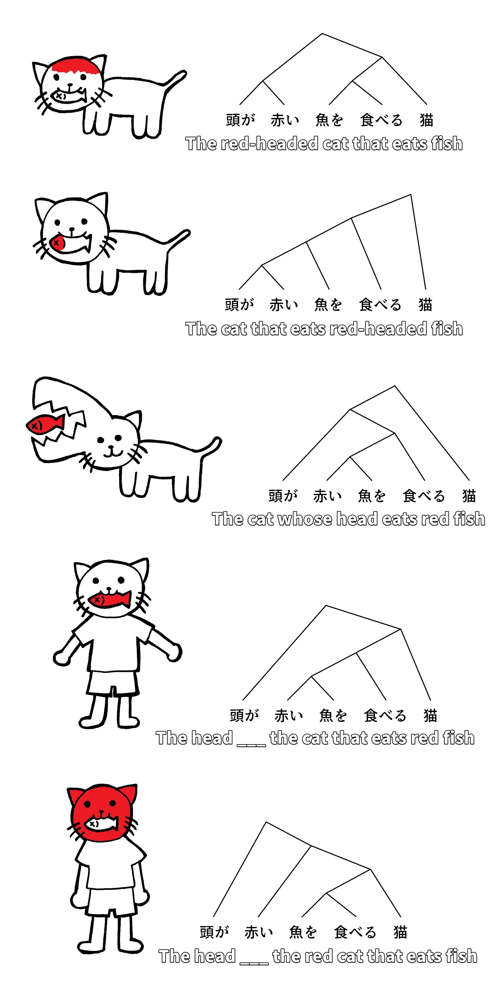

# Word order

!!! danger "WORD ORDER MATTERS (OR DOES IT?)"
    Word order DOES matter in Japanese, but not in the way that european languages (such as English) do.

There are two rules that we must always follow:

!!! info "Rule 1: Engine always goes at the END of the sentence"
    Let's say we have a sentence like this:

    - XがYでZを食べる

    Then the "train" will look like this:

    Main car "A" | 「で」 | 「を」 | Engine "B"
    :---: | :---: | :---: | :---:
    Xが | Yで | Zを | 食べる

    We can change the order of the cars however we want **as long as the engine "B" is at the end**:

    -| - | - | Engine "B"
    :---: | :---: | :---: | :---:
    Xが | Yで | Zを | 食べる
    Xが | Zを | Yで | 食べる
    Yで | Xが | Zを | 食べる
    Yで | Zを | Xが | 食べる
    Zを | Xが | Yで | 食べる
    Zを | Yで | Xが | 食べる

!!! info "Rule 2: If X is describing Y, then X must always come BEFORE Y"
    We already saw a sneak peek of this rule in the section about description.

    If we say:

    - ==美味しい== {++ラーメン++}  
    ==Delicious== {++ramen++}

    then 「美味しい」 is describing 「ラーメン」. Therefore, 「美味しい」 must always come BEFORE 「ラーメン」.

    Another example:

    - ==手を伸ばし抱き止めた激しい== {++光++}  
    {++The ==bursting== light++} ==that I reached out for and held so close==

    The thing that we are talking about is 「光」(light). 「激しい」(bursting) is describing the "light". 「手を伸ばし抱き止めた」(I reached out for and held so close) is also describing the "light". 
    
    Notice that in English, some of the description goes before "light" (bursting), and the other description goes after "light" (I reached out for and held so close). However, in Japanese, the entire description must always go BEFORE 「光」.

Now that we've learned about "description", "particle", and "word order", we can now finally enjoy and appreciate this wonderful joke:

Generally speaking, the interpretation #2 is the most likely one, where a word is modified directly by the word before it. Obviously, this isn't always going to be the case, but we can use context (and ruling out the absurd ones, like #3) to determine which interpretation it is.